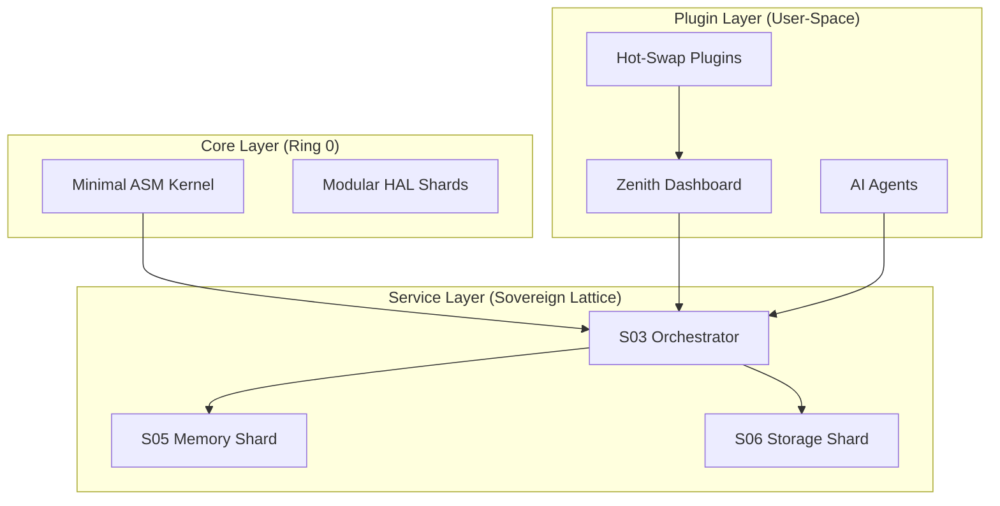
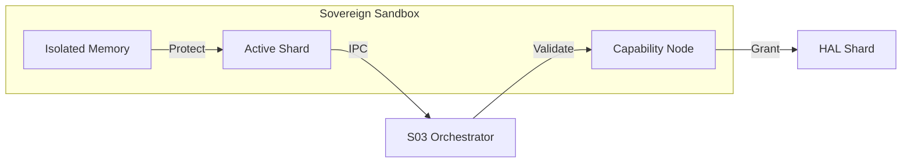

# SigmaOS Modularization Framework

SigmaOS is built on a foundation of extreme modularity, where every system component is an isolated **Sovereign Shard**.

## 1. Shard Architecture
Each of the 33 suites is composed of multiple shards. Shards communicate exclusively via the **S03 Orchestrator** using IPC, ensuring that no single component can compromise the entire lattice.

## 2. Shard Isolation & Sandboxing
To ensure absolute reliability, SigmaOS treats each shard as a containerized unit.

### Container-Like Isolation (Docker Inspired)
Each shard operates within its own **Lattice Jail** (`core/virtualization/lattice_jails.c`). This provides:
- **Namespace Isolation**: Shards only see their own resources via S-9P.
- **Resource Limits**: Deterministic memory and CPU allocation per shard.
- **Independent Lifecycle**: Shards can be updated or restarted without affecting the global lattice state.

## 3. Fault-Tolerant Supervision (Erlang Inspired)
We implement **Supervision Trees** (`core/lattice/supervision_tree.c`) to monitor shard health. If a shard crashes, its supervisor can automatically restart it using predefined strategies (One-for-One, One-for-All).

## 4. Dynamic Service Loading
Shards can be hot-swapped or loaded on-demand via the **SigmaPKG** manager and the **Sovereign UI Toolkit**. This allows for a system that evolves without reboots.

## 5. Capability-Based Isolation
Using the **S-Cap** system, shards are restricted to only the resources they need, preventing lateral movement in the event of a breach.

## Comparison Table

| Paradigm | SigmaOS Approach | Inspiration |
|----------|------------------|-------------|
| Kernel | Freestanding Lattice Shards | MINIX / Genode |
| Drivers | User-space Modular Drivers | L4 / Redox |
| Orchestration | Supervision Trees | Erlang / OTP |
| Config | Declarative JSON | NixOS / Systemd |
