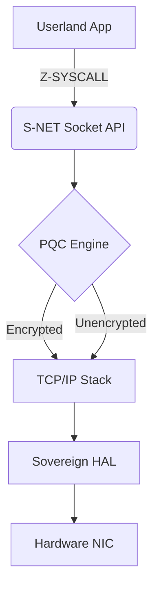

# Sovereign Networking Shard (S-NET)

The Networking Shard is a modular, hot-swappable TCP/IP stack implemented
independently from the monolithic kernel core. It provides secure sockets and
strict network isolation for SigmaOS.

## Architecture Diagram



## Key Features

- **TCP/IP Stack**: Full IPv4 (and future IPv6) implementation.

- **Secure Sockets**: Built-in integration with the Post-Quantum Cryptography
  (PQC) engine for default-encrypted packet transmission.

- **Hot-swappable**: The network driver and stack can be restarted or updated
  without rebooting the kernel.

## API Examples

### Creating a Socket

```c
int fd = sigma_net_socket(AF_SIGMA, SOCK_STREAM, IPPROTO_TCP);
sigma_net_connect(fd, &remote_addr);
sigma_net_send(fd, buf, len, 0);
sigma_net_close(fd);
```

### Enabling Post-Quantum Encryption

```c
sigma_net_enable_pqe(fd, &my_kyber_keypair);
```

## Roadmap

- [x] TCP/IP stack (`tcp.rs`, `tcpip.rs`)

- [x] PQC engine stub (`pqfs.rs`)

- [x] Socket API (`socket.rs`)

- [ ] IPv6 SLAAC / NDP

- [ ] DHCPv6 client

- [ ] WireGuard-inspired VPN tunnel
