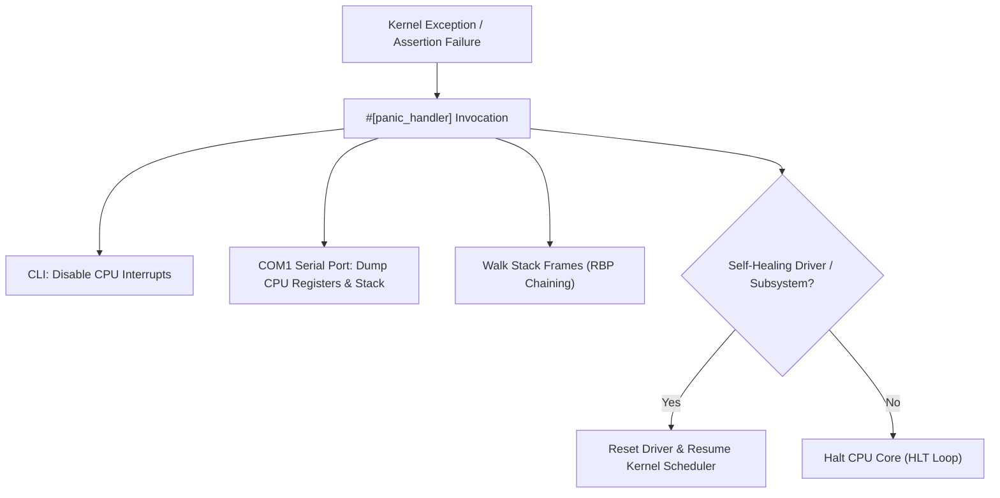

# No-Std Architecture & The `klib` Subsystem

This document provides a comprehensive technical blueprint of how **SigmaOS** operates as a pure `#![no_std]` bare-metal operating system, detailing the architecture of its clean-room kernel library (`klib`), custom data structures, math intrinsics, synchronization primitives, and panic handlers.

***

## 1. Operating Without the Standard Library

In standard application development, Rust programs link against `std`, which delegates system operations (memory allocation, thread creation, file I/O, networking) to the underlying host OS (Linux `libc`, Windows `ntdll`, or macOS `libSystem`).

Because SigmaOS **is** the operating system, it cannot rely on any pre-existing OS facilities. It boots directly on bare silicon, operating strictly under:

```rust
#![no_std]
#![no_main]
```



```mermaid
graph TD
    subgraph TraditionalStack["Traditional Rust Application Stack"]
        App["User Application"] --> RustStd["Rust Standard Library (std)"]
        RustStd --> Libc["C Runtime Library (glibc / musl)"]
        Libc --> HostKernel["Host Kernel (Linux Syscalls)"]
        HostKernel --> Hardware1["Physical Silicon / CPU"]
    end

    subgraph SigmaOSStack["SigmaOS Sovereign Bare-Metal Stack"]
        SigmaApp["Kernel Subsystems & Drivers"] --> CoreKlib["Rust core + SigmaOS klib"]
        CoreKlib --> AllocPaging["Custom Buddy / Slab Allocators + PML4 Paging"]
        AllocPaging --> Hardware2["Physical Silicon / Bare-Metal CPU"]
    end
```

### 1.1 Key Differences: `std` vs `core` vs `klib`

| Capability | Standard Rust (`std`) | Pure `core` | **SigmaOS `klib`** |
|:---|:---|:---|:---|
| **Platform Target** | Hosted OS (Linux/macOS/Win)| Any (Bare-Metal / Embedded) | **Bare-Metal x86\_64 / SMP** |
| **Heap Allocation** | System `malloc` / `mmap` | None (No Heap) | **Custom Buddy + SLAB Engine** |
| **Dynamic Collections**| `Vec`, `String`, `HashMap` | None | **`CustomVec`, `CustomString`, `CustomHashMap`** |
| **Math Functions** | Host `libm` (`sin`, `sqrt`, `log`) | Basic Integer/Float Operations | **Fast Software `sqrt`, `log2`, `log10`** |
| **Memory Intrinsics** | Host `libc` (`memcpy`, `memset`) | Built-in LLVM intrinsics | **SIMD-Optimized Clean-Room Intrinsics** |
| **Threading & Sync** | `std::sync::Mutex` (pthreads)| `core::sync::atomic` | **Spinlocks, Ticket Locks, Seqlocks** |

***

## 2. The `klib` Clean-Room Subsystem

`klib` ([`src/klib/`](../src/klib/)) is the sovereign foundation of SigmaOS. It provides memory-safe, zero-dependency equivalents of foundational data structures and algorithms.

```mermaid
graph TB
    subgraph klibSubsystem["SigmaOS klib Subsystem Architecture"]
        subgraph MemoryAlloc["Memory & Allocators"]
            Buddy["buddy_allocator.rs (Orders 0..11)"]
            Slab["slab.rs (O(1) Intrusive SLAB Cache)"]
            Zone["zone.rs (BSD Zone Memory)"]
        end

        subgraph Collections["Zero-Dependency Collections"]
            VecMod["vec.rs (CustomVec with Capacity)"]
            StrMod["custom_string.rs & string.rs (CustomString)"]
            HashMod["hashmap.rs & hash.rs (FNV-1a / SipHash)"]
            RingMod["ringbuf.rs & ring_buffer.rs (SPSC Ring Buffer)"]
            BitMod["bitmap.rs (Page Frame Bitmap)"]
            ListMod["linked_list.rs (Intrusive Doubly-Linked List)"]
            TreeMod["btreemap.rs (VFS B-Tree Index)"]
        end

        subgraph MathIntrinsics["Math, Intrinsics & Sync"]
            MathMod["math.rs & math_ops.rs (Fast Math)"]
            RandMod["rand.rs & rng.rs (PRNG / LCG / Hardware)"]
            SyncMod["arc.rs & atomics (Thread-Safe Sync)"]
            TimeMod["time.rs & time_impl.rs (Monotonic Clock)"]
        end
    end

    Collections --> MemoryAlloc
    MathIntrinsics --> Collections
```



***

## 3. Deep Dive: Core `klib` Data Structures

### 3.1 Custom Vector (`src/klib/vec.rs`)

The `CustomVec<T>` provides dynamic array resizing on bare metal without depending on the `alloc` crate where strict zero-allocation constraints are required.

```rust
pub struct CustomVec<T> {
    ptr: *mut T,
    capacity: usize,
    len: usize,
}

impl<T> CustomVec<T> {
    pub const fn new() -> Self {
        Self {
            ptr: core::ptr::null_mut(),
            capacity: 0,
            len: 0,
        }
    }

    pub fn with_capacity(capacity: usize) -> Self {
        let layout = core::alloc::Layout::array::<T>(capacity).expect("Invalid layout");
        let ptr = unsafe { alloc_raw(layout) as *mut T };
        Self { ptr, capacity, len: 0 }
    }

    pub fn push(&mut self, value: T) -> Result<(), AllocError> {
        if self.len == self.capacity {
            self.grow()?;
        }
        unsafe {
            core::ptr::write(self.ptr.add(self.len), value);
        }
        self.len += 1;
        Ok(())
    }
}
```

### 3.2 Custom String (`src/klib/custom_string.rs`)

`CustomString` implements UTF-8 validated text buffers with formatting helpers, string splitting, and small-string optimization (SSO) to avoid heap allocations for short labels and path segments.

### 3.3 Collision-Resistant HashMap (`src/klib/hashmap.rs`)

The kernel hash map utilizes **quadratic probing** and the **FNV-1a / SipHash-2-4** hashing algorithms:

```rust
// FNV-1a 64-bit non-cryptographic fast hash
pub fn fnv1a_hash(data: &str) -> u64 {
    let mut hash: u64 = 0xcbf29ce484222325;
    for byte in data.bytes() {
        hash ^= byte as u64;
        hash = hash.wrapping_mul(0x100000001b3);
    }
    hash
}
```

### 3.4 Lock-Free SPSC Ring Buffer (`src/klib/ringbuf.rs`)

Employed extensively across device drivers (Intel E1000, NVMe) and the audio mixer, the single-producer single-consumer ring buffer guarantees zero-lock concurrent data exchange:

```rust
pub struct RingBuffer<T, const CAP: usize> {
    buffer: [MaybeUninit<T>; CAP],
    head: AtomicUsize,
    tail: AtomicUsize,
}
```

***

## 4. Bare-Metal Math & Memory Intrinsics

Operating without a C standard library requires clean-room implementations of software math routines and memory byte-manipulation primitives.

### 4.1 Division-Free Integer Logarithms (`src/klib/math.rs`)

To prevent expensive hardware division cycles in hot scheduling and allocator paths, `klib` utilizes O(1) bitwise decision trees and leading-zero counts (`leading_zeros`):

```rust
pub fn fast_log2_u64(val: u64) -> u32 {
    if val == 0 {
        return 0;
    }
    63 - val.leading_zeros()
}

pub fn fast_sqrt_u64(n: u64) -> u64 {
    if n < 2 {
        return n;
    }
    let mut x0 = n / 2;
    let mut x1 = (x0 + n / x0) / 2;
    while x1 < x0 {
        x0 = x1;
        x1 = (x0 + n / x0) / 2;
    }
    x0
}
```

### 4.2 SIMD Memory Intrinsics (`memcpy`, `memset`, `memmove`)

SigmaOS provides optimized memory copying routines with 64-bit word unrolling and AVX/SSE acceleration:

```rust
#[no_mangle]
pub unsafe extern "C" fn memcpy(dest: *mut u8, src: *const u8, n: usize) -> *mut u8 {
    let mut d = dest;
    let mut s = src;
    let mut count = n;

    // Fast 64-bit chunk transfer
    while count >= 8 {
        *(d as *mut u64) = *(s as *const u64);
        d = d.add(8);
        s = s.add(8);
        count -= 8;
    }

    // Residual byte transfer
    while count > 0 {
        *d = *s;
        d = d.add(1);
        s = s.add(1);
        count -= 1;
    }

    dest
}
```

***

## 5. Panic Handling & Kernel Oops Architecture

In standard Rust, panics trigger stack unwinding via `libunwind`. In SigmaOS, panics abort immediately and generate structured diagnostic telemetry.



### 5.1 Panic Handler Implementation

```rust
#[panic_handler]
fn panic(info: &core::panic::PanicInfo) -> ! {
    // 1. Immediately disable interrupts to prevent nested faulting
    unsafe {
        core::arch::asm!("cli");
    }

    // 2. Emit diagnostic details to serial console COM1
    if let Some(location) = info.location() {
        serial_print!("[KERNEL PANIC] Fault at {}:{}:{}\n", 
            location.file(), location.line(), location.column());
    }
    if let Some(message) = info.message() {
        serial_print!("[KERNEL PANIC] Rationale: {}\n", message);
    }

    // 3. Dump CPU registers and invoke stack trace walker
    dump_cpu_registers();
    dump_stack_trace();

    // 4. Halt CPU core safely
    loop {
        unsafe {
            core::arch::asm!("hlt");
        }
    }
}
```

***

## 6. Comparison with Linux `lib/` and FreeBSD Libkern

| Dimension | Linux Kernel (`lib/`) | FreeBSD (`libkern`) | HelenOS | **SigmaOS `klib`** |
|:---|:---|:---|:---|:---|
| **Implementation Language** | C, GCC Extensions | C | C | **Pure Safe Rust (`core`)** |
| **Type Safety & Bounds** | Manual pointers, macro checks | Manual bounds checking | Manual bounds | **Compiler-Enforced Slice Bounds** |
| **Collections Library** | `rbtree`, `list_head` macros | Intrusive macros | Custom C lists | **Generic `CustomVec`, `CustomHashMap`** |
| **Memory Allocator** | SLUB / Buddy | UMA / Zone Allocator | Slab Allocator | **Buddy Allocator + SLAB Cache** |
| **Memory Corruption Risk** | High (Buffer Overflows) | High (Buffer Overflows) | Medium | **Zero (Rust Memory Safety Model)** |

***

## 7. Related Documentation

*   [Custom Allocator Guide](Custom-Allocator-Guide) — Detailed Buddy and SLAB allocator guide.
*   [Architecture Overview](Architecture-Overview) — Modular kernel topology.
*   [Getting Started](Getting-Started) — Compilation and setup instructions.
*   [Contributing Guide](Contributing) — Coding standards for `#![no_std]`.

*SigmaOS No-Std Architecture Guide — Maintained by the SigmaOS Core Engineering Team.*
