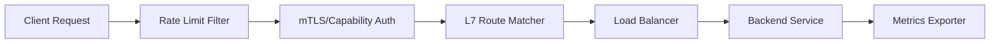
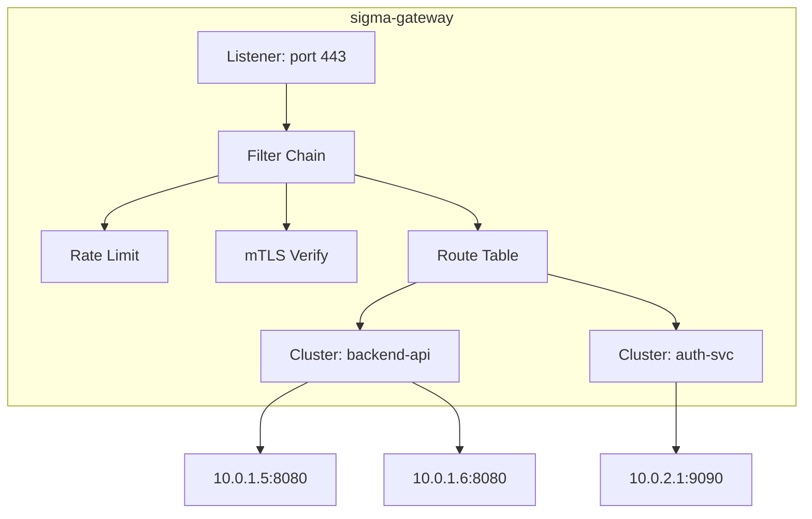

# OSS Absorption: Envoy Proxy — Service Mesh Data Plane

> **Status**: 📋 Planned | **Source Project**: Envoy (CNCF) | **Target Shard**: `SigmaOS Sovereign Gateway`

---

## 1. Executive Summary

Envoy is a high-performance, extensible L7 proxy and communication bus designed for large-scale modern service-oriented architectures. Originally built at Lyft and donated to the CNCF, it is the universal data plane for service meshes including Istio.

SigmaOS absorbs Envoy's **xDS dynamic configuration API**, **L7 routing primitives**, and **filter chain architecture** into `sigma-gateway`, enabling SigmaOS services to discover, load-balance, and observe each other transparently.

---

## 2. Key Features Absorbed

### 2.1 xDS-Inspired Dynamic Configuration

Instead of static config files, `sigma-gateway` accepts runtime configuration updates via a streaming gRPC API modeled after Envoy's xDS (Listener/Route/Cluster/Endpoint Discovery Service).

```toml
# /etc/sigma/gateway/clusters.toml — static fallback
[[cluster]]
name = "backend-api"
endpoints = ["10.0.1.5:8080", "10.0.1.6:8080"]
health_check = { interval = "5s", path = "/healthz" }
lb_policy = "round_robin"
```

```bash
$ sigma gateway clusters list
Σ [GATEWAY] Active clusters:
  backend-api  2 endpoints  LB=round_robin  HC=pass
  auth-svc     1 endpoint   LB=passthrough   HC=pass
```

### 2.2 L7 Filter Chain

Every request entering `sigma-gateway` passes through a composable filter chain: rate-limiting → auth → routing → observability → upstream.



### 2.3 Circuit Breaking & Outlier Detection

If a backend returns 5xx errors above a threshold, `sigma-gateway` ejects it from the load-balancer pool temporarily and routes traffic to healthy endpoints.

```bash
$ sigma gateway outliers
Σ [GATEWAY] Outlier report:
  backend-api/10.0.1.6:8080  EJECTED  5xx rate: 12%  cooldown: 30s remaining
```

---

## 3. Architecture



---

## 4. References & Standards

- Envoy Proxy — `envoyproxy.io` (Apache-2.0)
- xDS API specification — `github.com/envoyproxy/data-plane-api`
