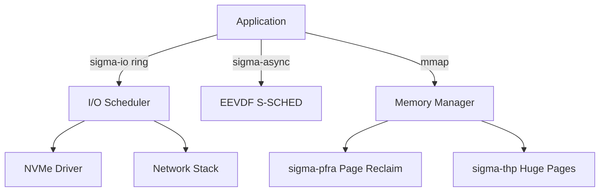

# OSS Absorption: Linux Kernel — Mainline Innovation Absorption

> **Status**: 📋 Planned | **Source Project**: Linux Kernel (torvalds/linux) | **Target Shard**: `SigmaOS Kernel Core`

---

## 1. Executive Summary

The Linux kernel is the most battle-tested, widely deployed OS kernel in existence. While SigmaOS is not Linux, it systematically studies and adapts Linux's most proven innovations: the EEVDF scheduler, io_uring asynchronous I/O, eBPF programmable kernel, page cache management, and CFS load balancing.

SigmaOS absorbs each of these as native implementations in Rust, targeting superior safety guarantees while maintaining comparable performance characteristics.

---

## 2. Key Features to Absorb

### 2.1 EEVDF Scheduler (Linux 6.6+)

Linux replaced the aging CFS scheduler with EEVDF (Earliest Eligible Virtual Deadline First) in kernel 6.6. SigmaOS's `S-SCHED` implements EEVDF natively, giving priority to latency-sensitive workloads like audio and UI while maintaining throughput.

```
Process eligible if: eligible_time <= current_vruntime
Schedule: process with smallest virtual deadline among eligible tasks
Result:   audio/UI tasks preempt CPU-bound tasks consistently
```

### 2.2 io_uring-Inspired Async I/O

Linux's io_uring is the highest-performance I/O interface available on any OS. SigmaOS absorbs its **submission ring / completion ring** model into `sigma-io`, enabling zero-copy, zero-syscall-overhead async I/O for userland applications.

```rust
// sigma-io ring API (io_uring-inspired)
let ring = sigma_io::Ring::new(256)?;
let read_op = ring.read(fd, &mut buf);
let write_op = ring.write(out_fd, &buf);
ring.submit_and_wait([read_op, write_op]).await?;
// Both ops submitted in one syscall, completed via ring
```

### 2.3 Memory Management — PFRA & Huge Pages

Linux's Page Frame Reclaim Algorithm (PFRA) and Transparent Huge Pages (THP) are absorbed into SigmaOS's memory manager as:
- **sigma-pfra**: LRU-based page reclaim with proactive swapping.
- **sigma-thp**: Automatic 2MB huge page promotion for large anonymous mappings.

---

## 3. Architecture Diagram



---

## 4. References & Standards

- Linux Kernel — `kernel.org` (GPL-2.0)
- EEVDF Paper — "A proportional share resource allocation algorithm for real-time, time-shared systems" (Stoica, 1996)
- io_uring — `kernel.dk/io_uring.pdf`
