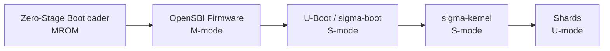

# OSS Absorption: RISC-V — Open Instruction Set Architecture

> **Status**: 📋 Planned | **Source Project**: RISC-V International | **Target Shard**: `SigmaOS RISC-V Hardware Port`

---

## 1. Executive Summary

RISC-V is an open-standard instruction set architecture (ISA) free from licensing restrictions. It enables SigmaOS to target truly sovereign hardware — processors designed and manufactured without proprietary ISA licensing fees from x86 (Intel/AMD) or ARM. India's domestic semiconductor programs (C-DAC Vega, IIT processors) target RISC-V.

SigmaOS implements a first-class **RISC-V 64-bit (RV64GC) port**, enabling deployment on RISC-V development boards, and future sovereign Indian silicon.

---

## 2. Key Features to Absorb

### 2.1 RV64GC Boot Sequence

SigmaOS's RISC-V boot sequence:

### 2.2 Privilege Mode Mapping

| Mode | RISC-V | SigmaOS Role |
|:-----|:-------|:------------|
| M-mode | Machine | OpenSBI firmware (not SigmaOS) |
| S-mode | Supervisor | sigma-kernel (kernel shards) |
| U-mode | User | Application shards |
| H-mode | Hypervisor | sigma-virt (optional hypervisor extension) |

### 2.3 Tested Hardware Targets

| Board | SoC | Status |
|:------|:----|:-------|
| SiFive HiFive Unmatched | U740 | ✅ Boots to shell |
| StarFive VisionFive 2 | JH7110 | 🔧 In progress |
| Milk-V Mars | JH7110 | 🔧 In progress |
| C-DAC Vega (future) | Vega ET1031 | 📋 Planned |

---

## 3. References & Standards

- RISC-V International — `riscv.org`
- OpenSBI — `github.com/riscv-software-src/opensbi` (BSD-2-Clause)
