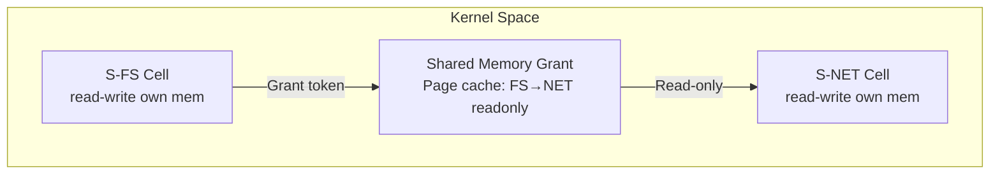

# OSS Absorption: Theseus OS — Intra-Language Safety and Live Evolution

> **Status**: 📋 Planned | **Source Project**: Theseus OS (Kevin Boos, Rice University) | **Target Shard**: `SigmaOS Kernel Live Evolution`

---

## 1. Executive Summary

Theseus is a research OS written entirely in Rust that pushes the language's safety guarantees into the OS itself. Its key innovations are **intra-language safety** (the OS kernel can be verified at language level), **live evolution** (hot-swapping kernel modules at runtime), and **intralingual design** (no unsafe unsafe-escape-hatches).

SigmaOS absorbs Theseus's **hot-swappable kernel module** pattern and **cell-based memory isolation** into its own shard architecture, enabling kernel updates without reboots.

---

## 2. Key Features to Absorb

### 2.1 Live Kernel Module Hot-Swap

SigmaOS kernel shards (drivers, schedulers, filesystems) can be hot-swapped at runtime. The old module's connections are drained, the new module is atomically installed, and existing processes continue without interruption.

```bash
$ sigma kernel swap S-SCHED sigma-sched-v2.spkg
Σ [KERNEL] Hot-swapping S-SCHED:
  1. Load sigma-sched-v2.spkg into isolated memory cell
  2. Verify ABI compatibility (Dilithium5 signature OK)
  3. Drain existing scheduler connections (0.2ms grace)
  4. Atomically redirect IPC → sigma-sched-v2
  5. Unload sigma-sched-v1 (memory freed)
  Swap complete. No reboot required. ✓
```

### 2.2 Cell-Based Memory Isolation

Instead of a flat kernel address space, each SigmaOS kernel shard occupies an isolated **cell** with explicit grants for shared memory regions. No shard can access another's private memory without an explicit grant token.



---

## 3. References & Standards

- Theseus OS — `github.com/theseus-os/Theseus` (MIT)
- Boos et al., "Theseus: an Experiment in Operating System Structure and State Management", OSDI 2020
