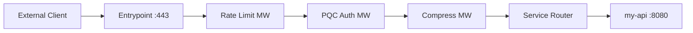

# OSS Absorption: Traefik — Cloud-Native Reverse Proxy

> **Status**: 📋 Planned | **Source Project**: Traefik Labs | **Target Shard**: `SigmaOS Auto-Discovery Gateway`

---

## 1. Executive Summary

Traefik is a modern HTTP reverse proxy and load balancer that integrates with container orchestrators to automatically discover services and configure routing rules. Its middleware pipeline makes it easy to add authentication, rate limiting, and TLS termination declaratively.

SigmaOS absorbs Traefik's **automatic service discovery** and **middleware chain** patterns into `sigma-gateway`, enabling zero-config reverse proxying for any service registered in the `sigma-mesh` service catalog.

---

## 2. Key Features Absorbed

### 2.1 Automatic Service Discovery

When a new SigmaOS service registers with `sigma-mesh`, `sigma-gateway` automatically creates a route entry without any manual configuration.

```bash
$ sigma service register my-api --port 8080 --label env=prod
Σ [MESH] Service registered: my-api (10.0.1.5:8080)
Σ [GATEWAY] Route auto-created: my-api.sigma.local → 10.0.1.5:8080
```

### 2.2 Declarative Middleware Chains

Middleware transforms are composable TOML declarations applied per-route:

```toml
# /etc/sigma/gateway/routes/my-api.toml
[route]
match = "Host(`my-api.sigma.local`)"
service = "my-api"
middlewares = ["rate-limit", "pqc-auth", "compress"]

[middleware.rate-limit]
average = 100
burst = 50

[middleware.compress]
algorithm = "zstd"
```

### 2.3 Automatic TLS with ACME

Combined with the Caddy-inspired ACME integration, Traefik's Let's Encrypt challenge solver pattern provides automatic certificate provisioning and renewal.

---

## 3. Architecture



---

## 4. References & Standards

- Traefik — `traefik.io` (MIT)
