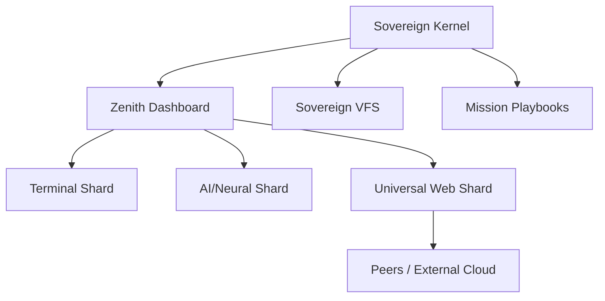

# Σ SIGMAOS ZENITH SUPREME (v153.2)

> **Absolute Sovereignty. Zero Dependency. Industrial-Grade Orchestration.**

SigmaOS is a next-generation, high-performance operating system designed for **Industrial Sovereignty**. It operates as a unified shard matrix, absorbing the USPs of Windows, macOS, Linux, and specialized cloud distros into a single, bare-metal execution environment.

---

## 🚀 Quick Start

### 1. Launch the OS

Simply open `index.html` in any modern browser to initialize the Zenith Dashboard.

### 2. Enter the Pulse

Open the **Terminal Shard** from the dock and type:

```bash
help
```

### 3. Shard a Multi-Distro Instance

Use the **Universal Web Shard** to boot full Linux distros (Ubuntu, Arch, Kali) within SigmaOS via DistroSea parity.

---

## 🛠 Features

- **Sovereign VFS**: Persistent, browser-native file system with no simulation.
- **Neural Matrix Shard**: Real-time ML execution and visualization.
- **Mission Playbooks**: Automated system orchestration and sharding.
- **Industrial Site Sharding**: Transform any web service into a standalone OS app (ICE parity).
- **Sovereign Cloud Hub**: Aggregate all your web-based tools into a single mission dashboard.

---

## 🏗 Architecture



---

## 🔧 Shard Management (sigmactl)

SigmaOS includes a built-in management utility. Open the terminal and use:

- `sigmactl list`: View all active system shards.
- `sigmactl audit`: Review the industrial security logs.
- `sigmactl health`: Check silicon-level telemetry.
- `sigmactl profile switch <MODE>`: Toggle between Developer, Gaming, and Minimal environments.
- `sigmactl macro run <NAME>`: Execute complex automation workflows (e.g. DEV_READY).

---

## 📝 Roadmap

- [x] v152.0: Persistent VFS & Industrial Shell.
- [x] v153.0: Site Sharding & Sovereign Cloud Hub.
- [x] v154.0: **Industrial Profiles & Automation Macros**.
- [ ] v155.0: **Peer-to-Peer Shard Sharing** (Planned).
- [ ] v155.0: **Sovereign VPN & Privacy Matrix** (Planned).

---

## 🤝 Contribution

We welcome sovereign developers. Please review `CONTRIBUTING.md` for guidelines on raw ASM, C11, and React-Free development.

---

## ⚖️ License

Sovereign Industrial License (See LICENSE file).
