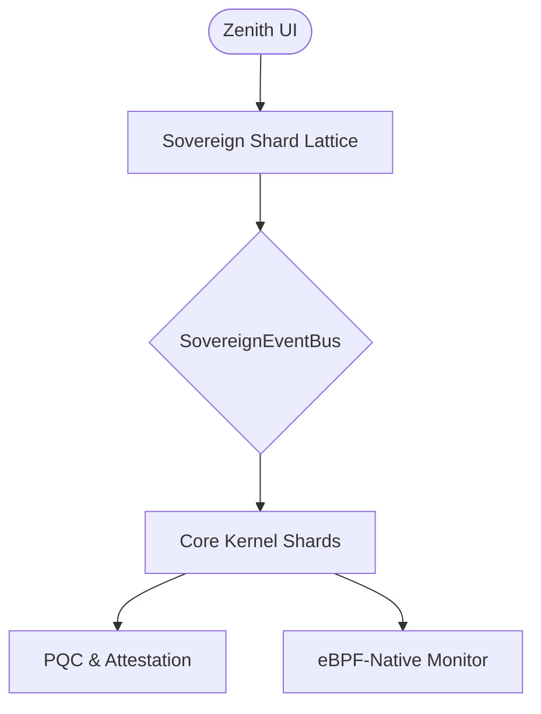

# SigmaOS: Sovereign Lattice Industrial v100

[](https://opensource.org/licenses/MIT)
[](https://github.com/AaryanSinghChauhan09/SigmaOS/actions)
[](https://github.com/AaryanSinghChauhan09/SigmaOS/releases)
[](SECURITY.md)

> A high-performance, cloud-native operating system designed for distributed sovereignty. SigmaOS manages 600+ independent functional shards across clusters and edge nodes, outclassing traditional monolithic distributions in isolation, scalability, and security.


## [→ Live Demo](https://aaryansinghchauhan09.github.io/SigmaOS/)

## Quick Start

```bash
git clone https://github.com/AaryanSinghChauhan09/SigmaOS.git
cd SigmaOS
node server.js          # Serves on http://localhost:5000
```

## System Architecture: The Sovereign Lattice

SigmaOS is built on the **Sovereign Lattice**, a modular 600-shard architecture designed for horizontal scalability, absolute isolation, and high-assurance computing. Unlike monolithic kernels, SigmaOS shards are distributed across the lattice, enabling seamless cloud-bursting and self-healing.



## Zenith Desktop Features

| Category | Features |
| :--- | :--- |
| **Interface** | Glassmorphic UI, Dynamic Desktop Shards, Drag & Snap Windows |
| **Observability** | Real-time eBPF System Telemetry, CPU/Memory Heatmaps |
| **Security** | Post-Quantum Cryptography (LBSV), Hardware Attestation (TEE) |
| **Intelligence** | Integrated SovereignAI Assistant, Command Palette (Ctrl+Space) |

## Shortcuts

| Shortcut | Action |
| :--- | :--- |
| **Ctrl + Space** | Command Palette (Search all actions) |
| **Alt + 1 – 4** | Switch Virtual Desktops (1 - 4) |
| **Ctrl + Alt + T** | Launch Markup Forge |
| **↑ / ↓** | Terminal Command History |
| **Right-Click** | Desktop Context Menu |

## Contributions

Contributions are welcome! Please see [CONTRIBUTING.md](CONTRIBUTING.md) and the [Official Wiki](https://github.com/AaryanSinghChauhan09/SigmaOS/wiki).

## License

This project is licensed under the MIT License - see the [LICENSE](LICENSE) file for details.
