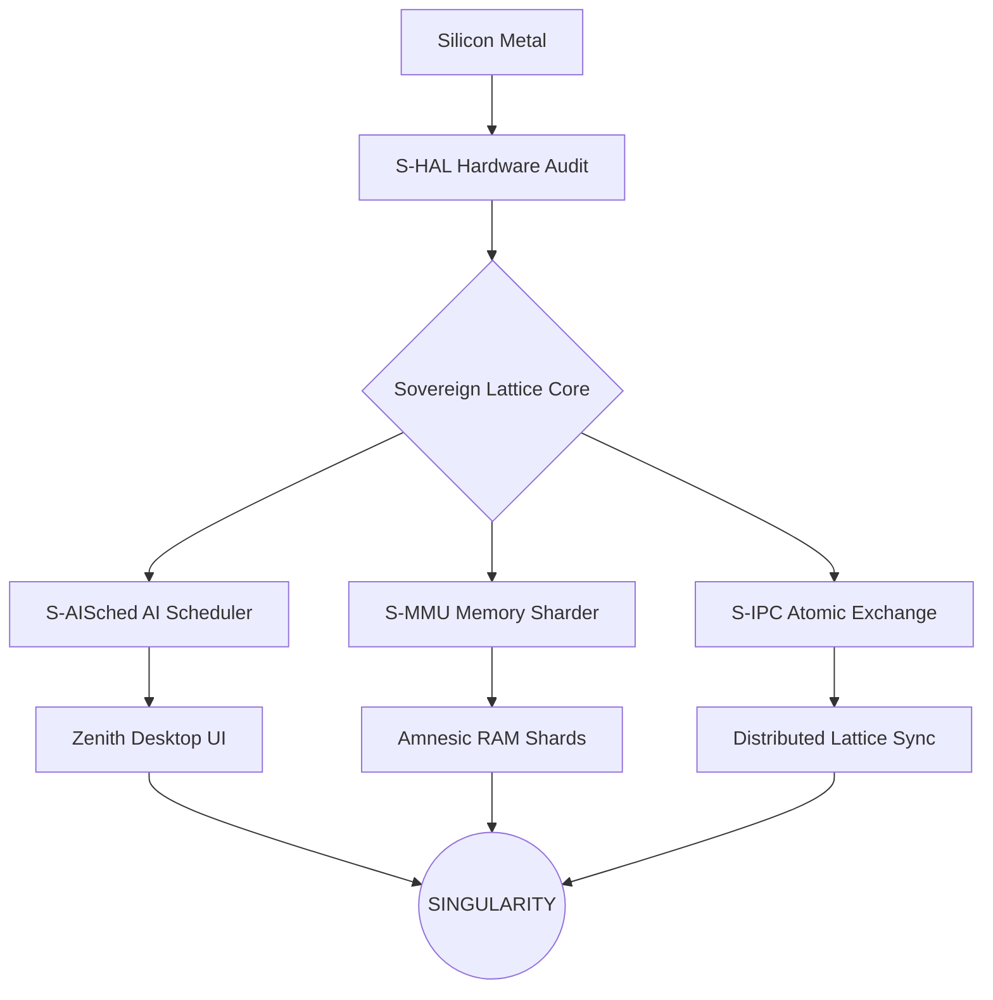

# 🏛️ SigmaOS: Sovereign Zenith Lattice

SigmaOS is a next-generation, zero-dependency, bare-metal operating system. Built around a 600-shard modular lattice architecture, SigmaOS discards legacy POSIX and Glibc bloat in favor of a silicon-native, mathematically proven execution environment.

## 🚀 Why SigmaOS?

Traditional operating systems are constrained by decades of legacy abstractions. SigmaOS reimagines the Silicon-to-Logic handshake:
- **Zero-Dependency:** Runs directly on silicon without legacy HALs.
- **Modular Atomicity:** A 600-shard micro-kernel architecture allows unprecedented scalability and parallel execution.
- **Amnesic Memory:** Stateless execution boundaries for enhanced security.
- **Silicon-Native Performance:** Near-zero latency context switching via Wait-Free Atomic Exchange (WFAE).

## 🛠️ Quick Start

### 1. Build the Kernel
```bash
make singularity
```

### 2. Run in QEMU (Boot Demo)
To see the sovereign lattice ignite and watch the serial boot trace:
```bash
make qemu
```
*Note: This requires `qemu-system-x86_64` installed.*

## 🌌 Architecture Overview

SigmaOS operates on a Sovereign Lattice architecture where every service is an independent "Shard".



## 🧩 Defining a Shard

Every shard in SigmaOS follows a strict C++ singleton pattern. Here is a minimal example:

```cpp
#include "sigma_hal.h"

// 1. Shard Definition
class MyShardEngine {
public:
    static MyShardEngine& getInstance() {
        static MyShardEngine instance;
        return instance;
    }
    void ignite() {
        sigma_log("[MY-SHARD] Ignition sequence start.");
    }
};

// 2. Sovereign Entry Point
extern "C" void myshard_init() {
    MyShardEngine::getInstance().ignite();
}
```

## 📚 Glossary

| Term | Technical Explanation |
| :--- | :--- |
| **Amnesic Memory** | Stateless RAM allocation that scrubs data immediately after use. |
| **Singularity** | The state where all 600 shards are synchronized and operational. |
| **Sovereign Lattice** | The distributed, modular graph of all system services. |
| **Shard** | A standalone, zero-dependency binary module (singleton). |

## 🗺️ Roadmap & Stability

See [ROADMAP.md](ROADMAP.md) for detailed phase tracking and [BUILD.md](BUILD.md) for build instructions.

---

*Σ SIGMAOS: Beyond Linux. Absolute Sovereignty.*
