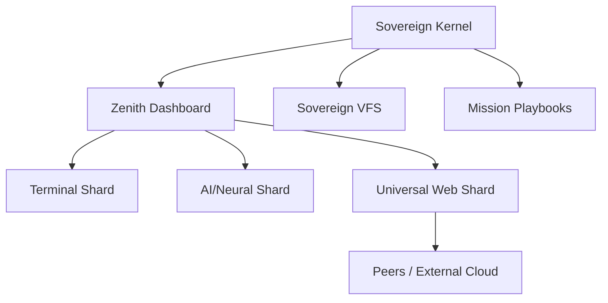

# Σ SIGMAOS ZENITH SUPREME (v153.2)

> **Absolute Sovereignty. Zero Dependency. Industrial-Grade Orchestration.**

SigmaOS is a next-generation, high-performance operating system designed for **Industrial Sovereignty**. It operates as a unified shard matrix, absorbing the USPs of Windows, macOS, Linux, and specialized cloud distros into a single, bare-metal execution environment.

---

## 🚀 Quick Start

### 1. Launch the OS

Simply open `index.html` in any modern browser to initialize the Zenith Dashboard.

### 2. Enter the Pulse

Open the **Terminal Shard** from the dock and type:

```bash
help
```

### 3. Shard a Multi-Distro Instance

Use the **Universal Web Shard** to boot full Linux distros (Ubuntu, Arch, Kali) within SigmaOS via DistroSea parity.

---

## 🛠 Features

- **Sovereign VFS**: Persistent, browser-native file system with no simulation.
- **Neural Matrix Shard**: Real-time ML execution and visualization.
- **Mission Playbooks**: Automated system orchestration and sharding.
- **Industrial Site Sharding**: Transform any web service into a standalone OS app (ICE parity).
- **Sovereign Cloud Hub**: Aggregate all your web-based tools into a single mission dashboard.

---

## 🏗 Architecture



---

## 🔧 Shard Management (sigmactl)

SigmaOS includes a built-in management utility. Open the terminal and use:

- `sigmactl list`: View all active system shards.
- `sigmactl audit`: Review the industrial security logs.
- `sigmactl health`: Check silicon-level telemetry.
- `sigmactl status --live`: Show real-time system performance and VFS health.
- `sigmactl persona set <ROLE>`: Apply role-based environments (Developer/Gamer/Researcher).
- `sigmactl suggest performance`: Get AI-assisted recommendations to optimize the OS.

---

## 📝 Roadmap

- [x] v180.0: Performance & Algorithmic Efficiency.
- [x] v190.0: Self-Healing & Sovereign Crypto.
- [x] v200.0: Lattice-PQC & Sovereign Scheduler.
- [x] v210.0: Sovereign Rollbacks & Macro Orchestration.
- [x] v220.0: Supreme App-Sovereignty & Emulation.
- [x] v230.0: Industrial Backend Sovereignty.
- [x] v240.0: Sovereign Architecture & Mount Management.
- [x] v250.0: Core Kernel Architecture (PCB, IDT, HAL).
- [x] v260.0: Omnipotent Masterpiece: Advanced Tool Integration.
- [x] v270.0: **Absolute Stability Patch (Error Catching, Memory Leaks, UI Fixes) (Zenith Legacy Final Build)**.
- [ ] v280.0: **Peer-to-Peer Shard Sharing** (Planned).

---

## 🤝 Contribution

We welcome sovereign developers. Please review `CONTRIBUTING.md` for guidelines on raw ASM, C11, and React-Free development.

---

## ⚖️ License

Sovereign Industrial License (See LICENSE file).
