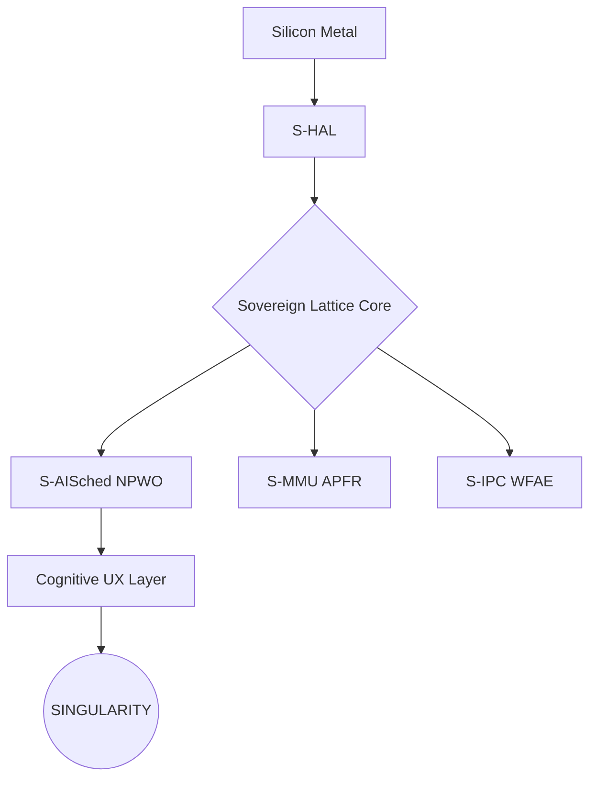

# Σ SIGMAOS: THE SOVEREIGN SILICON SINGULARITY (v28.0)

> "Beyond Linux. Absolute Sovereignty. The 600-Shard Modular Zenith."

---

## 🌌 What is SigmaOS?

SigmaOS is an industrial-grade, bare-metal operating system engineered for 
**Architectural Supremacy**. Unlike monolithic legacy kernels (Linux, Windows, 
macOS), SigmaOS is built on a **600-shard modular lattice** where every 
component is a sovereign, OOP-isolated singleton engine.

### 💎 Key Singularity Features:
- **600-Shard Atomic Lattice**: Zero-dependency, hot-swappable service shards.
- **Morphic Zenith UI**: Ultra-low-latency glassmorphism compositor (ZCSR).
- **S-HYPER SIV**: Type-1 hypervisor hooks directly integrated into the lattice.
- **S-IDENTITY RLSA**: Post-quantum identity vault (Ring-LWE).
- **NLO (Neural Lattice Optimization)**: Automated, self-healing shard management.

---

## 🚀 Installation (Bare-Metal ABMD)

SigmaOS uses the **S-Install** engine for autonomous deployment.

1. **Download** the `zenith-singularity.iso`.
2. **Flash** to a silicon-native target (USB/SSD).
3. **Boot**. The **ABMD** algorithm will automatically map your hardware to 
   the sovereign lattice.

```bash
make zenith-iso  # Generate the production-grade ISO
```

---

## 🛠️ Usage & Orchestration

Interact with the sovereign lattice via the **Zenith Dashboard** or the 
**Sovereign Assistant (IDLO)**.

### Shard Ignition:
```bash
# Ignite a specific shard via the Unified Shard Registry (USR)
sigma-ignite S09_NEURAL_ACCEL
```

---

## 🏛️ Architecture Overview



---

## 🤝 Contributing

We welcome sovereign developers. Please review our [CONTRIBUTING.md](CONTRIBUTING.md) 
for shard-level coding standards and the **v28.0 modularity paradigm**.

---

## 🔒 Security

SigmaOS is **Zero-Trust** by design. Report vulnerabilities to the 
[S-Audit](SECURITY.md) shard.

---

## 📜 License

MIT © 2026 SigmaOS Foundation. See [LICENSE](LICENSE) for details.

*Σ SIGMAOS: Absolute Sovereignty. Singularity Achieved.*
