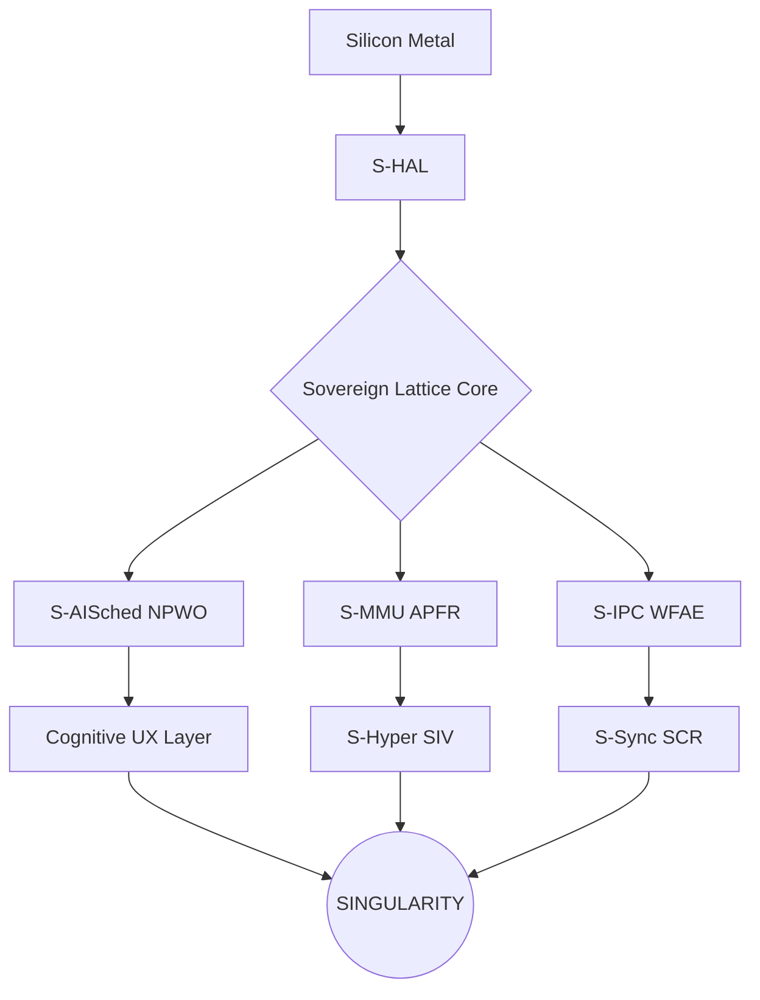

# 🏛️ SigmaOS: Sovereign Zenith Lattice

SigmaOS is a next-generation, zero-dependency, bare-metal operating system. Built around a 600-shard modular lattice architecture, SigmaOS discards legacy POSIX and Glibc bloat in favor of a silicon-native, mathematically proven execution environment.

## 🚀 Why SigmaOS?

Traditional operating systems are constrained by decades of legacy abstractions. SigmaOS reimagines the Silicon-to-Logic handshake:
- **Zero-Dependency:** Runs directly on silicon without legacy HALs.
- **Modular Atomicity:** A 600-shard micro-kernel architecture allows unprecedented scalability and parallel execution.
- **Cryptographic Isolation:** Every shard runs in a Zero-Trust Cryptographic Isolation Boundary (CIB).
- **Silicon-Native Performance:** Achieve near-zero latency for context switching and IPC.

## 🛠️ Getting Started (Experimental)

SigmaOS is currently in its `v28.0 Zenith` experimental phase. To build the lattice:

```bash
# 1. Clone the repository
git clone https://github.com/AaryanSinghChauhan09/SigmaOS.git
cd SigmaOS

# 2. Ignite the Sovereign Lattice
make singularity

# 3. Build the Cognitive UX
make zenith

# 4. Generate the Bootable ISO
make zenith-iso
```

## 🌌 Architecture

SigmaOS operates on a Sovereign Lattice architecture. 



## 🗺️ Feature Roadmap

- [x] Phase 1: Bare-Metal Bootstrapping
- [x] Phase 2: Multi-Core Shard Orchestration (S-SMP)
- [x] Phase 3: Zero-Trust Cryptographic Isolation (CIB)
- [x] Phase 4: Glassmorphic Zenith Desktop UI
- [ ] Phase 5: Post-Quantum Identity Integration (RLSA)
- [ ] Phase 6: Neural Lattice Self-Healing Automation

## 🤝 Contributing
We welcome contributions from kernel engineers, UI/UX designers, and security researchers. Please read our [Contribution Guidelines](CONTRIBUTING.md) to get started.

## 📜 License
This project is proprietary and confidential. All rights reserved.
