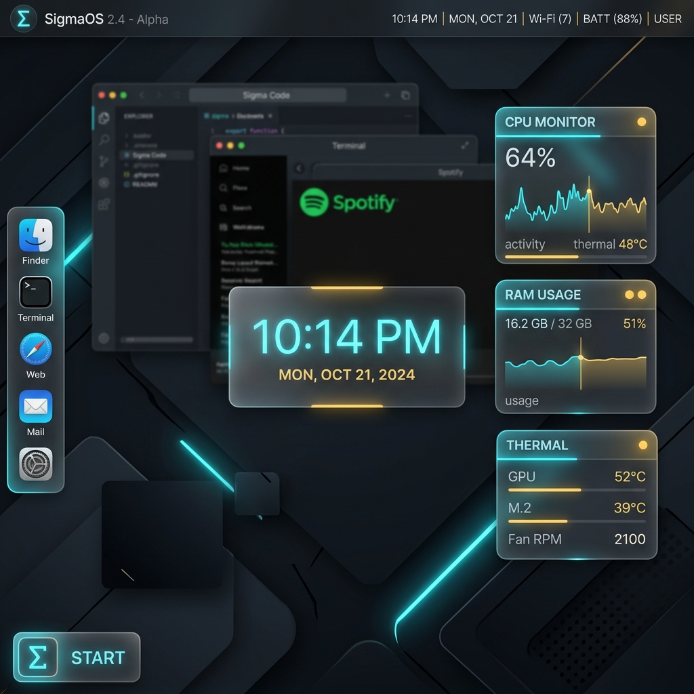

[](https://opensource.org/licenses/MIT)
[](https://github.com/AaryanSinghChauhan09/SigmaOS/actions)
[](https://github.com/AaryanSinghChauhan09/SigmaOS/releases)
[](SECURITY.md)

> A browser-based OS simulation with a glassmorphic desktop, draggable windows, terminal, file manager, AI assistant, and live system telemetry. Zero build step — open `index.html` and go.



**[→ Live Demo](https://aaryansinghchauhan09.github.io/SigmaOS/)**

```bash
git clone <https://github.com/AaryanSinghChauhan09/SigmaOS.git>
cd SigmaOS
node server.js          # serves on <http://localhost:5000>

```

| Shortcut | Action |
| :--- | :--- |
| **Ctrl + Space** | Command Palette (Search all actions) |
| **Alt + 1 – 4** | Switch Themes (Cyan / Gold / Crimson / Solar) |
| **↑ / ↓** | Terminal Command History |
| **Right-Click** | Desktop Context Menu |

SigmaOS is built on the **Sovereign Lattice**, a modular 600-shard architecture designed for absolute isolation and high-assurance computing.

Contributions are welcome! Please see [CONTRIBUTING.md](CONTRIBUTING.md) and the [Official Wiki](https://github.com/AaryanSinghChauhan09/SigmaOS/wiki).

This project is licensed under the MIT License - see the [LICENSE](LICENSE) file for details.


