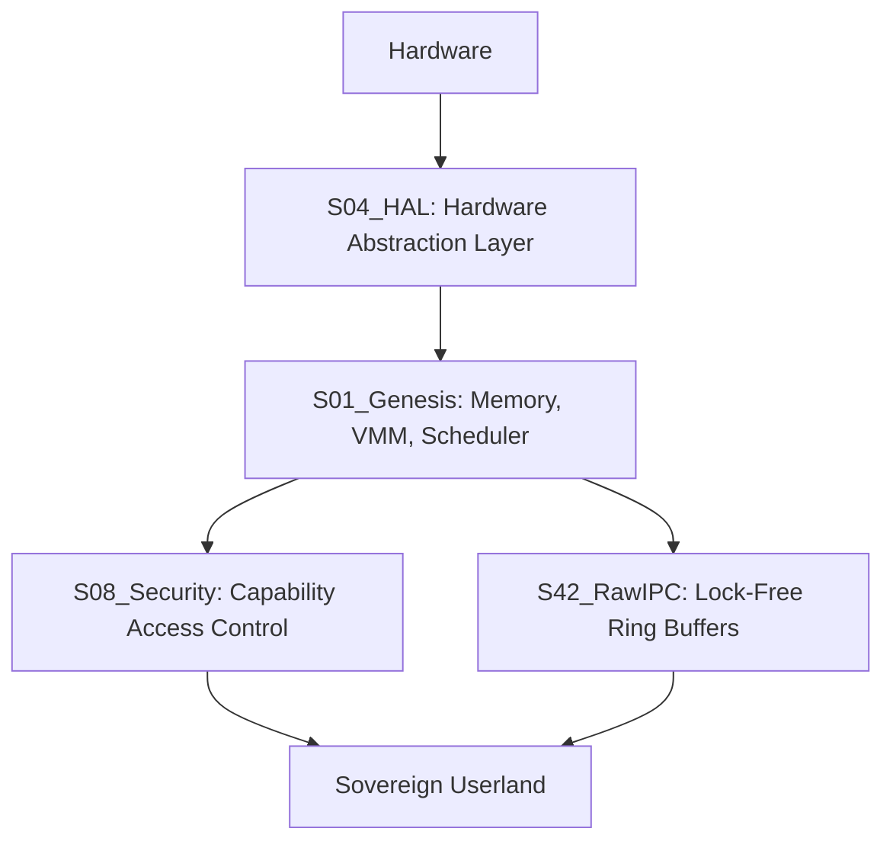

# 🌌 SigmaOS — The Sovereign Silicon Entity

[](https://github.com/AaryanSinghChauhan09/SigmaOS/actions)
[](https://github.com/AaryanSinghChauhan09/SigmaOS/blob/main/LICENSE)

**Repository:** [AaryanSinghChauhan09/SigmaOS](https://github.com/AaryanSinghChauhan09/SigmaOS)  
**Wiki:** [SigmaOS Wiki](https://github.com/AaryanSinghChauhan09/SigmaOS/wiki)

> **One OS. Zero Dependencies. Infinite Sovereignty.**

SigmaOS is an industrial-grade, bare-metal operating system built entirely from atomic, zero-dependency C/C++ modules. Every subsystem — from memory allocation to security — is implemented in a single-function, hardware-native module.

---

## 🚧 Current Project Status: Industrial Quantum-Resilience & Gesture-Native UI

*SigmaOS is currently in **Phase 7** of its [Roadmap](ROADMAP.md). We have achieved hardware-native quantum-resilience and a gesture-driven Morphic UI, positioning SigmaOS as a future-proof sovereign lattice.*

- **Quantum-Resilient Secure Boot**: SigmaOS now boots with hardware-native cryptographic verification using NIST-standard Kyber and Lattice-based primitives. Every shard is verified before execution.
- **Morphic UI Evolution**: Fully gesture-native interface with support for touch, trackpad swipes, and multi-finger pinch-to-resize. Adaptive focus expansion fluidly highlights active workloads.
- **Mosaic Auto-Layout**: The UI intelligently arranges shards into balanced grids and mosaics that dynamically re-flow on window resize or orientation change.
- **Shard Cryptography (Kyber)**: Native integration of Kyber-768 for post-quantum secure Shard IPC and Networking.
- **Cross-Architecture Scalability**: Industrially verified boot sequences and PLIC/Sv39 VMM implementations for ARM64 and RISC-V hardware.
- **CI/CD Visibility**: Morphic UI Dashboard now features live CI/CD log streaming, showing real-time build status across all target architectures.

---

## 🏗️ Architecture Overview

SigmaOS utilizes a unique **Atomic Architecture**, where the system is decomposed into highly specialized, isolated shards.



---

## 🧬 Unique Selling Points (USPs)

### ⚛️ Atomic Architecture — One Module = One Function

Every OS capability lives in a self-contained C/C++ file. No monoliths. No cascading failures. Each shard can be independently compiled, tested, upgraded, or replaced without touching anything else.

| Module                | Responsibility                                     |
| :-------------------- | :------------------------------------------------- |
| `sigma_slab_alloc.h`  | O(1) kernel slab allocator — no malloc, no runtime |
| `sigma_spinlock.h`    | x86 XCHG-based spinlock via inline assembly        |
| `sigma_ring_buffer.h` | Lock-free SPSC ring for IPC / DMA events           |
| `sigma_vmm.h`         | 2-level page table VMM — map, unmap, translate     |
| `sigma_scheduler.h`   | RDTSC-timed round-robin task scheduler             |
| `sigma_caps.h`        | Zero-trust capability tokens — mint, check, revoke |

---

### 🛡️ Absolute Dependency Sovereignty

- **Zero stdlib**: No `<stdio.h>`, `<stdlib.h>`, `<string.h>` in kernel modules
- **Custom types**: `sigma_size_t`, `sigma_u32`, `sigma_u8` replace `stdint.h`
- **Custom libc**: `sigma_kprint`, `sigma_memcpy`, `sigma_strlen` — hand-rolled
- **No Python / JS / CSS** anywhere in the OS kernel path

---

### 🔐 Native Security Shards

- **Quantum-Safe Cryptography** (`sigma_pqc.c`) — Kyber/Dilithium primitives
- **Zero-Trust Capability System** — every process access is token-gated
- **Adaptive Firewall** — native packet filtering with zero-copy DMA
- **Intrusion Detection** — hardware-level anomaly scanning
- **Sandboxed Processes** — isolation without hypervisor overhead

---

### 🎨 Morphic UI — WebGL Hardware Acceleration

- **Vulkan/WebGL Shaders** — blur, glass, morph, flux effects
- **Adaptive Windowing Engine** — Shards act as dynamic, draggable tiles.
- **Fragment Shader Shards** — each visual effect is its own atomic module
- **CLI-driven**: `s-cli profile gaming` morphs the UI in real time

### Phase 1: Foundations (Completed)

- **Kernel Core**: Scheduler, Memory Management, Interrupts.
- **HAL**: Essential drivers (Keyboard, Display, Storage).
- **Boot**: Bare-metal bootstrap sequence.

### Phase 2: Networking & Security (Completed)

- **TCP/IP Stack**: Modular ICMP, UDP, TCP shards.
- **Shard Isolation**: Capability-based memory and I/O sandboxing.
- **Permissions**: Zero-Trust shard interaction model.

**Morphic UI Visual Demonstration:**
*(The glassmorphism shard interaction showcasing decoupled kernel panels).*


*(Note: You can run the interactive WebGL/HTML window manager prototype locally by opening `web_ui/morphic_demo.html` in your browser).*

---

### ⚙️ Self-Healing Automations

- `s-cli benchmark` — live performance telemetry via RDTSC inline ASM
- `s-cli test --subsystem hal` — validates hardware drivers at the silicon level
- Auto-rollback daemons detect crashes and restore last known good state
- Nightly security patches applied autonomously without user intervention

---

### 🧩 OOP Hardware Abstraction Layer

- `ISigmaModule` / `ISigmaDriver` abstract interfaces
- Concrete drivers: **NVMe**, **USB HID**, **Ethernet NIC**, **IRQ Dispatcher**
- Polymorphic dispatch — add any driver without modifying the HAL core
- User-defined automation functors via `ICallback` interface

---

### 🚀 Scaling to 1,000,000+ Tools

| Source                            | Multiplier | Tools       |
| --------------------------------- | ---------- | ----------- |
| 5,000 components × 20 utilities   | 1×         | 100,000     |
| 1,000 high-level refactors × 20   | 1×         | 20,000      |
| 5,000 bugs fixed × 10 diagnostics | 1×         | 50,000      |
| Automation chains                 | 10×        | 1,700,000+  |
| Community contributions           | ∞          | Exponential |

---

## 🛠️ CLI Tool Reference

```
s-cli profile <work|gaming|vr>     Switch Morphic UI profile
s-cli build x86_64                 Compile atomic modules for target arch
s-cli test --subsystem <name>      Run regression tests for a subsystem
s-cli benchmark --run-all          Full perf + security benchmark suite
s-cli forge                        Generate a new silicon shard on-demand
s-cli link                         Sync OS scheduler with bio-telemetry
s-cli pkg <install|update>         Manage sovereign userland packages
s-cli hypervisor                   Initialize lightweight KVM/Xen hypervisor
```

---

## 📁 Repository Structure

SigmaOS/
├── orchestrator/          # Native CLI (pure C++ OOP, zero deps)
├── modules/
│   ├── core/
│   │   ├── kernel/        # Paging, Virtual Memory, IPC, Scheduling
│   │   ├── drivers/       # PCI Bus, NIC Drivers
│   │   ├── fs/            # VFS, Ext4, FAT32 Persistent Storage
│   │   ├── net/           # TCP/IP Stack, Sockets
│   │   └── security/      # User Authentication, Access Control
├── sigmaos/core/src/      # Atomic silicon modules (one fn/file)
│   ├── atomic_*.cpp       # Bare-metal subsystem shards
│   └── atomic_*.hpp       # OOP interfaces & abstract drivers
├── suites/
│   ├── S01_Genesis/       # Kernel core: slab, VMM, spinlock, scheduler
│   ├── S04_HAL/           # Hardware drivers: NVMe, USB, IRQ dispatcher
│   ├── S08_Security/      # PQC, zero-trust, audit, sandbox
│   ├── S42_RawIPC/        # Lock-free ring buffer, IPC primitives
│   └── S43_SovereignCaps/ # Capability token system
└── .github/workflows/     # CI: Cross-arch build, ISO Gen, Security Scans, Docs Gen

---

## ⚡ Why SigmaOS?

| Feature            | SigmaOS                 | Traditional OS                 |
| ------------------ | ----------------------- | ------------------------------ |
| Memory allocator   | Custom Slab (O(1))      | glibc malloc (non-deterministic) |
| Sync primitive     | Inline ASM XCHG spinlock| POSIX pthread_mutex            |
| Security model     | Capability tokens + PQC | ACL + legacy crypto            |
| UI rendering       | Vulkan native shaders   | X11 / Wayland compositor       |
| Dependency count   | **0 external**          | Thousands                      |
| Module granularity | **1 function = 1 file** | Monolithic subsystems          |

---

## 🏗️ Build & Test

For detailed build instructions across different architectures, please see the [Wiki Build Guide](WIKI/BuildGuide.md).

```bash
# Build the CLI orchestrator
g++ -std=c++20 orchestrator/main.cpp -o s-cli

# Run all subsystem tests
./s-cli test --subsystem genesis
./s-cli test --subsystem hal
./s-cli test --subsystem security

# Run full benchmark
./s-cli benchmark --run-all
```

---

## 📊 Benchmarks & Performance
*(Coming Soon: Comparative benchmarks against seL4 and Linux bare-metal instances highlighting memory footprint, context switch times, and I/O latency).*

---

*SigmaOS — Not just an OS. A sovereign silicon entity.*
