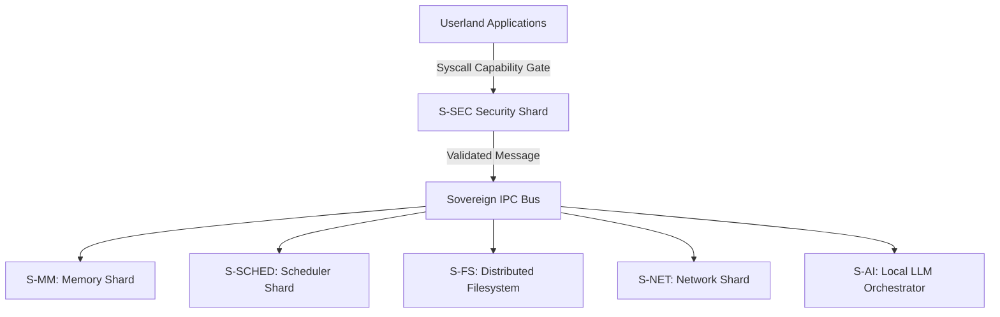

# 🛡️ SigmaOS — Sovereign, AI-Native Operating System

> **"Sovereignty is the ultimate efficiency."**
> The world's first industrial-grade microkernel designed for total digital autonomy, post-quantum resilience, and Indian industrial compliance.

---

## 🎯 Overview

SigmaOS is a sovereign, zero-dependency, AI-native operating system built entirely in Rust. It discards legacy POSIX assumptions to build a hyper-secure, capability-based microkernel designed for an AI-first, object-oriented ecosystem.

### Core Pillars

- **Post-Quantum Cryptography**: Native Kyber-1024 KEM + Dilithium-5 signatures (NIST FIPS 203/204).
- **Capability-Based Security**: 64-bit hardware-enforced permission model replacing legacy ACLs.
- **Shard Architecture**: 600+ hot-swappable kernel modules with zero-latency IPC.
- **AI-Native Design**: Local LLM inference as a first-class OS primitive.
- **India-First**: Native GST, Income Tax, UPI, and 22-language support.


---

## 📊 System Architecture

SigmaOS decomposes the traditional monolithic kernel into specialized, isolated shards. The interaction between these shards is governed by a capability-enforced transaction bus.



- **S-MM**: Sovereign Memory Manager (Buddy Allocator).
- **S-SCHED**: Predictive Multi-Priority Scheduler (MLFQ + CFS + EDF).
- **S-FS**: Sovereign Distributed Filesystem (VFS + SigmaFS).
- **S-SEC**: Security Framework (PQC + MAC + Sandbox).
- **S-AI**: AI Task Orchestrator (Local LLM routing).


---

## 🚀 Quick Start

### Running the QEMU Demo (Works Today)

Ensure you have the required compiler toolchain and emulation packages:

```bash

# Install dependencies

sudo apt install -y build-essential nasm cmake qemu-system-x86 golang-go xorriso

# Clone the repository

git clone https://github.com/AaryanSinghChauhan09/SigmaOS.git
cd SigmaOS

# Build the system image

make clean && make all -j$(nproc)

# Run in QEMU

qemu-system-x86_64 -cdrom build/sigmaos.iso -m 2G -serial stdio
```

### Profile Builds

SigmaOS supports declarative compilation profiles specified at build-time:

```bash
make PROFILE=standalone all    # Full desktop ISO
make PROFILE=rtos all          # Hard real-time ELF
make PROFILE=cloud all         # Headless cloud image
make PROFILE=browser all       # WASM bundle
```

---

## 🔒 Security & Sandboxing

SigmaOS features a capability-native access control system. Programs are executed with explicit privilege tokens (capabilities) rather than generic user IDs.

```rust
// Capability delegation example
let token = CapabilityToken::new()
    .allow_network("tcp", 80)
    .allow_read("/var/www");
```

For a detailed review of all security policies, see the canonical [Security Framework](https://github.com/AaryanSinghChauhan09/SigmaOS/wiki) page on the Wiki.

---

## 📚 Canonical Documentation (GitHub Wiki)

```text
Phase F (Competitor Crusher)   ████████████████████  100% ✅
Phase G (Kernel Boot)          ████████████░░░░░░░░   60% ← ACTIVE
Phase H (India Stack)          ░░░░░░░░░░░░░░░░░░░░    0% (blocked on G)
```

### Current Status

- ✅ Kernel scheduler (MLFQ+CFS+EDF)
- ✅ Syscalls (I/O + Process)
- ✅ Physical MM (buddy allocator)
- 🔄 Virtual MM (paging) - Partial
- ✅ APIC + timer
- ✅ sigma_pledge + sigma_unveil
- ✅ Kyber-1024 KEM + Dilithium-5
- 🔄 TCP/UDP stack - Partial
- ✅ Ext4 + FAT32 filesystems
- ✅ NVMe + USB xHCI drivers
- ✅ Zenith Desktop prototype
- ✅ sigma-pkg CLI
- ⬜ Bootable ISO (Phase G)


---

## 🤝 Contributing

We welcome contributions! See [CONTRIBUTING.md](CONTRIBUTING.md) for guidelines.

### High-Impact Areas

- Round-robin scheduler implementation
- Buddy allocator completion
- sigma-sh REPL
- USB HID keyboard driver
- VESA framebuffer driver
- Package recipes


---

## 📚 Documentation

> **All plans, roadmaps, blueprints, and specifications have been migrated to the [GitHub Wiki](https://github.com/AaryanSinghChauhan09/SigmaOS/wiki).**

### Repository Documentation

- [CONTRIBUTING.md](https://github.com/AaryanSinghChauhan09/SigmaOS/wiki/CONTRIBUTING) — Contribution guidelines
- [CHANGELOG.md](CHANGELOG.md) — Version history

### GitHub Wiki (Canonical Documentation)

All detailed documentation, roadmaps, plans, and blueprints live in the GitHub Wiki:

- 🗺️ **[Future Development Roadmap](https://github.com/AaryanSinghChauhan09/SigmaOS/wiki/FUTURE-DEVELOPMENT-ROADMAP)** — Long-term vision
- 🔧 **[Improvement Plan](https://github.com/AaryanSinghChauhan09/SigmaOS/wiki/ImprovementPlan)** — Master improvement tracking
- 🐧 **[Linux Distro Parity Roadmap](https://github.com/AaryanSinghChauhan09/SigmaOS/wiki/LINUX_DISTRO_PARITY_ROADMAP)** — Distro compatibility plans
- 🛡️ **[Defensive Audit Systems](https://github.com/AaryanSinghChauhan09/SigmaOS/wiki/DEFENSIVE_AUDIT_SYSTEMS_BLUEPRINT)** — Security audit blueprints
- 💾 **[Filesystem Spec](https://github.com/AaryanSinghChauhan09/SigmaOS/wiki/FILESYSTEM_SPEC)** — SigmaFS specification
- 🖥️ **[Win32 Compatibility](https://github.com/AaryanSinghChauhan09/SigmaOS/wiki/WIN32_COMPATIBILITY_PLANS)** — Windows compatibility layer
- 📡 **[Interoperability Standards](https://github.com/AaryanSinghChauhan09/SigmaOS/wiki/INTEROPERABILITY_STANDARDS_ROADMAP)** — Cross-platform interop
- ⚡ **[Realtime & HPC Scheduling](https://github.com/AaryanSinghChauhan09/SigmaOS/wiki/REALTIME_HPC_SCHEDULING_ROADMAP)** — Scheduling subsystem
- 🔍 **[Observability & Tracing](https://github.com/AaryanSinghChauhan09/SigmaOS/wiki/OBSERVABILITY_TRACING_ROADMAP)** — System observability
- 📦 **[OCI Container Runtime](https://github.com/AaryanSinghChauhan09/SigmaOS/wiki/OCI_CONTAINER_RUNTIME_ROADMAP)** — Container support
- 🧩 **[Constellation Mesh](https://github.com/AaryanSinghChauhan09/SigmaOS/wiki/CONSTELLATION_MESH_ROADMAP)** — Distributed mesh network
- 🔒 **[Qubes Isolation](https://github.com/AaryanSinghChauhan09/SigmaOS/wiki/QUBES_ISOLATION_ROADMAP)** — Compartmentalized security
- 📋 **[Next Steps Guidelines](https://github.com/AaryanSinghChauhan09/SigmaOS/wiki/NEXT_STEPS_GUIDELINES)** — Current priorities
- 🏛️ **[3-Year Strategic Vision](https://github.com/AaryanSinghChauhan09/SigmaOS/wiki/3-YEAR-STRATEGIC-VISION)** — Strategic direction
- 📊 **[What's Working & Not Working](https://github.com/AaryanSinghChauhan09/SigmaOS/wiki/WHAT_IS_WORKING_AND_NOT_WORKING)** — System status
- 🌐 **[Full Wiki Index](https://github.com/AaryanSinghChauhan09/SigmaOS/wiki)** — All documentation


---

## 📄 License

Dual-licensed under MIT and GPL-2.0. See the `LICENSE` file for details.
