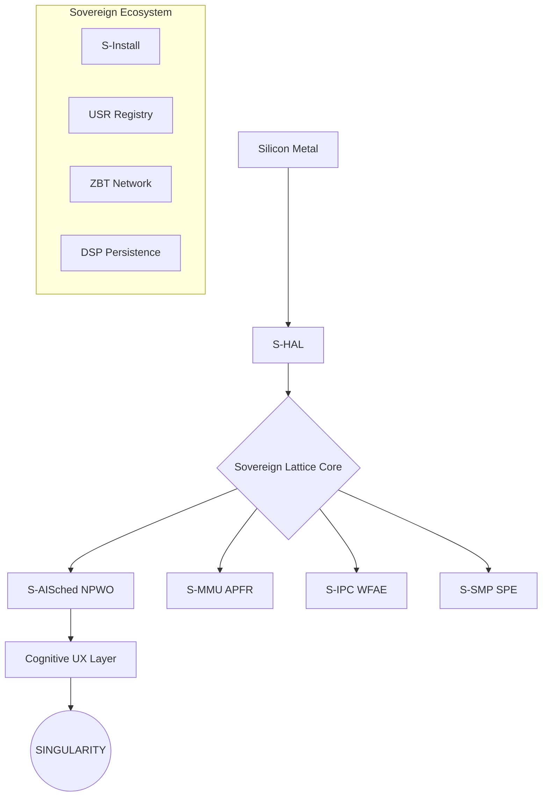
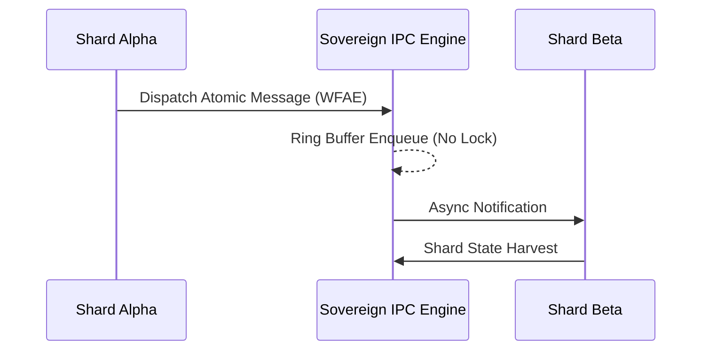

# Σ SIGMAOS: THE SOVEREIGN SILICON SINGULARITY (v28.0)

> "Beyond Linux. Absolute Sovereignty. The 600-Shard Modular Zenith."

---

## 🌌 What is SigmaOS?

SigmaOS is an industrial-grade, bare-metal operating system engineered for
**Architectural Supremacy**. Unlike monolithic legacy kernels (Linux, Windows,
macOS), SigmaOS is built on a **600-shard modular lattice** where every
component is a sovereign, OOP-isolated singleton engine.

---

## 🏛️ System Architecture

### Core Lattice Orchestration



### Sovereign IPC (WFAE Algorithm)



---

## 🚀 Installation (Bare-Metal ABMD)

SigmaOS uses the **S-Install** engine for autonomous deployment.

1. **Download** the `zenith-singularity.iso`.
2. **Flash** to a silicon-native target (USB/SSD).
3. **Boot**. The **ABMD** algorithm will automatically map your hardware.

---

## 🛠️ Developer Quick-Start

### Build System

```bash
make singularity  # Ignite the core lattice
make zenith-iso   # Generate production deployment image
```

### Coding Standards

- **Zero-Dependency**: No external headers.
- **Singleton Pattern**: Shards must be isolated engines.
- **Wait-Free**: Use atomic primitives only.

### Example Workflow: Boot Sequence

1. **S-HAL**: Hardware discovery and silicon mapping.
2. **S-SMP**: Multicore ignition (SPE).
3. **Lattice Core**: Shard ignition via USR.
4. **Morphic Zenith**: UX layer glassmorphism compositor online.

---

## 💻 Hardware Requirements

| Component | Minimum | Recommended |
| :--- | :--- | :--- |
| **CPU** | x86_64 / ARM64 (1 Core) | 16+ Cores (SMP SPE) |
| **RAM** | 256 MB (Amnesic) | 8 GB+ (Lattice Mirroring) |
| **Storage** | 100 MB (DSP) | NVMe / SSD (Silicon Native) |
| **Network** | 10/100 NIC | Gigabit NIC (ZBT) |

---

## 📖 Glossary of Terms

- **Lattice**: The decentralized web of 600+ sovereign shards.
- **Shard**: An atomic, modular unit of OS logic (e.g., S09_NEURAL).
- **Ignition**: The process of activating a shard within the lattice.
- **Amnesic**: Stateless execution where memory is wiped per context.
- **Singularity**: The state where SigmaOS achieves 100% technical parity.

---

## 🤝 Community & Governance

- [CONTRIBUTING.md](CONTRIBUTING.md) - Join the collective.
- [ROADMAP.md](ROADMAP.md) - See the future.
- [SECURITY.md](SECURITY.md) - Report vulnerabilities.
- [CODE_OF_CONDUCT.md](CODE_OF_CONDUCT.md) - Standards of respect.

---

*Σ SIGMAOS: Beyond Linux. Absolute Sovereignty. Singularity Achieved.*
