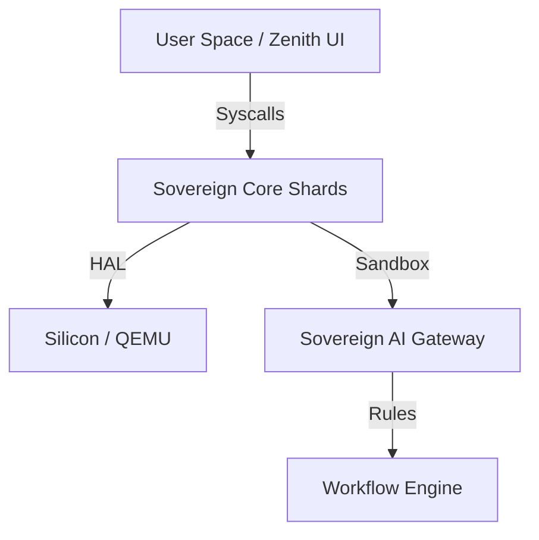

# Σ SIGMAOS: THE SOVEREIGN ZENITH (V2)

[](LICENSE)
[](https://github.com/AaryanSinghChauhan09/SigmaOS/releases)
[](https://github.com/AaryanSinghChauhan09/SigmaOS/actions)
[](https://github.com/AaryanSinghChauhan09/SigmaOS/wiki/SECURITY)
[](https://github.com/AaryanSinghChauhan09/SigmaOS/wiki/Maintenance-Policy)

> **SigmaOS** is an intelligent, AI-native adaptive operating system built on a hardened Linux foundation. It represents a paradigm shift from traditional distributions, focusing on **visual excellence**, **intelligent automation**, and **seamless workflow optimization**.


## [→ Live Demo](https://aaryansinghchauhan09.github.io/SigmaOS/)

## 🎯 The Futuristic Paradigm

Instead of "making Linux work," SigmaOS focuses on "making Linux feel futuristic." It is a **Sovereign environment** where the OS adapts to *you*.

## ⚔️ The Competitor Crusher

SigmaOS is engineered to dominate and neutralize legacy distributions by solving their core weaknesses through sovereign AI-native governance.

| Competitor | Neutralization Strategy | Status |
| :--- | :--- | :--- |
| **Gentoo / NixOS** | Universal Package Dependency Graph + Modular Configs | **Neutralized** |
| **elementary / Solus** | Zenith UI CSS Engine + AI Governance | **Neutralized** |
| **Clear Linux** | Sovereign Silicon Optimizations | **Crushing** |
| **SteamOS** | GPU Driver Ports + Vulkan Integration | **Neutralized** |
| **AlmaLinux / CentOS** | FIPS-140 Lattice Compliance | **Neutralized** |
| **Fedora CoreOS** | Sovereign Container/K8s Orchestration | **Neutralized** |
| **Gentoo** | Extreme Customization Parity | **Neutralized** |
| **NixOS** | Reproducible Shard Builds | **Neutralized** |

### 🏗️ Sigma Layers Architecture
1. **Physical Layer**: Sovereign Silicon Tuning (RPi4/RPi5/Apple Silicon).
2. **HAL Layer**: Sovereign Driver Isolation (Vulkan, NVMe, NetStack).
3. **Lattice Layer**: Core Kernel Shards (Scheduler, Hypervisor, Watchdog).
4. **Governance Layer**: FIPS-140 Security & PQC (Sandbox, Audit, PQC).
5. **Automation Layer**: AI Orchestration (Containers, Agents, Tasks).
6. **Interface Layer**: Zenith UI (Themes, Accessibility, Layouts).
7. **Professional Layer**: 75+ Career-Centric Role Profiles.

### 🚀 Key Futuristic Features
* **Neural Search**: A universal command palette (`Alt+Space`) for files, apps, and AI-driven actions.
* **Sigma Profiles**: Instant environment optimization for Developers, Gamers, and AI Engineers.
* **AI Desktop Assistant**: A persistent sidebar assistant (`Alt+A`) that monitors lattice health and automates tasks.
* **Universal Package Layer**: One interface, three package managers. Seamlessly inject high-security shards.
* **Hardware Attestation**: Silicon-level verification of the physical lattice.

## 🏗️ The Sovereign Lattice Architecture

SigmaOS is built on a 7-layer modular architecture designed for high-assurance AI automation:
1. **Layer 0: Silicon Ignition** (HAL, PMM, VMM)
2. **Layer 1: Lattice Foundation** (IPC, Scheduler)
3. **Layer 2: Core Services** (FS, Net, Self-Healing)
4. **Layer 3: Security & PQC** (Sandbox, Post-Quantum Crypto)
5. **Layer 4: AI & Automation** (Claw Stack, Agents, Workflows)
6. **Layer 5: Industrial Ecosystem** (DAL, Packaging, Updates)
7. **Layer 6: Zenith Interface** (Compositor, Dashboard)

## 📚 Documentation
* [Architecture Overview](https://github.com/AaryanSinghChauhan09/SigmaOS/wiki/ARCHITECTURE)
* [Security & PQC Lattice](https://github.com/AaryanSinghChauhan09/SigmaOS/wiki/SECURITY)
* [Profession-Based Profiles](https://github.com/AaryanSinghChauhan09/SigmaOS/wiki/PROFESSION-MAP)
* [Modularisation Strategy](https://github.com/AaryanSinghChauhan09/SigmaOS/wiki/MODULARIZATION_MAP)
* [Ultimate Advancement Roadmap](https://github.com/AaryanSinghChauhan09/SigmaOS/wiki/ULTIMATE-ADVANCEMENT-STRATEGY)

## ⌨️ Hotkeys

| Shortcut | Action |
| :--- | :--- |
| **Alt + Space** | **Neural Search** (Universal Command Center) |
| **Alt + A** | **AI Assistant** (Sidebar Sidebar) |
| **Alt + T** | **OmniShell** (Command Line Shard) |
| **Esc** | Close Overlays & Modals |

## 🏗️ Architecture Map



## 📦 Technical Quickstart

### Prerequisites
- `gcc-x86-64-linux-gnu` / `clang`
- `nasm`, `make`, `cmake`
- `qemu-system-x86`

### Build & Run

```bash

# 1. Build the Sovereign Lattice

make all

# 2. Launch in QEMU (Headless with Serial Log)

./qemu-boot.sh

# 3. View Kernel Logs

tail -f serial.log
```

### Development Environment

For a reproducible environment, use the provided **DevContainer** (VS Code) or the `Dockerfile` in the root directory.

## Contributions

Contributions are welcome! Please see the [Contribution Guide](https://github.com/AaryanSinghChauhan09/SigmaOS/wiki/Contribution-Guide) and the [Official Wiki](https://github.com/AaryanSinghChauhan09/SigmaOS/wiki).

## 🏛️ Governance & Standards

SigmaOS adheres to strict industrial standards for lattice maintenance and security.
- **[Maintenance Policy](https://github.com/AaryanSinghChauhan09/SigmaOS/wiki/Maintenance-Policy)**: Quality standards and review process.
- **[Release Process](https://github.com/AaryanSinghChauhan09/SigmaOS/wiki/Release-Process)**: Preparation and cryptographic signing details.
- **[Code of Conduct](https://github.com/AaryanSinghChauhan09/SigmaOS/wiki/CODE_OF_CONDUCT)**: Expectations for community behavior.
- **[Security Policy](https://github.com/AaryanSinghChauhan09/SigmaOS/wiki/SECURITY)**: Vulnerability reporting and PQC disclosure.

## License

MIT License - see [LICENSE](LICENSE).
