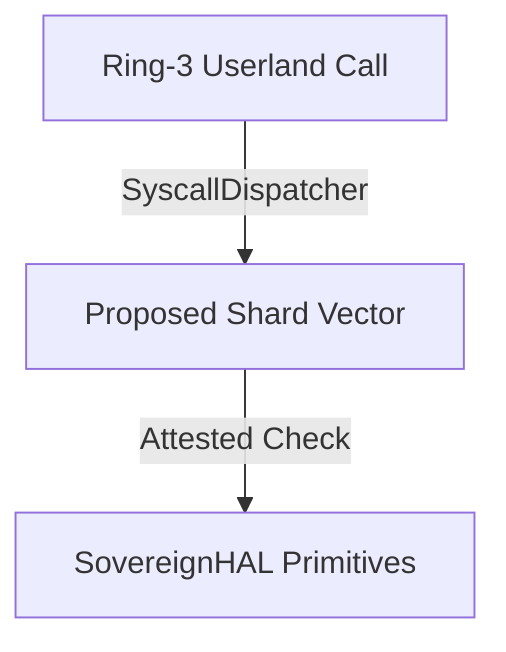

# SigmaOS RFC (Request For Comments) Template

## Title: [Subsystem Expansion Design Proposal]
- **Author**: [Your Name/PQC Key ID]
- **Status**: Draft / Under Review / Approved
- **Date**: YYYY-MM-DD
- **Branch Focus**: main / standalone / rtos / mobile / microkernel

---

## 1. Executive Summary
Provide a brief 2-3 sentence overview of the design goals, target architectural shard, and anticipated performance changes.

---

## 2. Technical Motivation
Why is this expansion required? Explain what competency gap is addressed and how it compares against competing designs (e.g., NixOS, Clear Linux, or CAINE).

---

## 3. High-Level Architecture
Describe how this module interacts with the core microkernel, tracing the dispatch pipeline:



---

## 4. Zero-Dependency Code Primitives & Layout
Provide concrete mock interfaces of the C++ classes conforming to static singletons:

```cpp
namespace SigmaOS {
namespace Subsystem {

class ProposedSingleton : public SigmaOS::SigmaObject {
public:
    const char* type_name() const noexcept override { return "ProposedSingleton"; }
    static ProposedSingleton& getInstance();
    void execute();
};

} // namespace Subsystem
} // namespace SigmaOS
```

---

## 5. Security & Attestation Vectors
Define the Dilithium-5 attestation criteria to authorize the shard boundary load.

---

## 6. Performance Benchmarks & Targets
Specify maximum acceptable context switch cycle costs and memory footprints.
 