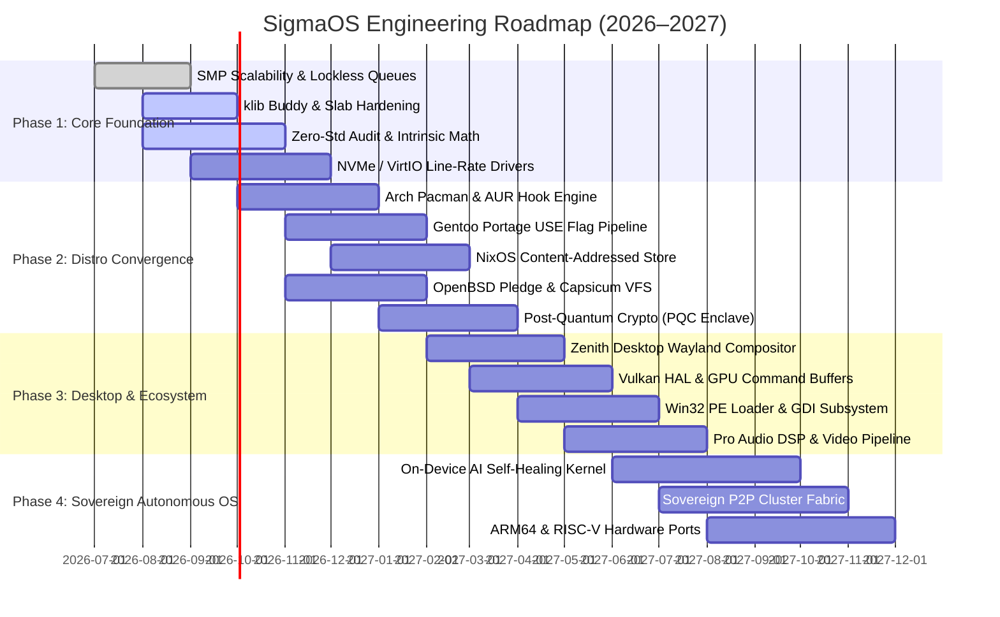
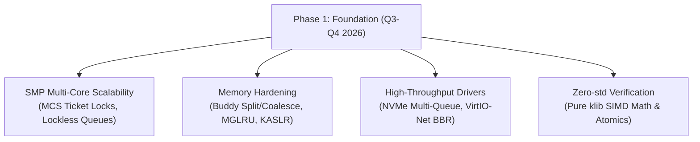
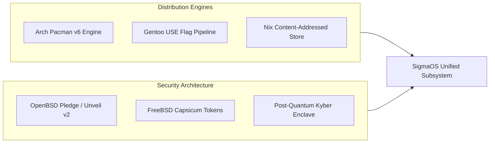
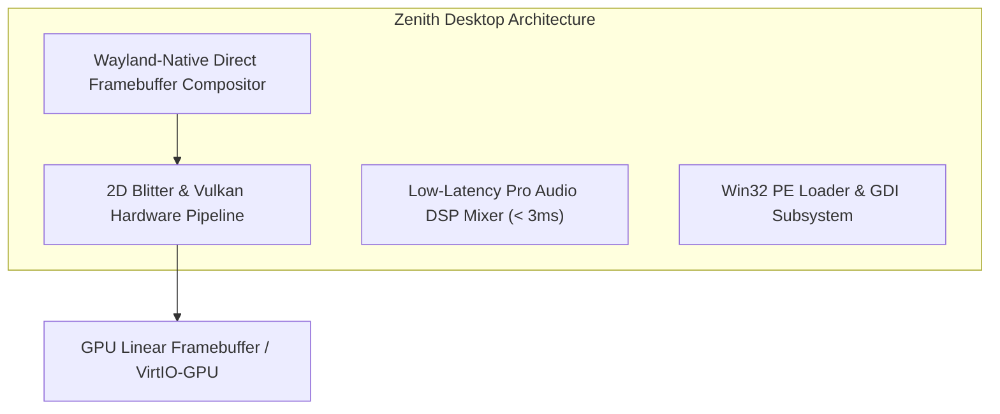
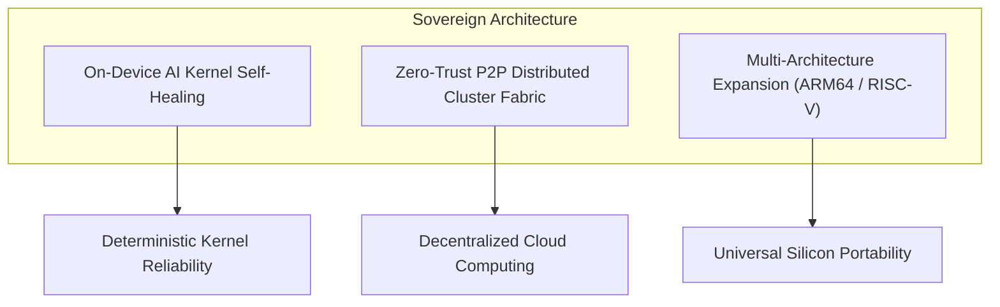
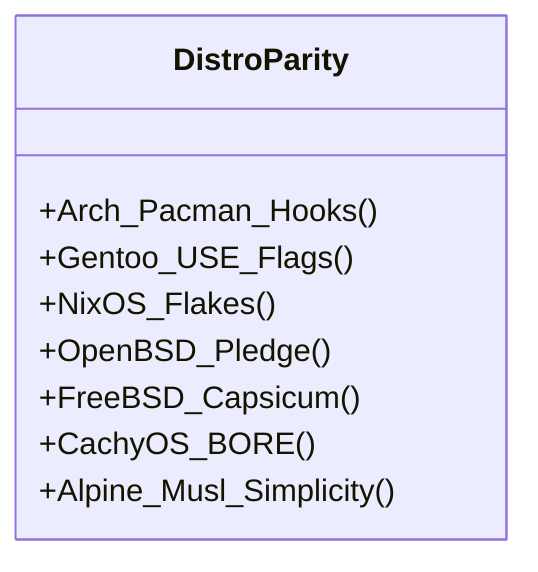

# SigmaOS Development Roadmap (2026–2027)

This document establishes the strategic, multi-phase technical roadmap for **SigmaOS** across 2026 and 2027. It outlines engineering milestones, architectural deliverables, distribution convergence targets, and key performance indicators (KPIs).

***

## 1. Roadmap Overview & Timeline

***

## 2. Phase 1: Core Foundation & Subsystem Stabilization (Q3–Q4 2026)

**Objective**: Fortify the `#![no_std]` core kernel, optimize memory management algorithms, achieve line-rate storage I/O, and eliminate all remaining runtime overheads.

### Key Deliverables:

1.  **Multi-Core SMP Scalability**:
    *   Transition from simple spinlocks to Mellor-Crummey and Scott (MCS) scalable ticket locks to eliminate lock contention on high-core-count processors (32+ cores).
    *   Implement per-CPU runqueues for the BORE and EEVDF schedulers with NUMA-aware work stealing.
2.  **Custom Allocator & Memory Hardening**:
    *   Refine buddy allocator buddy-coalescing algorithms using bitwise XOR arithmetic in O(1) time.
    *   Deploy Kernel Address Space Layout Randomization (KASLR) with hardware entropy fed from RDRAND/RDSEED.
    *   Integrate MGLRU (Multi-Gen LRU) page scanning in `LinuxKswapd` for smooth memory reclamation under heavy workloads.
3.  **Line-Rate Device Drivers**:
    *   Complete asynchronous DMA submission and completion queues for NVMe PCIe 4.0/5.0 SSDs.
    *   Implement Intel E1000/E1000e multiqueue Rx/Tx ring descriptors with hardware checksum offload.

***

## 3. Phase 2: Distro Convergence & Defensive Security (Q4 2026 – Q1 2027)

**Objective**: Deliver cross-distribution compatibility and establish an uncompromising security posture inspired by OpenBSD, FreeBSD, and Qubes OS.

### Key Deliverables:

1.  **Universal Distribution Convergence**:
    *   **Arch Linux**: Full support for `.pkg.tar.zst` packages, AUR compilation scripts, and pre/post transaction Pacman hooks.
    *   **Gentoo Linux**: Portage-inspired dynamic `USE` flag engine allowing users to toggle per-package features and compile with architecture-specific compiler flags (`-march=native`).
    *   **NixOS**: Immutable, content-addressed `/nix/store` closure layouts enabling deterministic builds and zero-downtime atomic rollbacks.
2.  **Defensive Security & Sandboxing**:
    *   **Pledge & Unveil v2**: Enforce syscall filtering and path-hiding on all userland daemons and desktop applications.
    *   **Capsicum Object Capabilities**: Bind non-forgeable capability tokens to open file descriptors, sockets, and IPC channels.
    *   **Post-Quantum Cryptography (PQC)**: Enclave support for ML-KEM (Kyber-768/1024) key encapsulation and ML-DSA (Dilithium) digital signatures.

***

## 4. Phase 3: Desktop Environment & Universal App Ecosystem (Q1–Q2 2027)

**Objective**: Deliver a fluid, modern graphical user interface (Zenith Desktop) and broad application compatibility.

### Key Deliverables:

1.  **Zenith Desktop Environment**:
    *   Native Wayland display server implementation rendering directly to GPU framebuffers.
    *   Dynamic fractional scaling, wide color gamut (HDR) support, and fluid sub-pixel text rendering.
2.  **Universal Application Compatibility**:
    *   **Linux ABI**: 100% coverage of core POSIX and Linux 6.x syscalls.
    *   **Win32 Compatibility**: Native PE (Portable Executable) binary loader with Win32 User32/GDI32 emulation for running legacy Windows tools.
3.  **Multimedia & Audio Subsystems**:
    *   Pro audio multi-track mixer with real-time parametric EQ, dynamic compression, and low-latency DSP chains.
    *   Hardware-accelerated video decoding (H.264, HEVC, AV1).

***

## 5. Phase 4: Sovereign Autonomous OS & Cloud Fabric (Q3–Q4 2027)

**Objective**: Transform SigmaOS into an autonomous, self-healing sovereign operating system capable of resilient peer-to-peer clustering and multi-architecture operation.

### Key Deliverables:

1.  **AI-Driven Self-Healing**:
    *   Integrated on-device micro-model for anomaly detection, automated dead-lock resolution, and proactive page defragmentation.
    *   Transactional driver crash recovery without system reboots.
2.  **Sovereign P2P Cluster Fabric**:
    *   Decentralized node discovery and cryptographic ledger synchronization without reliance on centralized DNS or proprietary clouds.
3.  **Multi-Architecture Expansion**:
    *   **`aarch64` Port**: Full support for ARM64 servers, Apple Silicon bare-metal, and Raspberry Pi 5.
    *   **`riscv64` Port**: Native support for RISC-V QEMU and SiFive hardware platforms.

***

## 6. Key Performance Indicators & Benchmark Targets

The following metrics represent target performance thresholds for SigmaOS:

| Benchmark / Metric | Traditional Linux Baseline | SigmaOS Target (2026) | SigmaOS Target (2027) |
|:---|:---|:---|:---|
| **Cold Boot Time (QEMU x86\_64)** | ~1,200 ms | **< 300 ms** | **< 150 ms** |
| **SigmaBus IPC Latency (64B)** | 850 ns (D-Bus) | **< 150 ns** | **< 90 ns** |
| **Context Switch Overhead** | 650 ns | **< 400 ns** | **< 280 ns** |
| **Idle Memory Footprint** | ~350 MB | **< 48 MB** | **< 24 MB** |
| **SAT Dependency Solve (10k pkgs)**| 450 ms | **< 50 ms** | **< 20 ms** |
| **Audio Buffer Round-Trip Latency**| 12.5 ms | **< 4.0 ms** | **< 1.8 ms** |
| **Driver Recovery After Crash** | System Reboot (Kernel Panic) | **< 10 ms (Zero Reboot)** | **< 2 ms (Transparent)**|

***

## 7. Strategic Distro Parity Roadmap

*   **Arch Linux**: Rolling release stability, cutting-edge kernel parameters, AUR tooling compatibility.
*   **Gentoo Linux**: Fine-grained compiler optimization flags, source distribution capabilities.
*   **NixOS**: Purely functional system generation, atomic rollbacks, isolated build derivations.
*   **OpenBSD**: Strict process privilege reduction (`pledge`), filesystem hiding (`unveil`), proactive W^X enforcement.
*   **FreeBSD**: Fine-grained object capabilities (`capsicum`), multi-tenant Jails isolation.
*   **CachyOS**: Ultra-responsive BORE scheduler heuristics, Ananicy-CPP rule prioritization.

***

## 8. Related Documentation

*   [Home](Home) — Main Wiki documentation hub.
*   [Architecture Overview](Architecture-Overview) — Modular system architecture.
*   [Scheduler Architecture](Scheduler-Architecture) — BORE and EEVDF implementation details.
*   [Security & Hardening](Security-Hardening) — Pledge, unveil, and capabilities.
*   [Contributing](Contributing) — Engineering standards and pull request workflows.

*SigmaOS Roadmap 2026–2027 — Maintained by the SigmaOS Core Engineering Team.*
