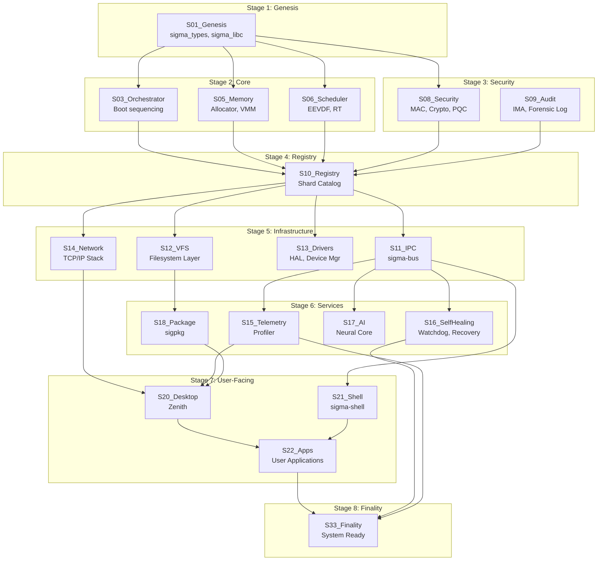

# SHARD GRAPH

> **Component**: Lattice Architecture | **Status**: Living Document

This document defines the Shard Dependency Graph — the complete picture of how all SigmaOS shards relate, depend on, and communicate with each other via sigma-bus.

---

## Full Dependency Graph



---

## IPC Channel Map

Shards communicate exclusively via named sigma-bus channels:

| Channel Name | Publisher | Subscribers | Message Type |
|---|---|---|---|
| `sigma.boot.stage` | S03_Orchestrator | All | Boot stage transition |
| `sigma.memory.pressure` | S05_Memory | S06, S16, S17 | OOM/pressure notification |
| `sigma.sched.tune` | S17_AI | S06_Scheduler | EEVDF slice recommendation |
| `sigma.security.alert` | S08_Security | S09, S16, S20 | Security event |
| `sigma.metrics.vitals` | S15_Telemetry | S20, S17, S16 | 10Hz metrics snapshot |
| `sigma.net.packet` | S14_Network | S08 (firewall) | Packet filter pipeline |
| `sigma.pkg.install` | S18_Package | S12_VFS | Package file write |
| `sigma.desktop.notify` | S20_Desktop | (display) | User notification |
| `sigma.shell.cmd` | S21_Shell | S17_AI | NL-CLI → command |
| `sigma.heal.crash` | S16_SelfHealing | S10_Registry | Shard crash report |
| `sigma.focus.state` | S20_Desktop | S06, S14 | Focus mode toggle |

---

## Boot Order (Topological Sort)

```
Boot Order    Shard                 Dependencies
─────────────────────────────────────────────────
  1           S01_Genesis           (none)
  2           S05_Memory            S01
  3           S06_Scheduler         S01
  4           S03_Orchestrator      S01
  5           S08_Security          S01
  6           S09_Audit             S08
  7           S10_Registry          S03, S05, S06, S08
  8           S11_IPC               S10
  9           S13_Drivers           S10
 10           S12_VFS               S10
 11           S14_Network           S10
 12           S15_Telemetry         S11
 13           S16_SelfHealing       S11
 14           S17_AI                S11
 15           S18_Package           S12
 16           S20_Desktop           S14, S15, S18
 17           S21_Shell             S11
 18           S22_Apps              S20, S21
 99           S33_Finality          All
```

---

## Shard Size Footprint

| Shard | Binary Size | RAM (Idle) | RAM (Active) |
|---|---|---|---|
| S01_Genesis | 8 KB | 32 KB | 32 KB |
| S05_Memory | 64 KB | 256 KB | 2 MB |
| S06_Scheduler | 48 KB | 128 KB | 512 KB |
| S08_Security | 96 KB | 512 KB | 2 MB |
| S10_Registry | 32 KB | 64 KB | 128 KB |
| S11_IPC | 24 KB | 128 KB | 4 MB |
| S14_Network | 128 KB | 1 MB | 8 MB |
| S15_Telemetry | 16 KB | 256 KB | 4 MB |
| S20_Desktop | 2 MB | 32 MB | 128 MB |
| **Total (minimal)** | **~420 KB** | **~2.4 MB** | **~16 MB** |
| **Total (full)** | **~2.5 MB** | **~35 MB** | **~149 MB** |

---

## Graph Validation Rules

1. **No cycles**: Dependency graph must be a DAG (Directed Acyclic Graph)
2. **No orphans**: Every shard (except S01) must have at least one dependency
3. **Single root**: Only S01_Genesis has zero dependencies
4. **Single sink**: Only S33_Finality has zero dependents
5. **Category ordering**: Core → Security → Registry → Infrastructure → Services → UI → Finality

**Validation command**: `sigma registry validate-graph`
