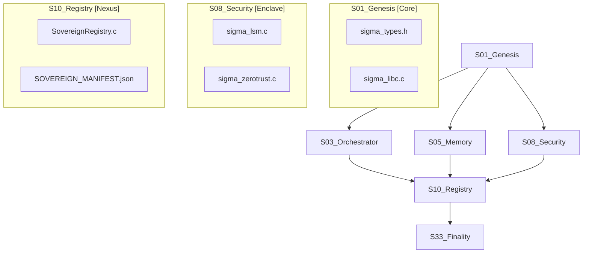

# 📊 SigmaOS Shard Dependency Graph (v4.0 Finality)

```mermaid
graph TD
    S01_Genesis --> S03_Orchestrator
    S01_Genesis --> S05_Memory
    S01_Genesis --> S08_Security
    S03_Orchestrator --> S10_Registry
    S05_Memory --> S10_Registry
    S08_Security --> S10_Registry
    S10_Registry --> S33_Finality

    subgraph "S01_Genesis [Core]"
        sigma_types.h
        sigma_libc.c
    end
    subgraph "S08_Security [Enclave]"
        sigma_lsm.c
        sigma_zerotrust.c
    end
    subgraph "S10_Registry [Nexus]"
        SovereignRegistry.c
        SOVEREIGN_MANIFEST.json
    end
```

