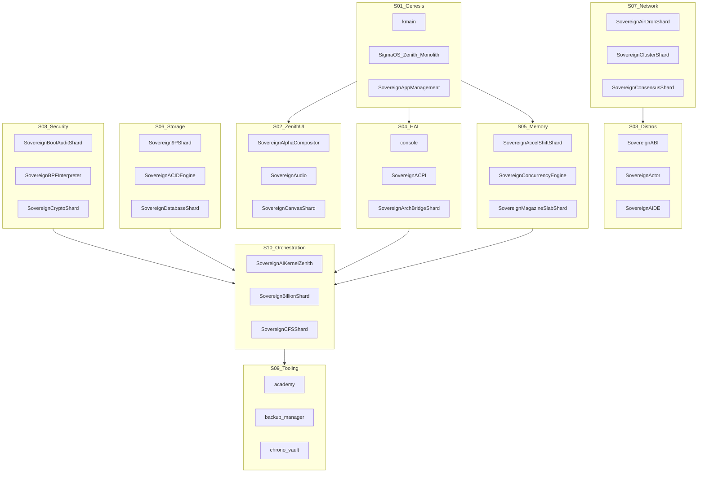

# 📊 SigmaOS Shard Dependency Graph

```mermaid
graph TD
    S01_Genesis --> S02_ZenithUI
    S01_Genesis --> S04_HAL
    S01_Genesis --> S05_Memory
    S05_Memory --> S10_Orchestration
    S06_Storage --> S10_Orchestration
    S04_HAL --> S10_Orchestration
    S08_Security --> S10_Orchestration
    S10_Orchestration --> S09_Tooling
    S07_Network --> S03_Distros
    subgraph S01_Genesis
        kmain
        SigmaOS_Zenith_Monolith
        SovereignAppManagement
    end
    subgraph S02_ZenithUI
        SovereignAlphaCompositor
        SovereignAudio
        SovereignCanvasShard
    end
    subgraph S03_Distros
        SovereignABI
        SovereignActor
        SovereignAIDE
    end
    subgraph S04_HAL
        console
        SovereignACPI
        SovereignArchBridgeShard
    end
    subgraph S05_Memory
        SovereignAccelShiftShard
        SovereignConcurrencyEngine
        SovereignMagazineSlabShard
    end
    subgraph S06_Storage
        Sovereign9PShard
        SovereignACIDEngine
        SovereignDatabaseShard
    end
    subgraph S07_Network
        SovereignAirDropShard
        SovereignClusterShard
        SovereignConsensusShard
    end
    subgraph S08_Security
        SovereignBootAuditShard
        SovereignBPFInterpreter
        SovereignCryptoShard
    end
    subgraph S09_Tooling
        academy
        backup_manager
        chrono_vault
    end
    subgraph S10_Orchestration
        SovereignAIKernelZenith
        SovereignBillionShard
        SovereignCFSShard
    end
```
