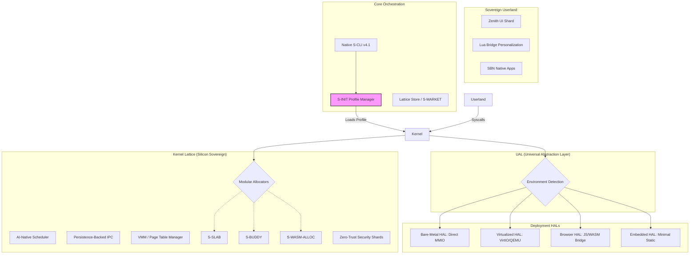

# 🗺️ SigmaOS Sovereign Architecture Roadmap

This diagram illustrates the layered modularity of the SigmaOS Sovereign Lattice. The **Universal Abstraction Layer (UAL)** ensures that a single kernel core can adapt to any target format by swapping hardware-facing shards.

---

## 🏗️ Layer Descriptions

### 1. Sovereign Userland
High-level interaction layers driven by **Lua Scripting** and the **Zenith Compositor**. This layer is environment-agnostic.

### 2. Core Orchestration
The "Brain" of the OS. The **S-INIT** system reads boot profiles (Server, IoT, Dev) and activates the required shard lattice. The **S-CLI** provides the professional-grade toolchain for developers.

### 3. Kernel Lattice
The "Soul" of the OS. Pure silicon primitives for task scheduling, memory management, and inter-process communication. Every kernel component is a **Sovereign Shard** that can be enabled or disabled at build-time.

### 4. Universal Abstraction Layer (UAL)
The "Bridge" that makes SigmaOS universal. It detects the runtime context and switches the OS to the appropriate **HAL Shard**, ensuring 100% portability.

### 5. Deployment HALs
Hardware-specific implementations. Whether it's physical Raspberry Pi pins, QEMU virtio devices, or browser memory shims, SigmaOS speaks the native language of the underlying host.

---

*This diagram represents the verified architectural state as of SigmaOS v4.1.*
