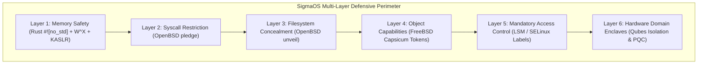
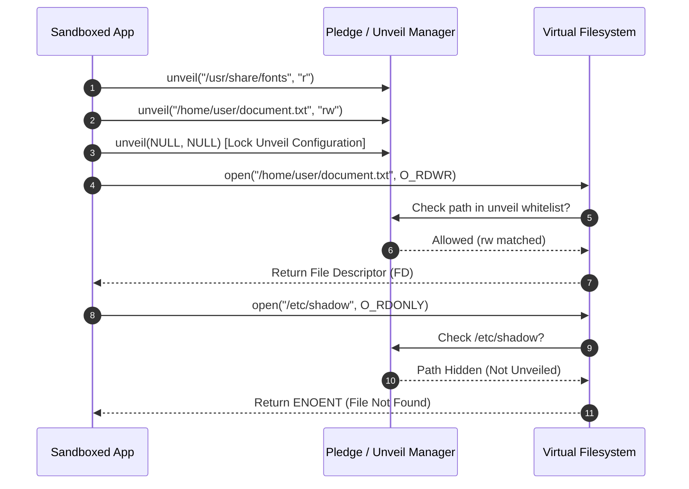
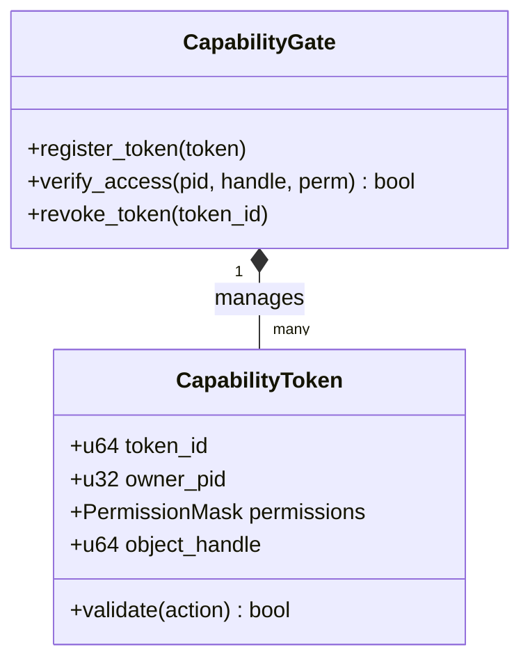
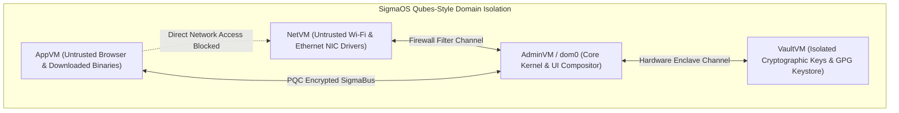
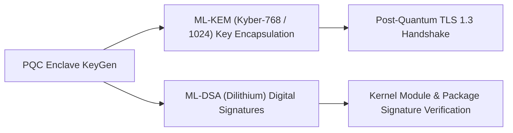

# Security Hardening: Pledge, Unveil, Capabilities & Enclaves

This document provides a comprehensive architectural specification of the **Defensive Security & Hardening Architecture** of **SigmaOS**, covering OpenBSD-inspired `pledge()` and `unveil()`, FreeBSD-inspired Capsicum capability tokens, Linux LSM/SELinux MAC integration, Qubes OS-style domain isolation, and Post-Quantum Cryptographic (PQC) enclaves.

---

## 1. Defense-in-Depth Security Philosophy

SigmaOS abandons the traditional "all-or-nothing" root security model. Instead, every process, kernel subsystem, driver, and application executes within a strictly bounded **defense-in-depth isolation perimeter**.



---

## 2. OpenBSD-Inspired Process Privilege Hardening

### 2.1 Process Sandboxing with `pledge()` (`src/security/pledge.rs`)

`pledge()` allows a process to voluntarily and permanently discard system call privileges that it does not require for its execution lifecycle.

```rust
pub struct PledgePromise {
    permissions: Vec<Permission>,
    active: AtomicBool,
}

impl PledgePromise {
    pub fn new(permissions: Vec<Permission>) -> Self {
        Self {
            permissions,
            active: AtomicBool::new(false),
        }
    }

    /// Permanently activate the pledge (can only drop privileges, never escalate)
    pub fn activate(&self) -> Result<(), PledgeError> {
        if self.active.load(Ordering::SeqCst) {
            return Err(PledgeError::AlreadyActive);
        }
        self.active.store(true, Ordering::SeqCst);
        Ok(())
    }

    pub fn allows(&self, permission: Permission) -> bool {
        if !self.active.load(Ordering::SeqCst) {
            return true; // Unpledged process
        }
        self.permissions.contains(&permission)
    }
}
```

#### Supported Pledge Permission Classes:
- **`stdio`**: Basic console I/O, memory allocation, monotonic clock queries.
- **`rpath`**: Read-only filesystem operations.
- **`wpath`**: Write operations to existing files.
- **`cpath`**: File creation and directory modification.
- **`inet`**: Network socket creation and packet transmission.
- **`unix`**: Unix domain socket IPC communication.
- **`exec`**: Execution of external binaries.
- **`proc`**: Process creation (`fork`, `clone`) and signal dispatch.

> [!CAUTION]
> If a pledged process attempts an unpledged syscall, the kernel immediately terminates the offending thread with a `SIGSEGV` or `SIGKILL`, dumps the CPU registers to the security audit log, and raises an alert.

---

### 2.2 Filesystem Sandboxing with `unveil()` (`src/security/unveil.rs`)

`unveil()` hides the entire filesystem hierarchy from a process, exposing only explicitly declared directory trees with restricted permissions:



---

## 3. FreeBSD Capsicum-Inspired Capability Tokens (`src/security/capability.rs`)

Capsicum eliminates ambient authority by replacing global namespace access with **non-forgeable capability tokens** attached directly to object handles.



Once a process enters Capability Mode:
1. Global filesystem paths (`/etc`, `/tmp`) can no longer be opened directly.
2. All operations must proceed via operations relative to already-held directory tokens (`openat`).
3. Capability tokens are cryptographically signed and cannot be forged across IPC channels.

---

## 4. Mandatory Access Control (MAC) & LSM Integration (`src/security/selinux.rs`)

SigmaOS implements a high-speed Linux Security Module (LSM) hook dispatch engine supporting SELinux-compatible security context labels:

```
system_u:object_r:kernel_t:s0
user_u:object_r:user_home_t:s0
unconfined_u:unconfined_r:zenith_desktop_t:s0
```

Every VFS inode and IPC message endpoint contains a security identifier (SID). Prior to executing an operation, the LSM engine evaluates the compiled policy matrix in O(1) time.

---

## 5. Qubes OS-Inspired Domain Isolation (`src/security/qubes_isolation.rs`)

To isolate untrusted hardware and network stacks, SigmaOS incorporates lightweight microVM domain isolation:



- **`NetVM`**: Encapsulates raw network drivers and firmware blobs. A compromised network driver cannot access kernel memory or application keys.
- **`AppVM`**: Runs untrusted user applications with strict ephemeral memory boundaries.
- **`VaultVM`**: Air-gapped domain for password hashes, private keys, and encryption secrets.

---

## 6. Post-Quantum Cryptography & Enclaves (`src/security/pqc_enclave.rs`)

To guarantee forward secrecy against future quantum computing threats, SigmaOS incorporates native **Post-Quantum Cryptography (PQC)**:



### 6.1 PQC Key Features:
- **ML-KEM (Kyber)**: Integrated into SigmaBus network connections for quantum-resistant shared secret negotiation.
- **ML-DSA (Dilithium)**: Used in `src/sigpkg/` for cryptographic package verification.
- **Zero-Leak Memory Scrubbing**: Sensitive key memory is allocated in non-swappable locked pages and wiped with zeroizing routines immediately upon deallocation.

---

## 7. Memory Paging Hardening & KASLR

1. **W^X (Write XOR Execute)**:
   - Enforced across all page tables in [`src/memory/paging.rs`](../src/memory/paging.rs).
   - No memory page can ever have both `WRITABLE` (Bit 1) and `EXECUTE` (Bit 63 NX clear) flags set simultaneously.
2. **Kernel Address Space Layout Randomization (KASLR)**:
   - Randomizes the base load address of the kernel code, stack, and heap on every boot using hardware entropy.
3. **Stack Canaries & Bounds Checking**:
   - Compiler-generated stack canaries and safe Rust slice windowing eliminate stack-based buffer overflows.

---

## 8. Comparative Security Matrix

| Security Feature | Standard Linux | OpenBSD | FreeBSD | Qubes OS | **SigmaOS** |
|:---|:---|:---|:---|:---|:---|
| **Memory Safety** | No (C code) | No (C code) | No (C code) | Partial (Xen/Linux) | **Pure Rust (`#![no_std]`)** |
| **Syscall Restriction** | Seccomp-BPF | `pledge()` | Capsicum | N/A | **Native `pledge()`** |
| **Path Concealment** | Mount Namespaces | `unveil()` | None | File Copy Proxy | **Native `unveil()`** |
| **Object Capabilities**| None | None | Capsicum | Xen Grants | **Capsicum Tokens** |
| **MAC Labeling** | SELinux / AppArmor | None | MAC Framework | SELinux | **LSM / SELinux Engine** |
| **Domain Isolation** | Containers (Cgroups) | Jails | Jails | Xen MicroVMs | **MicroVM Enclaves** |
| **Post-Quantum Crypto**| Userspace libs | None | None | None | **Native PQC Enclave** |

---

## 9. Related Documentation

- [Architecture Overview](Architecture-Overview.md) — Modular subsystem breakdown.
- [Code Scanning Fixes](Code-Scanning-Fixes.md) — Historical security remediations.
- [No-Std Architecture](No-Std-Architecture.md) — Memory safety foundations.
- [Custom Allocator Guide](Custom-Allocator-Guide.md) — W^X memory paging.

*SigmaOS Security Hardening Specification — Maintained by the SigmaOS Security SIG.*
