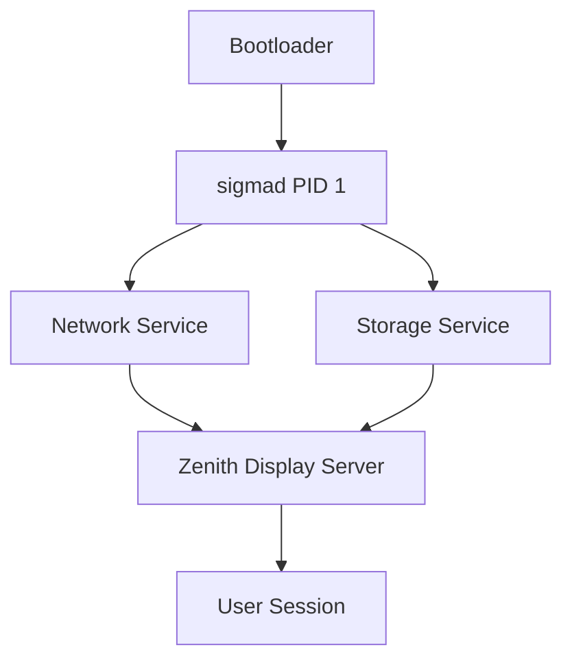

# SigmaOS Service Manager (sigmad)

## Overview
SigmaOS features a lightweight, dependency-aware service manager (`sigmad`) written in Rust and Nim. It is designed to combine the simplicity and speed of `runit` with the dependency tree management of `OpenRC`, providing a modern alternative to `systemd` that runs low-level code without reliance on heavy runtime engines or high-level languages.

## Architecture & Principles
1. **PID 1 supervision**: The root process is minimal and supervises the execution tree.
2. **Declarative services**: Services are defined using simple `.sigma` or YAML configurations rather than complex scripts.
3. **Dependency tracking**: Directed Acyclic Graph (DAG) for parallel startup.
4. **Self-healing**: Auto-restart on failure, crash rollback, and anomaly scoring.



## Configuration Specification
Service configurations are defined in `/etc/sigmad/services/`.

Example config (`network.sigma`):
```toml
[service]
name = "network"
description = "SigmaOS Core Network Stack"
exec = "/bin/sigma_net_stack"
restart = "always"
restart_delay = "2s"
limit_nofile = 65536

[dependencies]
required = ["storage"]
before = ["zenith"]
```

## Technical Implementation
The supervisor uses `epoll` (on Linux) or native event notifications to monitor daemon state.

```rust
// kernel/init/sigma_init.rs
pub struct Service {
    pub name: String,
    pub exec_path: PathBuf,
    pub status: ServiceStatus,
    pub pid: Option<u32>,
    pub dependencies: Vec<String>,
}

impl Service {
    pub fn spawn(&mut self) -> Result<u32, io::Error> {
        let child = Command::new(&self.exec_path)
            .stdout(Stdio::piped())
            .stderr(Stdio::piped())
            .spawn()?;
        self.pid = Some(child.id());
        self.status = ServiceStatus::Running;
        Ok(child.id())
    }
}
```

## Roadmap & Milestones
- **Phase 1 (Months 0-3)**: Core process spawner, stdout/stderr logging redirect.
- **Phase 2 (Months 3-6)**: Parallel startup using a topological sort of the dependency graph.
- **Phase 3 (Months 6-9)**: Systemd service conversion tool and compatibility wrappers.
- **Phase 4 (Months 9-12)**: Hot-reload, live state checkpointing, and kernel integration.
