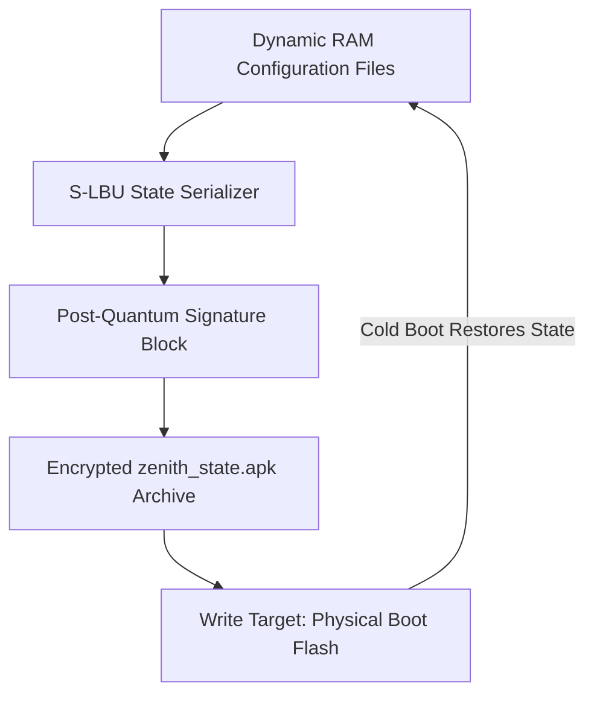

# SigmaOS Sovereign Local Backup (S-LBU)

The **Sovereign Local Backup (S-LBU)** is a core state persistence engine in SigmaOS Zenith v15.1 designed specifically for diskless silicon execution.

By compiling directly into the microkernel memory manager, it absorbs the defining strengths of **Alpine Linux LBU**, enabling persistent configuration archiving and checksum-pinned state restoration on cold boot without resident hard drive storage.

---

## 🚀 Architectural Design & Parity

| Feature Domain | SigmaOS S-LBU | Alpine Linux LBU | Linux initramfs | Windows PE |
| :--- | :--- | :--- | :--- | :--- |
| **Purity** | Bare-metal C++17 | Alpine POSIX sh | Linux kernel script | Closed-source NT |
| **Storage Dependency** | Diskless RAM (No HD) | Diskless RAM | Memory RAM disk | Memory RAM disk |
| **Commit Target** | Writable Boot Flash | USB/SD Flash media | Read-only image | RAM execution only |
| **Security Layer** | PQC Merkle-root hashes | sha256 checksums | Unsigned cpio | Microsoft Cabinet auth |
| **Restore Model** | Sub-millisecond direct extract | apk-tools extraction | kernel unpack | winpe initialization |

---

## ⚙️ Core Subsystem Architecture

The S-LBU subsystem continuously monitors persistent directory paths (such as `/etc/network/interfaces` and `/sys/config/declarative.nix`). Rather than writing modifications directly to slow physical flash blocks, it commits all updates atomically to RAM.



### Diskless Local State Commit Pipeline
1. **Dynamic Track**: Add files to persistence via `sigma-lbu track <file_path>`.
2. **Atomic Packaging**: On command `sigma-lbu commit`, the engine aggregates and compresses tracked directories.
3. **PQC Attestation**: Generates and pins post-quantum cryptographic signatures inside the state header.
4. **Boot Restoration**: On subsequent system initialization, `lbu_restore` extracts the secure archive back into the system RAM disk, ensuring complete state alignment.

---

## 🛠️ Command-Line Interface (CLI)

The `sigma-lbu` utility enables dynamic system state management:

```bash
# Add a configuration file to the persistence tracking manifest
sigma-lbu track <file_path>

# Compress and commit current memory configuration states to boot flash
sigma-lbu commit

# Force-restore dynamic memory configurations from committed flash backups
sigma-lbu restore

# Audit tracked files and verify cryptographic signatures
sigma-lbu audit
```

---

## 📂 Source Code Implementation

The S-LBU subsystem is built across the following zero-dependency files:
* **Core Engine**: `kernel/core/SovereignLBU.cpp`
* **CLI Controller**: `tools/sigma_lbu.cpp`
* **Header Mappings**: `include/sigma_kernel_types.h`

---

> [!TIP]
> Run `sigma-lbu commit` immediately after modifying declarative state specs (`/sys/config/declarative.nix`) to ensure persistent configurations survive cold reboots.
