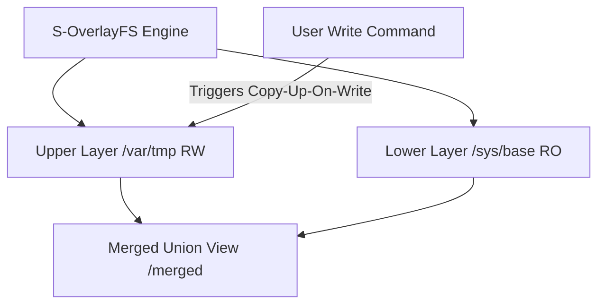

# SigmaOS Sovereign Overlay File System (S-OverlayFS)

The **Sovereign Overlay File System (S-OverlayFS)** is a core, zero-dependency storage virtualization subsystem of SigmaOS Zenith v15.1.

By executing directly within the microkernel storage mount path, it absorbs the union mounting advantages of **Linux OverlayFS**and**UnionFS** without high-overhead VFS translation layers, enabling rapid live boot from read-only silicon.

---

## 🚀 Architectural Design & Parity

| Feature Domain | SigmaOS S-OverlayFS | Linux OverlayFS | FreeBSD unionfs | Plan 9 Union Mount |
| :--- | :--- | :--- | :--- | :--- |
| **Purity** | Bare-metal C++17 | Monolithic C / Virtual FS | BSD Kernel Layer | Distributed Name Spaces |
| **Merge Model** | Upper (RW) + Lower (RO) | Upper + Lower + Work | Upper + Lower (stacked) | Unified Directory Union |
| **Write Resolution** | Transactional Copy-Up | Copy-Up-On-Write (CFS) | Duplicate-on-Write | Duplicate-on-Write |
| **Device Parity** | Physical block virtualization | Virtual block mount | Mount union node | Mount union namespace |
| **Integrity Checks** | PQC-verified signatures | Sysfs security hooks | File-level permission check | Plan 9 auth credentials |

---

## ⚙️ Core Subsystem Architecture

The S-OverlayFS system manages dynamic union mounting. A read-only base system partition (e.g. `/sys/base` on live silicon) is merged with a temporary writable RAM disk partition (`/var/tmp`) to form a single, fully editable virtual partition (`/merged`).




### Transactional Copy-Up-On-Write

When a write command targets a read-only lower file (e.g., `config.json` inside `/sys/base`), the overlay engine automatically:

1. **Intercepts** the write request before block commitment.
2. **Copies** the lower file contents to the upper read-write layer (`/var/tmp`).
3. **Applies** the new data directly to the upper variant.
4. **Shadows** the lower file in the merged view, prioritizing the active upper variant.

---

## 🛠️ Command-Line Interface (CLI)

The `sigma-overlay` utility allows live, non-disruptive union manipulation:


```bash
# Mount a new OverlayFS partition combining base and temp layers
sigma-overlay mount <lowerdir> <upperdir> <mergeddir>

# Write to a file (triggers dynamic Copy-Up if file is currently read-only)
sigma-overlay write <filename> <content>

# List the active files inside the merged directory view
sigma-overlay list


```

---

## 📂 Source Code Implementation

The S-OverlayFS subsystem is built across the following zero-dependency files:

***Core Engine**: `kernel/core/SovereignOverlayFS.cpp`***CLI Controller**: `tools/sigma_overlayfs.cpp`* **Header Mappings**: `include/sigma_kernel_types.h`

---

> [!NOTE]
> All live system files running inside S-OverlayFS are attested using Post-Quantum Cryptographic signatures to prevent upper-layer unauthorized modifications.
