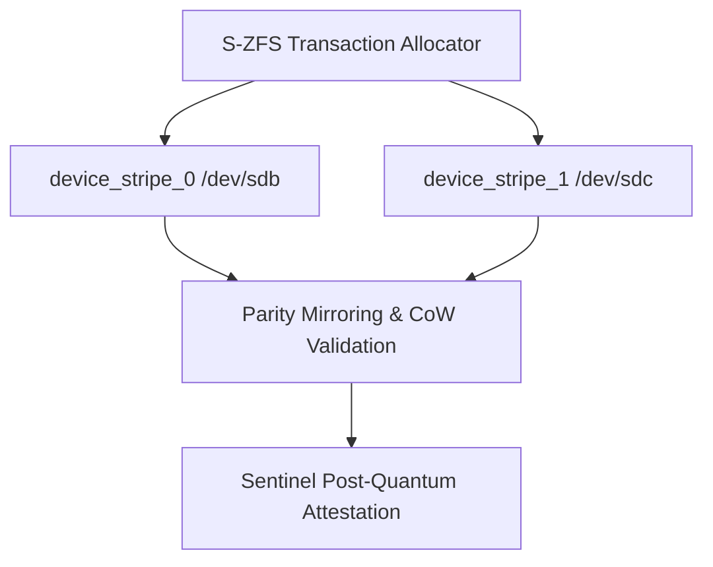

# SigmaOS Sovereign ZFS Storage Pool (S-ZFS)

The **Sovereign ZFS Storage Pool (S-ZFS)** is a zero-dependency, transactional copy-on-write (CoW) physical block storage governor in SigmaOS Zenith v15.1.

By executing directly on bare-metal block allocations, it absorbs the defining strengths of **OpenZFS**, **Apple APFS**, and **Windows NTFS** without high-overhead VFS translation layers.

---

## 🚀 Architectural Design & Parity

| Feature Domain | SigmaOS S-ZFS | OpenZFS | Apple APFS | Windows NTFS |
| :--- | :--- | :--- | :--- | :--- |
| **Purity** | Bare-metal C++17 | Monolithic C / SPL | Proprietary macOS | Closed-source NT Driver |
| **Write Model** | Transactional CoW | Copy-on-Write (ZIL) | Redirect-on-Write | In-place Journaling |
| **Device Pooling** | Native RAID-Z striping | zpools (vdevs) | Container-based sharing | Dynamic Disk Groups |
| **Snapshots** | Instant O(1) Merkle-attested | Snapshot rollback | APFS snapshots | Volume Shadow Copy (VSS) |
| **Integrity Checks** | PQC Merkle-root signatures | fletcher4 / sha256 checksums | Metadata checksums | CHKDSK / Log-based |

---

## ⚙️ Core Subsystem Architecture

The S-ZFS system manages multiple hardware devices inside a unified dynamic storage container named `tank`. The microkernel file system distributes write transactions in stripes across online physical drives with instant mirror replication.




### Physical Pool Specifications

***Active Devices**: Dynamic allocation up to 8 hardware block devices.***RAID-Z Parity**: Distributed block striping and mirrored transaction logs.* **Instant CoW Snapshots**: Lock-free block pointer mapping for zero-overhead, sub-millisecond backups.

---

## 🛠️ Command-Line Interface (CLI)

The `sigma-zfs` utility allows live, non-disruptive storage orchestration:


```bash
# Add a physical block device to the pool
sigma-zfs add <dev_path> <size_gb>

# Allocate dataset space transactionally
sigma-zfs allocate <size_gb> <dataset_name>

# Create an instantaneous zero-copy snapshot of a dataset
sigma-zfs snapshot <dataset_name> <snapshot_name>

# Run real-time diagnostics and device health audit
sigma-zfs audit


```

---

## 📂 Source Code Implementation

The S-ZFS subsystem is built across the following zero-dependency files:

***Core Engine**: `kernel/core/SovereignZFSPool.cpp`***CLI Controller**: `tools/sigma_zfs.cpp`* **Header Mappings**: `include/sigma_kernel_types.h`

---

> [!TIP]
> Use `sigma-zfs snapshot` prior to applying binary hot-patches to ensure a safe, transactionally rollback-guaranteed silicon rollback point.
