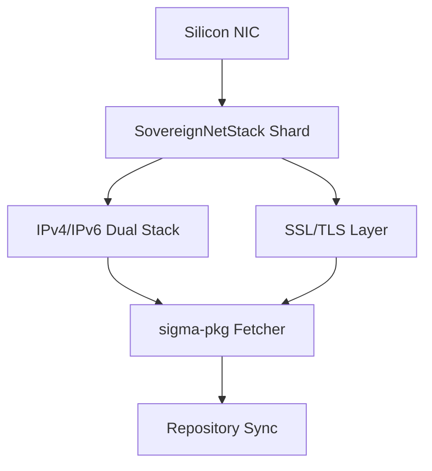
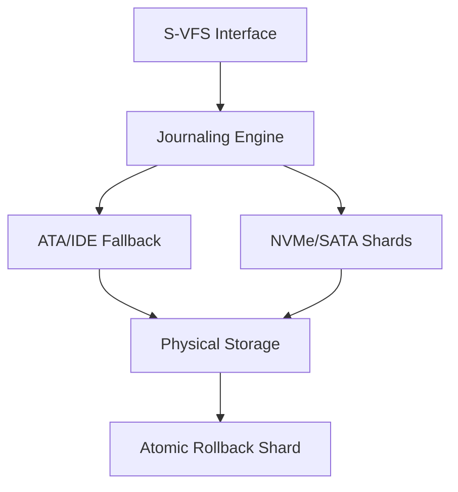
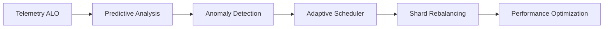
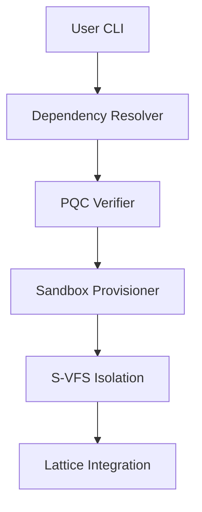

# Subsystem Diagrams

## 1. Sovereign Network Stack (S-NET)

```mermaid
graph TD
    A[Silicon NIC] --> B[SovereignNetStack Shard]
    B --> C[IPv4/IPv6 Dual Stack]
    B --> D[SSL/TLS Layer]
    C --> E[sigma-pkg Fetcher]
    D --> E
    E --> F[Repository Sync]
```

## 2. Sovereign File System (S-VFS)

```mermaid
graph TD
    A[S-VFS Interface] --> B[Journaling Engine]
    B --> C[ATA/IDE Fallback]
    B --> D[NVMe/SATA Shards]
    C --> E[Physical Storage]
    D --> E
    E --> F[Atomic Rollback Shard]
```

## 3. AI Telemetry & Adaptive Scheduling

```mermaid
graph LR
    A[Telemetry ALO] --> B[Predictive Analysis]
    B --> C[Anomaly Detection]
    C --> D[Adaptive Scheduler]
    D --> E[Shard Rebalancing]
    E --> F[Performance Optimization]
```

## 4. Package Management (sigma-pkg)

```mermaid
graph TD
    A[User CLI] --> B[Dependency Resolver]
    B --> C[PQC Verifier]
    C --> D[Sandbox Provisioner]
    D --> E[S-VFS Isolation]
    E --> F[Lattice Integration]
```
