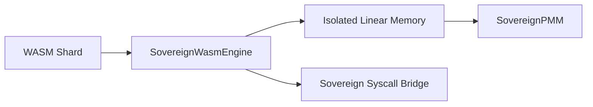

# SigmaOS: WebAssembly (WASM) Runtime Shard

## Architecture Overview

The SigmaOS WASM Runtime provides a high-performance, sandboxed execution environment for userland applications and isolated kernel tasks. Leveraging the **Sovereign PSE (Portable Shard Execution)** model, WASM modules can run natively on the silicon bus without traditional instruction set translation overhead.



## Core Features

- **JIT & AOT Compilation**: Shards are pre-compiled to native machine code (AVX-512/RISC-V) for zero-latency execution.
- **Linear Memory Isolation**: Each WASM instance is confined to a strictly bounded memory region, preventing cross-shard data leaks.
- **Capability-Based I/O**: Access to system resources (network, storage) is governed by tokenized permissions.
- **Hot-Reloading**: Shards can be updated or replaced at runtime without affecting system stability.

## Implementation Details

The runtime is implemented as a modular C++ singleton:

```cpp
class SovereignWasmEngine {
public:
    static SovereignWasmEngine& getInstance();
    void loadShard(const uint8_t* bytecode, size_t size);
    void execute();
private:
    // ...
};
```

## Security & Compliance

- **WASI Compliance**: Adheres to the WebAssembly System Interface for cross-platform compatibility.
- **Amnesic Cleanup**: All linear memory is scrubbed upon shard termination.
- **LBSV Verification**: WASM bundles must be signed by the `SovereignPQCEngine`.
