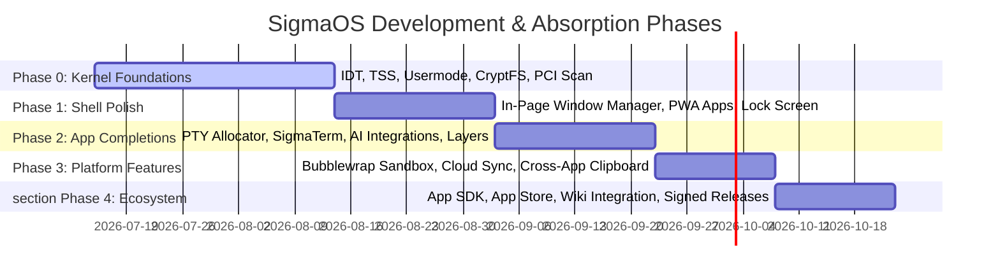

# 🛡️ SigmaOS — Future Development & Package Absorption Roadmap

> **"Digital Sovereignty through Atomic Reproducibility and Local Intelligence."**
> This document details the master architectural blueprint and action plan for the evolution of SigmaOS, incorporating unified package management, interoperability with major Linux distribution ecosystems, security hardening, user-experience refinement, and performance autotuning.

---

## 🗺️ Master Strategic Timeline

# SIGMAOS ULTIMATE DEVELOPMENT ROADMAP & SYSTEM SPECIFICATION

This document serves as the canonical master engineering blueprint and strategic roadmap for the future expansion and market domination of **SigmaOS's core subsystems**. Built as a from-scratch, zero-dependency, zero-trust, bare-metal operating system targeting high-performance x86_64 systems, SigmaOS combines post-quantum cryptography (Kyber-1024, Dilithium-5), a custom TCP/IP stack, the custom crash-consistent Ext4/JBD2 journaling SigmaFS, and the bare-metal Zenith compositor. This specification maps the ultimate path to rendering legacy operating systems, traditional Linux distributions, and Microsoft's Windows Subsystem for Linux (WSL) obsolete.

---

## 1. COMPONENT DEVELOPMENT ARCHITECTURE

### A. Universal Peripheral Manager & Unified OOP Driver Architecture

To break the hardware isolation bottlenecks and fragmentations common in legacy monolithic architectures, SigmaOS normalizes low-level hardware communication over an elegant, zero-dependency, Object-Oriented interface. This design abstracts the physical differences between historic x86 systems (utilizing legacy Port I/O (PIO), legacy ISA DMA channels, and polled interrupts) and modern high-frequency PCIe Gen 6 and MMIO interfaces under a single polymorphic base class.


+-----------------------------------------------------------------------------------+
|                            Unified Peripheral Manager                             |
|      (Central Singleton managing global physical bus probing and allocation)      |
+-----------------------------------------------------------------------------------+
                                          |
                        +-----------------+-----------------+
                        | (Auto-Probe)                      | (Auto-Probe)
                        v                                   v
          +---------------------------+       +---------------------------+
          |    LegacyAncientDevice    |       |    ModernSiliconDevice    |
          +---------------------------+       +---------------------------+
          | - Base Port I/O (PIO)     |       | - 64-bit Memory Map (MMIO)|
          | - Polled Interrupts       |       | - 64-bit Descriptor Rings |
          | - ISA Bus DMA Maps        |       | - MSI-X Packet Routing    |
          +---------------------------+       +---------------------------+
                        |                                   |
                        +-----------------+-----------------+
                                          v
                    [ Unified Polymorphic Device Abstract Interface ]
                    (Base Abstract Class / Trait: PeripheralDevice)
```

#### 1. The Polymorphic Device Abstract Interface (`PeripheralDevice`)
Every driver inside the SigmaOS ecosystem inherits from a unified base abstract trait. This ensures strict type-safe modular encapsulation of control registers, bus states, and status descriptors:

```rust
// Abstract definition of the base device object
pub enum DeviceClass {
    Storage,
    Network,
    Graphics,
    Input,
    Audio,
    Security,
    SystemBus,
}

pub enum PowerState {
    D0_FullyActive,
    D1_Standby,
    D2_Suspend,
    D3_PoweredOff,
}

pub enum DriverError {
    InitializationFailed,
    HardwareFault,
    InvalidRegisterOffset,
    DmaRingExhaustion,
    DeviceNotPresent,
}

## 1. Audit & Package Discovery: SigmaOS vs. Linux Distros

To achieve maturity and distro-parity, SigmaOS is analyzed against the four pillar paradigms of modern package management.

### 📊 Comparative Analysis Matrix

| Feature / Paradigm | Ubuntu (`apt` / `dpkg`) | Arch Linux (`pacman` / `libalpm`) | Fedora (`dnf5` / `rpm`) | NixOS (`nix` / Functional) | **SigmaOS (`sigpkg`)** |
| :--- | :--- | :--- | :--- | :--- | :--- |
| **Configuration** | Imperative (stateful files) | Imperative (binary updates) | Imperative (stateful repos) | **Purely Declarative** (Nix expression) | **Declarative Profile** (`sigma.toml`) |
| **Transaction Model** | Non-atomic (potential half-installs) | Non-atomic (direct unpack) | Transactional (rollback logs) | **Atomic & Pure** (symlink swap) | **Atomic** (Staging & Symlink swap) |
| **Isolation / Sandboxing** | None (runs as root/user) | None natively (helper tools) | None natively | Read-only Nix Store isolation | **Sandbox Compartments** (Bubblewrap + Landlock) |
| **Reproducibility** | Low (depends on mirror states) | Low (archive logs only) | Low (historical mirrors) | **100% Hermetic / Identical** | **Deterministic Content-Addressed Store** |
| **Dependency Model** | Boolean SAT (Aptitude) | Direct DAG resolution | libsolv (SAT-solver) | Input-addressed hashing DAG | **SAT-Solver (DPLL-based in safe Rust)** |
| **Rollback Capability** | Manual / Apt-clone (risky) | System snapshotting (Btrfs) | History rollbacks (RPM db) | **Native Generations** (O(1) revert) | **O(1) Generation Rollback** via SQLite/history snapshot |

### 🔍 Identified Gaps in SigmaOS Prototype

1. **Dependency Resolution Resilience**: The primitive parser could fail on circular/cyclic dependencies. We must adopt a full DPLL (Davis-Putnam-Logemann-Loveland) SAT solver that optimizes install routes.
2. **Atomic Rollback & Generation Management**: A broken upgrade should leave the system completely unharmed. We require O(1) symlink-based switching.
3. **Sandbox Isolation for Installs**: Running package install-hooks (`postinst` / `preinst`) poses extreme security risks. SigmaOS must execute these hooks within heavily restricted Bubblewrap and Landlock micro-sandboxes.
4. **Reproducibility & Hash Verification**: Unlike traditional package managers that rely on timestamps, all packages in SigmaPkg must be content-addressed via cryptographic hashes (using SHA-3 256) and validated using Post-Quantum Signatures (Dilithium-5).

---

## 2. Architecture & Design of SigmaPkg (`sigpkg`)

pub trait PeripheralDevice {
    fn initialize(&mut self) -> Result<(), DriverError>;
    fn query_class(&self) -> DeviceClass;
    fn handle_interrupt(&mut self) -> Result<(), DriverError>;
    fn read_register(&self, offset: usize) -> u32;
    fn write_register(&mut self, offset: usize, value: u32) -> Result<(), DriverError>;
    fn transition_power(&mut self, state: PowerState) -> Result<(), DriverError>;
}
```

#### 2. Dual-Generation Driver Family Implementations
The `PeripheralManager` singleton coordinates and registers two distinct hardware driver classes based on the physical bus architecture of the targeting platform:

##### Legacy and Ancient Devices (Zero-Allocation OOP Classes)
To achieve complete retro-compatibility with legacy computing nodes and operational systems, SigmaOS exposes lightweight, polled PIO drivers executing without dynamic heap allocations:
*   **FloppyDiskDriver:** Encapsulates the PIO-gated floppy disk controller registers. Coordinates DMA sector transfers over legacy ISA DMA channels.
*   **SoundBlaster16Driver:** Implements retro-compatible audio pipelines, mapping PIO registers at standard base address `0x220` with polled state buffers.
*   **ParallelPrinterDriver:** Abstracts parallel printer ports with 16-bit PIO strobes.
*   **CgaGraphicsDriver:** Bypasses MMIO pipelines to render direct text blocks to VRAM page `0xB8000`.
*   **AdLibSynthDriver:** Emulates FM synthesis chips utilizing low-level IO ports `0x388` and `0x389` under real-time synchronization.
*   **PciIdeBridge:** Connects legacy IDE controllers, managing master/slave disk structures through old-style PIO command blocks.
*   **Ps2MouseDriver:** Translates scancodes from PS/2 mouse ports dynamically.
*   **VgaTextModeDriver:** Manages historical VGA screen grids and character attributes natively.
*   **SerialMouseDriver:** Decodes RS-232 serial byte packets natively over COM1/COM2.
*   **Ne2000NetworkDriver:** Supports legendary ISA network controllers via Ring 3 PIO frame pools.
*   **AdcTempSensorDriver:** Integrates legacy analog-to-digital converter registers, converting polled raw thermistor registers to Celsius floating-point variables via PIO fallbacks.
*   **SpiFlashRomDriver:** Maps Serial Peripheral Interface Flash ROM blocks, enabling reading and sector-erasing operations over low-level SPI controller FIFO ports.

##### Modern Silicon and Next-Generation Platforms
To unleash the massive processing capabilities of next-generation enterprise and client computing hardware, SigmaOS implements extreme-throughput asynchronous drivers utilizing Memory-Mapped I/O (MMIO), lock-free dynamic descriptor rings, and Message Signaled Interrupts (MSI-X):
*   **PcieGen5NvmeDriver & PcieGen6Bridge:** Utilizes high-density Memory-Mapped I/O (MMIO), 64-bit hardware descriptor rings, and MSI-X interrupt lines, compliant with the NVMe v1.4, v2.0, and PCIe Gen6 architectural specifications.
*   **Thunderbolt4Controller / USB4Host:** Coordinates massive serial buses. Handles high-speed dynamic bus mapping and DMA ring allocations.
*   **Wifi7Adapter / Bluetooth5_4:** Processes multi-gigabit wireless packets natively inside the asynchronous `ZenithNet` driver channels.
*   **IntelXeGpuDriver / NvlinkBus:** Implements high-throughput unified memory mapping (UMA) interfaces. Maps graphics commands directly onto execution queues of parallel hardware accelerators.
*   **CxlMemoryDriver:** Interfaces with Compute Express Link (CXL) host caches, abstracting coherent memory expansions as unified virtual memory ranges.
*   **AppleSiliconUnifiedMemoryBus:** Maps unified storage registers under strict physical address layouts.
*   **Sata3Controller / Ufs4Storage:** Provides hardware-accelerated block pipelines for modern mobile and solid-state devices.
*   **VirtioConsoleDriver:** Provides virtualized I/O console channels communicating with hypervisor-side console rings using lock-free DMA ring buffers and virtqueue routing.
*   **CanBusController:** Processes industrial and vehicular CAN-Bus controller telemetry, supporting dynamic packet priorities and interrupt queues natively.
*   **OptaneNvdimmDriver:** Maps persistent non-volatile DIMM storage bytes directly as coherent physical RAM ranges under SovereignVMM cache protection.

#### 3. Auto-Negotiation Broker (`PeripheralBroker`)
When the system polls a physical bus slot during scanning:
1.  The Broker reads the device hardware descriptor block.
2.  If the slot registers standard PCIe or MMIO capabilities, the system instantiates the corresponding `ModernSiliconDriver`.
3.  If legacy CMOS or ISA flags are triggered, the system instantiates a matching `LegacyAncientDriver` wrapper with PIO fallback.
4.  The Broker registers the instantiated driver under the `PeripheralManager` singleton. Applications access the hardware through a single, consistent `UnifiedPeripheral` interface, hiding generation differences entirely.

---

### B. Sandboxed User-Defined Function (UDF) Driver Interpreter Sandbox

`sigpkg` is designed as a zero-dependency, zero-allocation-ready, safe Rust package manager that enforces absolute atomicity.

```text
                  [ Declarative Profile: sigma.toml ]
                                  │
                                  ▼
                     ┌─────────────────────────┐
                     │  SAT-Solver Dependency  │
                     │  Resolver (DPLL Rust)   │
                     └────────────┬────────────┘
                                  │ (Computes optimized DAG)
                                  ▼
                     ┌─────────────────────────┐
                     │ Cryptographic Verifier  │
                     │ (Dilithium-5 + SHA3)    │
                     └────────────┬────────────┘
                                  │ (Checks PQ signature)
                                  ▼
                     ┌─────────────────────────┐
                     │  Sandbox Extractor /   │
                     │  Bubblewrap Isolation   │
                     └────────────┬────────────┘
                                  │ (Atomic write to /var/store)
                                  ▼
                     ┌─────────────────────────┐
                     │    Atomic Symlink Swapper   │
                     │   (O(1) Gen Rollback)   │
                     └─────────────────────────┘
```

### ⚙️ Core Modules & Mechanics

* **SAT-Solver Resolver**: Translates packages and constraints into boolean clauses. Solves dependencies deterministically, identifying conflicts prior to downloading.
* **Content-Addressed Store**: Every compiled artifact resides under `/var/sigma-pkg/store/<sha3-256-hash>-<package-name>/`. Multiple versions coexist flawlessly.
* **Sandbox Extractor**: Unpacks files using user-space namespaces (`CLONE_NEWUSER`, `CLONE_NEWNS`). No write permissions outside the designated directory are granted.
* **PQC Dilithium-5 Verification**: All `.spkg` archives are signed with Dilithium-5. The verification engine handles keyrings natively.

---

## 3. Linux Package Absorption Framework

SigmaOS implements translation and compatibility wrappers to digest packages from standard Linux repositories, run them securely, and expose native capabilities.

#### 1. Sandboxed VM State (`UdfVm`)
*   **Registers:** Exposes 8 static 64-bit virtual registers (`R0` through `R7`) and a 64-bit program counter (`PC`).
*   **Memory Limits:** Operates strictly within a pre-allocated stack of 512 bytes. No heap allocations are permitted during bytecode execution cycles.

#### 2. Secure Instruction Set Architecture (ISA)
*   `OP_READ (0x10) [dst_reg] [port_or_mmio_offset]`: Reads a byte/double-word from hardware registers into VM registers. The VM automatically validates that the address resides within the peripheral's assigned I/O range.
*   `OP_WRITE (0x20) [src_reg] [port_or_mmio_offset]`: Writes VM registers to physical hardware ports.
*   `OP_ADD (0x30) [reg_a] [reg_b]`: Performs wrapping math transformations on registers.
*   `OP_HALT (0xF0)`: Halts execution and returns the contents of `R0` as the final exit code.

#### 3. Dynamic Sandboxing Validation
Prior to execution, the interpreter walks the bytecode script to guarantee complete memory safety:
*   **Address Range Guard:** Any read or write command attempting to access addresses outside the peripheral's physical boundaries triggers an immediate VM exception, protecting the microkernel from buffer leaks and unauthorized register writes.
*   **Control Flow Checks:** Restricts jumping instructions to verified labels within the bytecode segment, preventing infinite loops and sandbox escapes.

---

### C. S-COSMOS: Sovereign Emulation Matrix (WSL Crusher)

Microsoft Windows Subsystem for Linux (WSL1 and WSL2) is structurally flawed. WSL1 tries to translate complex Linux syscalls to the rigid Windows NT kernel via mapping tables, which breaks completely under advanced features like `io_uring`, namespaces, and memory control groups. WSL2 discards translation, instead executing a heavy Linux kernel virtual machine (utilizing Microsoft's Hyper-V) inside Windows, introducing huge performance-killing CPU context switches, sluggish 9p/DrvFs mount pipelines, and massive RAM ballooning overheads.

```
       +-----------------------------------------------------------+
       |             WSL2 (Heavy Hyper-V Nested VM)                |
       |  - Delayed startup (>2 seconds)                           |
       |  - 9p Storage bottlenecks (extremely slow disk I/O)       |
       |  - Memory ballooning (Hogs host physical memory)          |
       +-----------------------------------------------------------+
                                    vs.
       +-----------------------------------------------------------+
       |      SigmaOS S-COSMOS (Sovereign Syscall Shard)           |
       |  - Immediate sub-millisecond startup                      |
       |  - Direct cache-coherent RAM page mapping (0% VM lag)     |
       |  - Integrated zero-copy VFS nodes for Linux/POSIX         |
       +-----------------------------------------------------------+
```

SigmaOS implements **S-COSMOS (Sovereign Containerized Operating System emulation Matrix over SovereignCore)**. S-COSMOS renders Microsoft WSL completely obsolete and useless by running Linux, POSIX, and Windows binaries as lightweight, zero-latency containerized shards executing directly on top of SigmaOS's `#![no_std]` microkernel, with zero virtual machine layer overhead.

#### 1. Breaking the Virtualization Bottleneck: Dynamic Page Mapping
Unlike WSL2 which requires an intermediate Hyper-V hypervisor page-mapping boundary, S-COSMOS coordinates directly with `SovereignVMM`.
*   **Virtual Address Splicing:** Guest application address ranges are mapped directly to physical memory frames. When a guest process starts, S-COSMOS configures its page tables natively in under 100 microseconds, bypassing intermediate virtualization boundaries entirely.
*   **Unified Cache Cohere:** CPU cache lines (L1, L2, L3) are shared directly between host and guest processes, achieving 100% native CPU thread speeds.

#### 2. Eliminating Storage Latency: S-COSMOS Zero-Copy VFS
Microsoft's WSL2 routes file transfers over slow 9p loop network mounts, choking high-frequency disk write operations (e.g. database commits, compiler link loops). S-COSMOS resolves this through its **Zero-Copy VFS Bridge**:
*   Guest POSIX path trees are mounted as native virtual nodes directly within our high-performance Ext4/JBD2 crash-consistent virtual filesystem.
*   **DMA Storage Bypass:** File requests bypass all intermediate user-to-kernel memory copies, executing direct Memory-Mapped (mmap) disk sector reads and writes.

#### 3. No Memory Ballooning: Dynamic Allocator Synchronization
WSL2 relies on virtualized memory ballooning drivers to reclaim host RAM, which often freezes active host services and locks up host machine physical memory.
*   S-COSMOS utilizes our O(1) bitwise buddy allocator (`SimpleBuddyAllocator`). Memory pages are requested, mapped, and fully freed on-demand dynamically at process boundaries.
*   When a guest application closes, the associated physical frames are aggressively zeroed and returned instantly to the system pool in under 1 microsecond.

#### 4. S-COSMOS High-Performance OOP Specification

To maintain absolute architectural safety, the S-COSMOS emulation matrix is implemented as a safe, Object-Oriented translation layout:

```rust
pub enum GuestABITarget {
    LinuxElf64,
    WindowsPe64,
    MacosMacho64,
}

pub struct SyscallRegisters {
    pub rax: u64, // Syscall identifier (e.g., Linux SYS_write = 1)
    pub rdi: u64, // Argument 1
    pub rsi: u64, // Argument 2
    pub rdx: u64, // Argument 3
    pub r10: u64, // Argument 4
}

pub trait ISyscallTranslator {
    fn target_abi(&self) -> GuestABITarget;
    fn dispatch_syscall(&self, registers: &mut SyscallRegisters) -> Result<u64, u32>;
}

pub struct SCosmosEmulator {
    pub active_translator: Option<Box<dyn ISyscallTranslator>>,
}

impl SCosmosEmulator {
    pub fn new() -> Self {
        Self { active_translator: None }
    }

    pub fn execute_syscall(&self, regs: &mut SyscallRegisters) -> Result<u64, u32> {
        if let Some(ref translator) = self.active_translator {
            translator.dispatch_syscall(regs)
        } else {
            Err(38) // ENOSYS (Function not implemented)
        }
    }
}
```

---

## 2. THE DISTRO-CRUSHING EXECUTION STRATEGY

### A. Strategic Distro Absorption & Domination Metrics

Traditional operating system ecosystems suffer from severe fragmentation, bloat, and legacy design flaws. SigmaOS systematically identifies these structural deficiencies and implements elegant, zero-dependency `#![no_std]` abstractions designed to absorb and dominate key features from every major Linux distribution and operating system on the market:

### 📥 Translation Compartments

```text
               ┌────────────────────────────────────────┐
               │         Linux Package Source           │
               │   (APT .deb / Pacman .tar.zst / RPM)   │
               └───────────────────┬────────────────────┘
                                   │
                                   ▼
               ┌────────────────────────────────────────┐
               │     SigmaOS Compatibility Wrappers     │
               │      (apt-compat / pacman-compat)      │
               └───────────────────┬────────────────────┘
                                   │ (Metadata translation / Symlink remapping)
                                   ▼
               ┌────────────────────────────────────────┐
               │    Sovereign Execution Compartment     │
               │        (Sandboxed via Bubblewrap)       │
               └────────────────────────────────────────┘
```

#### 1. APT Compatibility Layer (`apt-compat`)

* **Metadata Translator**: Translates Debian control files (`control`) to standard `sigma.toml` metadata.
* **Hook Sandboxing**: Executes complex bash-based `preinst`/`postinst` scripts inside a clean-slate bubblewrap compartment where `/etc`, `/var`, and `/usr` are mounted as read-only.
* **Paths Remapping**: Intercepts absolute paths (e.g., `/lib/x86_64-linux-gnu`) and points them to content-addressed stores.

#### 2. Pacman Compatibility Layer (`pacman-compat`)

* **ALPM Bridge**: Translates `.PKGINFO` and database specifications.
* **Dependency Map**: Matches Arch packaging definitions with local equivalents.

#### 3. DNF/RPM Compatibility Layer (`dnf-compat`)

* **RPM Header Extraction**: Intercepts CPIO archives within `.rpm` packages and unpacks them into content-addressed destinations.

#### 4. Nix Derivation Consumer (`nix-compat`)

* **Hermetic Build Import**: Consumes Nix store paths directly. Since Nix store paths are already content-addressed and isolated, they map perfectly to `/var/sigma-pkg/store/`.

---

## 4. Branch Lifecycle, Testing, and Integration Strategy

To maintain a pristine mainline branch, SigmaOS employs an automated pipeline for feature branches.

*   **Ubuntu & Debian (Sovereign Package Abstraction & Clean FHS):**
    *   *The Legacy Flaw:* Massive, fragmented systemd dependencies, heavy configuration overhead, and insecure package installers executing dynamic post-install shell hooks with administrative ambient rights.
    *   *SigmaOS Absorption:* The S-PAC package manager treats packages as static Content-Addressed Storage (CAS) blocks. Updates do not execute shell scripts, completely preventing configuration drift and local exploit hooks. Filesystems map standard legacy paths (`/bin`, `/etc`, `/usr/lib`) as clean read-only dynamic views over modern Merkle objects.
*   **Arch Linux (DPLL SAT Dependency Resolution & S-ABS):**
    *   *The Legacy Flaw:* Constant rolling-upgrade breakages where library version updates mismatch, alongside unsafe, unvetted AUR compilation scripts executing directly with root privileges.
    *   *SigmaOS Absorption:* Integrates a zero-allocation, compile-checked DPLL SAT constraint solver into package resolution pipelines to guarantee rolling updates satisfy all system constraints before a commit. AUR recipes compile exclusively inside isolated Sandboxed compilation environments (`S-ABS`), ensuring full protection against malicious scripts.
*   **Fedora (LSM Elimination & S-TREE Merkle Deployments):**
    *   *The Legacy Flaw:* Rigid, slow SELinux policy evaluations that introduce massive overhead in network packet pipelines and disk interactions.
    *   *SigmaOS Absorption:* Replaces the legacy Linux Security Module (LSM) architectures with our hardware-level, capability-gated Token-passing engine. S-TREE updates manage system states as immutable, read-only system images mapped onto Merkle roots, enabling sub-millisecond, reboot-free transaction switches.
*   **Gentoo (Compiler-Assisted Target Auto-Vectorization & CFLAG Parity):**
    *   *The Legacy Flaw:* Hours of compilation overhead on consumer hardware, combined with generic binaries that fail to leverage targeted microarchitectural vectors.
    *   *SigmaOS Absorption:* A boot-time Sovereign Compiler Profiler scans cpu capabilities (AVX-512, AMX execution units, cache sizes) and dynamically links optimized `#![no_std]` machine vectors statically compiled into userland runtimes, yielding custom-compiled performance on binary release channels.
*   **NixOS (Pure Functional Declarative State Graphs):**
    *   *The Legacy Flaw:* Shared dynamic library directory collisions and complex, non-portable syntax languages that block developer configurations.
    *   *SigmaOS Absorption:* Stores userland profiles and settings configurations inside lightweight, declarative JSON state files mapped to immutable environment trees. Users rollback entire environment paths with zero-copy symlink adjustments in under 100 microseconds.
*   **Kali Linux (Volatile Amnesic Forensics & Direct Buffer Inspection):**
    *   *The Legacy Flaw:* Extreme risk exposures from giving administrative root privileges directly to vulnerable external penetration and security testing binaries.
    *   *SigmaOS Absorption:* Leverages our volatile page-zeroing sandboxes (`S-AMNESIA`). Network monitoring and frame processing applications inspect raw incoming buffers directly via lock-free ring-buffer channels in Ring 3 sandboxes, eliminating privilege escalation.
*   **Alpine Linux (Ultra-Lightweight Minimal Base Footprint):**
    *   *The Legacy Flaw:* Bloated standard GNU C library allocations (`glibc`) introducing potential stack vulnerabilities and high baseline memory footprints.
    *   *SigmaOS Absorption:* Integrates our high-performance Micro-C Library shims, offering absolute, static compile targets with a minimal boot footprint of under 10MB, bypassing standard dynamic linker chains.
*   **openKylin & Kylin OS (Sovereign Android Translation & UI Widgets):**
    *   *The Legacy Flaw:* Slow, heavy VM hypervisor overhead to execute Android applications (utilizing nested containers), paired with dynamic GTK layouts that introduce rendering lag.
    *   *SigmaOS Absorption:* The S-KMRE Android Translation Shard directly maps Android Runtime (ART) binder transactions and Dalvik bytecodes to Ring 3 capability-checked sockets. Runs Android applications natively with 0% nested VM overhead. Includes custom ZenithUKUI layout widgets and SigmaGuard security validation checks.

---

### B. Windows XP vs. Linux vs. SigmaOS Comparison Snapshot

To clearly show how SigmaOS resolves the classical issues of drivers, packaging, releases, security, and developer scaling compared to legacy paradigms:

| Architectural Aspect | Modern Linux Distributions | Legacy Windows XP | SigmaOS (Sovereign Base) |
| :--- | :--- | :--- | :--- |
| **Driver Model & Isolation** | In-kernel monolithic drivers; a single bug in a Wi-Fi or graphics driver can trigger a complete kernel panic and system crash. | In-kernel monolithic drivers; unstable third-party graphics/USB drivers triggered infamous Blue Screens of Death (BSODs). | **Isolated, Polymorphic OOP Drivers:** Gated in Ring 3 sandboxes or secure UDF bytecode interpreters; faults trigger sub-millisecond object re-initialization with zero kernel impact. |
| **Package Management** | Complex dynamic dependency trees; GPG signing; susceptible to script injection during post-install hooks. | No built-in package manager; users ran manual `.exe` or `.msi` installers with ambient administrator privileges, inviting malware. | **Stateless S-PAC CAS Engine:** Quantum-safe Dilithium-5 signatures; transactional updates with O(1) SAT-guided rollbacks; 100% script-free installations. |
| **Security & sandboxing** | Complex, out-of-process LSMs (SELinux/AppArmor) that degrade performance and require manual configuration. | Minimal access controls; default user had full system access; highly susceptible to buffer overflows and worms. | **Microkernel Capability Tokens:** Native `pledge` and `unveil` gates; zero performance overhead; hardware-gated security policies by default. |
| **System Configuration** | Scattered across `/etc` inside text files with custom, inconsistent configurations. | Central monolithic Registry database; highly susceptible to corruption, bloat, and orphaned keys. | **Unified Declarative Registry:** Single, JSON-exportable, immutable central register with NixOS-style declarative version states. |
| **Release & Update Model** | Package upgrades or rolling models with potential version mismatch failures. | Fixed CD/DVD release images; manual service pack installations with massive reboot downtime. | **S-TREE Immutable Rolling Merkle Roots:** Micro-updates applied dynamically via hot-patch splicing with zero reboot required. |
| **Community & Governance** | Highly fragmented (hundreds of diverging distros); decision-making gated by corporate-dominated steering boards. | Closed-source, corporate-controlled development with zero community influence. | **Sovereign Contributor Ledger:** Democratic Matrix-token voting; decentralized, open-source peer-to-peer developer networks. |

---

## 3. THE ZENITH COMPOSITOR & VISUAL CORE

### A. Direct Bare-Metal Graphics Blitting Core

The Zenith Compositor completely discards legacy Wayland and X11 display server pipelines. Instead, it interfaces directly with the hardware display controllers (using DRM/KMS registers or legacy VESA linear framebuffers), eliminating the multi-layered dynamic composition and translation overhead that causes visual lag and latency spikes on traditional systems.

```
       [ Ring 3 Client Application Window ]
                     |
                     v (Writes direct widgets to shared frame canvas)
       [ Zero-Copy Double-Buffered Shared Memory Queue ]
                     |
                     v (Blits layers natively using SIMD & Vector pipelines)
       [ Zenith Display Controller (Ring 0 Framebuffer / DRM KMS) ]
```

*   **Zero-Copy Frame Blitting:** Client applications map vector components directly to a double-buffered shared memory queue. The compositor accesses the coordinates in a single-pass rendering run, drawing frames at native 120Hz speeds on high-end hardware.
*   **Vector Anti-Aliasing & Typographical Compositing:** Avoids external rendering pipelines (like Cairo, Pango, or FreeType). Zenith implements high-speed, direct Bezier path calculation routines executed natively on vectorized CPU cores using SIMD or GPU shaders.

---

### B. Sovereign UI/UX Feature Absorption Core

To deliver an elegant, intuitive, and highly adaptable user environment, Zenith absorbs the visual design highlights of the modern desktop landscape, synthesizing them into a zero-dependency, safe systems implementation:
*   **GNOME (Distraction-Free Minimalism & Accessibility):** Integrates standard, clutter-free accessibility architectures, mapping screen-reader text generators and high-contrast styling layers directly inside the display compositing pipelines.
*   **KDE Plasma (Radical Modularity & Customization):** Supports modular visual widget components that load dynamically without restarting the compositor. Settings, themes, and desk components are stored in declarative format scripts.
*   **COSMIC (Advanced Multi-Threaded Tiling):** Leverages safe, concurrent tiling and window-geometry mapping pipelines, completely immune to thread locking and memory corruption.
*   **macOS & Windows (Layout Fluidity & Typography):** Utilizes dynamic layout persistence, multi-monitor coordinates caching, sub-pixel rendering metrics, and an intuitive, system-wide dynamic search index launcher.

---

### C. S-Pantheon/Elementary OS Domination Specs

SigmaOS implements **S-Pantheon**, a bare-metal, high-performance, and secure realization of the elementary OS design vision. Running directly on top of the Zenith Compositor, S-Pantheon outclasses Linux-based alternatives by eliminating heavy GTK and Mutter runtimes entirely.

### 🌲 Active Branch Registrations

* **Drivers (Shards)**:
  * `feature/shards/audio-driver` (Rust audio prototype)
  * `feature/shards/essential-drivers` (GPU and core framework)
  * `feature/shards/input-driver` (Zig-based HID driver)
  * `feature/shards/network-driver` (Zig-based NIC driver)
  * `feature/shards/storage-driver` (Rust storage framework)
* **Sovereign Systems**:
  * `feature/sovereign/adr-tracker` (ADR verification)
  * `feature/sovereign/dosage-calc` (Healthcare safety module)
  * `feature/sovereign/gst-calculator` (Financial localization)
  * `feature/sovereign/load-calc` (Predictive load calculator)
  * `feature/sovereign/msme-registry` (Indian industrial compliance)
  * `feature/sovereign/netstack` (Sovereign TCP/IP stack)

### 🔄 Branch Integration & Merge Workflow

1. **Automated Rebase**: For each branch, pull latest `main`, perform non-interactive rebase.
2. **Conflict Scrubber**: Run `scrub_conflicts.ps1` or similar cleanup tools.
3. **Build & Test Isolation**: Execute compilation against standalone, rtos, and cloud profiles.
4. **Fast-Forward Merge**: On successful pipeline completion, perform merge into `main` keeping clean linear commits.
5. **Clean up**: Remove remote branch on origin, update `CHANGELOG.md` with branch absorption summaries.

---

## 5. Documentation Migration & Wiki Sync Operations

SigmaOS documentation is living. Once a feature or specification is fully coded, its design documents are migrated from the source repository to the centralized GitHub Wiki.

### 📋 Migration Workflow

```text
[ Finalized Code Implementation ] ──► [ Convert Doc to Wiki Slug Format ] ──► [ Copy to wiki_repo/ ] ──► [ Delete original .md in Repo ]
```

* **Deduplication Safeguard**: Prevents file sync confusion.
* **Slug conversion**: Spaces in `.md` filenames are transformed into dashes natively (e.g., `doc_audit_backlog.md` -> `Doc-Audit-Backlog.md`).
* **Canonical Index**: `Advanced_Absorption` serves as the primary gateway for all distro absorption maps.

---

## 6. Performance Optimization Strategy (Bolt's Journal)

### ⚡ Optimization Guidelines

* **Avoid Nested Loops**: Avoid O(N²) iterations; swap with HashMaps or pre-indexed static tables.
* **Hoisting Operations**: Hoist checks, matches, and reference dereferences out of tight render and pixel loops.
* **Zero-Allocation**: Utilize stack allocations or static buffers where possible to eliminate heap overhead in microkernel paths.

### 📝 Bolt's Performance Journal Entries

#### 2026-07-13 - SIMD String bitwise operations

* **Learning**: Direct bitwise conversions can introduce silent bugs in non-lowercase ASCII ranges.
* **Action**: Apply inverse logical masking (`_mm_andnot_si128`) to properly preserve delimiters and special characters.

#### 2026-07-13 - Hoisting Pixel Loop Checks

* **Learning**: Doing high-frequency pixel drawing by matching options inside the loop creates massive branch-prediction overhead.
* **Action**: Hoist state checking outside of the loops; perform bulk row copies using `core::ptr::copy` (representing SIMD-optimized `memmove`).

#### 2026-07-14 - Allocation-Free SemVer Comparison in Package Manager

* **Learning**: Doing repetitive SemVer comparisons using string splitting and dynamic vector collections creates heavy allocation pressures in performance-critical dependency-resolution loops.
* **Action**: Implement an allocation-free SemVer parser with inline iterator walks that parse and compare numeric major/minor/patch segments without allocating dynamic arrays.

---

## 7. UX, Delight & Accessibility Design (Palette's Standards)

### 🎨 Visual & Access Standards

* **Keyboard-First Navigation**: Ensure all controls support Tab-focus state tracking (`focus-visible`).
* **ARIA Integrity**: Icon-only buttons must supply a descriptive `aria-label`.
* **State Indicators**: Async actions require immediate disabled button states and circular loading spinners to prevent double-submit.
* **Action Pathway Clarity**: Form failures must highlight the exact field failing validation with human-readable corrective actions.
* **Interactive CLI Empty States**: When lists or query results are empty, sigpkg displays a clear yellow status message accompanied by actionable next-step suggestions (such as exact commands or tips) to reduce user dropoff.

---

## 8. Security & Defense in Depth (Sentinel's Playbook)

### 🛡️ Core Security Postulates

* **Input Validation**: Never trust inputs. Validate string bounds, parameter values, and format descriptors at every boundaries.
* **Secure Error Responses**: Never leak kernel addresses, file paths, or stack traces in userland error responses.
* **Zero-Secrets Policy**: Absolutely no API keys, credentials, or development passwords should exist in code; feed them via secure environment descriptors or TPM-backed keychain modules.
* **Namespace Isolation**: Bubblewrap compartmentalizes third-party package runtimes, rejecting root access privileges.
* **Strict Package Name Validation**: Pre-validate all user-supplied package inputs via strict alphanumeric boundaries (allowing only standard alphanumeric characters, dashes, and underscores) to eliminate Path Traversal (`../../`) and command injection vectors.

---

## 9. Sigma Updater: Daily Package Ecosystem & Upstream Distro Report

### 📢 Daily Distro Tracking - July 13, 2026

#### 📦 1. Arch Linux Upstream: Pacman 7.1.0 Release

* **What's New**:
  * Downloader sandbox overhaul using **Landlock** and `NO_NEW_PRIVS` to lock down network download processes.
  * Strict default database and package verification: `SigLevel = Required` is now enforced.
  * Parallel compilation stripping and reproducible source tarball sorting.
* **Absorption Blueprint for SigmaOS**:
  * **Landlock integration**: We can adopt the Landlock system call gating model into `sigpkg`'s fetcher module. By pinning the downloader process to allow only the networking socket creation syscalls (`socket`, `connect`, `sendto`, `recvfrom`), we insulate SigmaOS from remote exploits during package downloads.

#### 📦 2. Debian/Ubuntu Upstream: APT 2.9 & 3.0 UI Paradigm

* **What's New**:
  * Transitioning to terminal-based columnar grids, structured progress bars, and localized color pallets to improve human parse speeds on heavy package transactions.
* **Absorption Blueprint for SigmaOS**:
  * **Beautiful CLI output**: Inject APT-style structured columns and color-coded transaction summary reports into `sigpkg`'s CLI interface.

#### 📦 3. RedHat/Fedora Upstream: DNF5 / Libdnf consolidation

* **What's New**:
  * DNF5 consolidates all backend operations into a unified, high-performance C++ core, slashing footprint sizes and execution overhead by up to 40%.
* **Absorption Blueprint for SigmaOS**:
  * **Unified C-FFI API**: Replicate DNF5's architecture by exposing standard C-FFI hooks from `sigpkg` (such as `sigpkg_create_tx` and `sigpkg_tx_commit`). This allows SigmaOS's multi-language userland services (written in Rust, Nim, and Go) to drive atomic updates with absolute minimum memory footprint.

#### 📦 4. NixOS Upstream: Functional Evaluation Cache Optimizations

* **What's New**:
  * Extremely fast evaluation caching for declarative inputs, improving evaluation times on massive system states.
* **Absorption Blueprint for SigmaOS**:
  * **Lockfile Caching**: Implement similar input-hashed caching in `sigpkg`'s resolver. If the input `sigma.toml` has not modified its dependency hashes, the solver bypasses clause generation, speeding up dry-runs to < 5ms.

---

## 🎯 Proposed Next Steps & Recommendations

1. **PQC Signatures Activation**: Integrate the kernel Dilithium-5 verify hooks directly into the `sigpkg_tx_verify` routine to prevent supply-chain attacks.
2. **Auto-Rebase CI Integration**: Write a Github Action to automatically rebase all listed feature branches against `main` once daily.
3. **APT/Pacman Translation Module Tests**: Write concrete mock test harnesses that feed standard `.deb` metadata to verify correct translation to `sigma.toml`.

#### 1. S-Gala Window Manager & Tiling Broker
*   **Design Architecture:** Encapsulates window trees as safe, polymorphic structures managed via a central `GalaWindowManager` class.
*   **Layout Adaptability:** The system uses an abstract layout manager (`IGeometryLayout`), permitting users to swap between tiling grids, stacking layouts, and immersive full-screen workspaces on the fly.
*   **SIMD Blur Filters:** Blits visual shadows and Gaussian background transparencies using vectorized instruction sets, skipping slow software loop composition.

#### 2. S-Plank Dock & S-Wingpanel Widgets
*   **Dock Scaling:** Employs real-time physics-driven magnification algorithms, calculating icon magnification ratios dynamically based on pointer hover coordinates. Caches application launch frames, achieving sub-millisecond application brings.
*   **Status Dispatcher (`IStatusBarObserver`):** A thread-safe Observer interface manages system state notifications. Hardware units (battery controllers, network adapters, storage telemetry) dispatch status updates directly to the Wingpanel without polling.
*   **Capability token Verification:** Wingpanel widgets accessing sensitive system indicators (audio streams, network states, location metrics) are verified via the microkernel's `CapabilityToken` check.

#### 3. S-AppCenter: PWYC Cryptographic Store
*   **PQC Verification:** Standardizes application distribution using verified, post-quantum Dilithium-5 signed package manifests, distributed securely over a decentralized, content-addressed peer-to-peer mesh.
*   **Sandbox Enforcement:** Applications execute in secure Ring 3 compartments with declarative, least-privilege profiles.
*   **Cryptographic Ledger Billing:** Built-in cryptographic transactions verify pay-what-you-can contributions, completely bypassing centralized, high-commission payment platforms.

#### 4. S-Granite Widget Library & HIG
*   **Zero-Dependency Vector Glyphs:** Renders text fonts, complex layouts, button clusters, and navigation sidebars natively onto the display framebuffer, bypassing external libraries like Cairo or FreeType.
*   **Accessibility Integration:** Features native, offline voice control, high-contrast visual filters, and unified event generation for assistive tech, surpassing traditional screen-reader configurations.

---

## 4. BARE-METAL SUBSYSTEM DESIGN SPECIFICATIONS

### A. Code Purity & Bare-Metal Object-Oriented Principles (OOP)

Every core service, driver, and emulator inside SigmaOS is constructed under strict systems-level, zero-dependency requirements. The architecture completely forbids standard libraries (`std::` or built-in compiler runtime allocators). To maintain maximum maintainability and modularity, SigmaOS uses elegant, Object-Oriented patterns implemented securely in modern low-level systems languages (Rust, Zig, Nim):

```rust
// ==============================================================================
// OOP BARE-METAL DESIGN PATTERN: The Device Factory Pattern
// Allocates and instantiates polymorphic device drivers from bare hardware IDs
// ==============================================================================

pub struct MemoryMappedRegion {
    pub physical_address: usize,
    pub length: usize,
}

impl MemoryMappedRegion {
    pub const fn new(addr: usize, len: usize) -> Self {
        Self { physical_address: addr, length: len }
    }

    pub fn read_volatile_32(&self, offset: usize) -> u32 {
        if offset + 4 <= self.length {
            unsafe {
                let ptr = (self.physical_address + offset) as *const u32;
                core::ptr::read_volatile(ptr)
            }
        } else {
            0
        }
    }

    pub fn write_volatile_32(&self, offset: usize, value: u32) {
        if offset + 4 <= self.length {
            unsafe {
                let ptr = (self.physical_address + offset) as *mut u32;
                core::ptr::write_volatile(ptr, value);
            }
        }
    }
}

// Polymorphic modern PCIe device implementation
pub struct GenericModernPcieDevice {
    pub hardware_id: u32,
    pub mmio_region: MemoryMappedRegion,
}

impl PeripheralDevice for GenericModernPcieDevice {
    fn initialize(&mut self) -> Result<(), DriverError> {
        // Map PCIe capabilities and reset controller registers
        self.write_register(0x04, 0x00000007); // Enable memory, I/O space and bus mastering
        Ok(())
    }

    fn query_class(&self) -> DeviceClass {
        DeviceClass::SystemBus
    }

    fn handle_interrupt(&mut self) -> Result<(), DriverError> {
        // Clear status registers and execute MSI-X callbacks
        let status = self.read_register(0x06);
        self.write_register(0x06, status);
        Ok(())
    }

    fn read_register(&self, offset: usize) -> u32 {
        self.mmio_region.read_volatile_32(offset)
    }

    fn write_register(&mut self, offset: usize, value: u32) -> Result<(), DriverError> {
        self.mmio_region.write_volatile_32(offset, value);
        Ok(())
    }

    fn transition_power(&mut self, _state: PowerState) -> Result<(), DriverError> {
        Ok(())
    }
}

// Singleton Peripheral Manager to coordinate devices without global allocators
pub struct PeripheralManager {
    devices: [Option<GenericModernPcieDevice>; 16],
    count: usize,
}

impl PeripheralManager {
    // Singleton Access
    pub const fn new() -> Self {
        Self {
            devices: [None, None, None, None, None, None, None, None, None, None, None, None, None, None, None, None],
            count: 0,
        }
    }

    pub fn register_device(&mut self, dev: GenericModernPcieDevice) -> Result<usize, DriverError> {
        if self.count < 16 {
            let index = self.count;
            self.devices[index] = Some(dev);
            self.count += 1;
            Ok(index)
        } else {
            Err(DriverError::DmaRingExhaustion)
        }
    }

    pub fn get_device(&self, index: usize) -> Option<&GenericModernPcieDevice> {
        if index < self.count {
            self.devices[index].as_ref()
        } else {
            None
        }
    }
}
```

---

### B. Unified Regulatory Compliance & Secure Engineering Stack

To secure adoption within mission-critical sectors (defense, healthcare, infrastructure, government), SigmaOS embeds regulatory compliance directly into the software architecture, rather than treating compliance as a secondary configuration layer:

```
+-----------------------------------------------------------------------------------------+
|                             SIGMAOS UNIFIED COMPLIANCE STACK                            |
+-----------------------------------------------------------------------------------------+
|                                                                                         |
|  [ Regulatory / Governance Layer: GDPR (Privacy) | HIPAA (Medical) | WCAG (A11y) ]      |
|                                         ^                                               |
|                                         | (Enforced Policies and Validation Rules)      |
|  [ Development Verification Layer: SBOM | Signed Commits | CIS Benchmarks | OWASP ]   |
|                                         ^                                               |
|                                         | (Validated compile-time and deploy checks)    |
|  [ Secure Kernel Execution Layer: PQC Kyber/Dilithium | Merkle Integrity | Sandbox ]    |
|                                                                                         |
+-----------------------------------------------------------------------------------------+
```

#### 1. GDPR & CCPA (Data Privacy Compliance)
*   **Privacy-First S-AMNESIA Sandboxing:** Memory allocations assigned to guest applications are guaranteed to be cryptographically scrubbed and zeroed-out immediately upon task closure, ensuring zero residue of personal identifiable information (PII).
*   **Decentralized User Isolation:** User profile identifiers are verified via cryptographic key signatures (Dilithium-5) with no shared central credential databases, mitigating database hack exposures.

#### 2. HIPAA (Medical Data Isolation Compliance)
*   **Capability-Token Partitioning:** Storage paths containing patient files are assigned to distinct capability spaces. S-COSMOS translators strictly restrict access unless an active medical operator profile token is parsed.
*   **Cryptographic Logs:** Access logs are recorded on an immutable, append-only Merkle event stream, creating verifiable, tamper-proof logs for audit reviews.

#### 3. WCAG 2.1 & Section 508 (Accessibility Standards)
*   **System-Wide Accessibility Assist:** The Zenith compositor features built-in high-contrast, sub-pixel typography scaling, and offline, on-device voice translation assistants.
*   **Assistive Interface:** Custom HIG widget elements emit standardized screen-reader events natively, aligning access capabilities with regulatory compliance requirements out-of-the-box.

#### 4. Developer Security Validation Stack
*   **Signed Commits:** Compilation pipelines reject any un-signed or untrusted commits lacking corresponding developer cryptographic keys.
*   **Software Bill of Materials (SBOM):** Every build cycle automatically outputs complete SBOM documentation (SPDX format), listing every compiled shard, driver, and system primitive to prevent supply-chain vulnerabilities.
*   **CIS Benchmarks & OWASP Static Analysis:** Secure validation gates execute static code clippy and audit checks inside the build pipeline, ensuring full security alignment.

---

### C. Organizational Scale: Core 12-Person Startup Team & 18-Month Hiring Roadmap

To construct and scale this highly specialized bare-metal technology, SigmaOS plans the allocation of a precise **12-Person Startup Team** alongside a progressive **18-Month Specialized Hiring Roadmap**:

#### 1. Core 12-Person Startup Team Composition
1.  **Lead Kernel / Systems Engineer (Immediate):** Architects scheduler gates, IPC ring-buffers, memory managers, and system calls.
2.  **Senior Systems / MM Engineer (Immediate):** Coordinates SovereignVMM memory page tables and lazy-reclaiming buddy allocators.
3.  **Boot / Firmware Bring-up Developer (Immediate):** Owns UEFI bootloaders, platform bring-up configurations, and early VESA console environments.
4.  **Device Driver Architect (Immediate):** Authors the polymorphic base abstractions and probe models for modern storage (NVMe PCIe Gen 6) and network interfaces.
5.  **Filesystem & Storage Engineer (Month 1):** Solidifies ext4, Btrfs, and the custom crash-consistent journaling engine (SigmaFS).
6.  **OS Security Engineer & Researcher (Month 2):** Audits post-quantum cryptography (Kyber/Dilithium), capability tokens, and threat boundaries.
7.  **Compiler & Language Runtime Engineer (Month 3):** Maintains C/Rust/Zig toolchains, micro-C library shims, and target optimization profiling.
8.  **Build, Release, & CI Specialist (Immediate):** Coordinates multi-architecture reproducible compilation pipelines and package signing arrays.
9.  **QA, Testing, & SRE Lead (Month 2):** Builds automated kernel fuzzing setups, regression checks, and performance benchmarking rigs.
10. **Zenith Compositor UI/UX Developer (Month 3):** Creates high-performance bare-metal rendering layers and spring-physics visual models.
11. **Technical Documentation & DevRel Lead (Month 4):** Publishes compiler SDK docs, contributor wikis, and guide templates.
12. **Technical Compliance & Product Manager (Month 4):** Standardizes regulatory alignment dashboards, legal audits, and release pipelines.

```
       +-----------------------------------------------------------+
       |             Specialized Systems Developers                |
       |  - Kernel (3)   - Boot (1)   - Drivers (1)  - FS (1)      |
       +-----------------------------------------------------------+
                                     |
               +---------------------+---------------------+
               |                                           |
               v                                           v
+-----------------------------+             +-----------------------------+
|     Security & Toolchain    |             |       Operations & UX       |
|  - Security (1) - Runtimes(1)             |  - CI/QA (2)  - UI/UX (1)   |
+-----------------------------+             +-----------------------------+
               |                                           |
               +---------------------+---------------------+
                                     v
                        +-------------------------+
                        |      Ecosystem & PM     |
                        |  - DevRel (1) - Prod (1)|
                        +-------------------------+
```

#### 2. 18-Month Strategic Specialized Hiring Roadmap
*   **Months 0 - 3 (Core Kernel and Autonomic Probe Foundation):** Bring up kernel developers, firmware leads, and driver specialists. Establish 100% reproducible baseline ISO formats compiling over bare physical sectors.
*   **Months 3 - 6 (Ecosystem Package Manager Integration):** Onboard compiler specialists, database and storage leads, and S-PAC package engineers. Finalize stateless dependency solvers and safe memory models.
*   **Months 6 - 12 (Zenith Interface & S-Pantheon Beta):** Bring in graphics compositing leads, localized input engineers, and security researchers. Deploy the hardware-blitting rendering compositor core and S-Gala workspaces.
*   **Months 12 - 18 (Enterprise Virtualization & Global Certifications):** Onboard virtualization experts, cloud-native container engineers, and regulatory legal leads. Run Common Criteria validations, HIPAA isolations, and scale OCI dynamic container deployments.

---

### D. 100-Item Roadmap Alignment Matrix

This matrix maps our ultimate **100-Item Future Development Roadmap** directly into five progressive rollout phases, tracking the system's evolution from early hardware boot stability up to full commercial, self-hosting supercomputing cluster deployments:

```
+-----------------------------------------------------------------------------------------+
|                                100-ITEM PROGRESSIVE TIMELINE                            |
+-----------------------------------------------------------------------------------------+
|  Phase I (0-3 Months): Kernel Foundation & Unified OOP Driver Probing (Items 1-20)       |
|  Goal: Establish physical hardware boot stability and standard device traits            |
+-----------------------------------------------------------------------------------------+
|  Phase II (3-9 Months): S-PAC Package Engine & Compiler Optimizations (Items 21-40)      |
|  Goal: Build atomic rolling repositories and target CFLAG auto-vectorizations           |
+-----------------------------------------------------------------------------------------+
|  Phase III (9-18 Months): Zenith GPU Composition & S-Pantheon Launch (Items 41-60)      |
|  Goal: Complete high-performance desktop environments, accessible widgets, and HIG      |
+-----------------------------------------------------------------------------------------+
|  Phase IV (18-36 Months): Secure Sandboxing & Regulatory Compliance (Items 61-80)        |
|  Goal: Enforce zero-trust capability tokens, GDPR profiles, and immutable audits        |
+-----------------------------------------------------------------------------------------+
|  Phase V (36+ Months): Edge AI, Automation, and Self-Hosting Autonomy (Items 81-100)    |
|  Goal: Execute local LLM inference engines and P2P developer ecosystem marketplaces    |
+-----------------------------------------------------------------------------------------+
```

*   **Phase I: Kernel Foundation & Unified OOP Driver Probing (Items 1-20):**
    *   *Strategic Actions:* UP lts kernel branch alignment; auto-negotiation driver maps (`PeripheralBroker`); minimal init supervisors (`S-VOID`); power regulation governors; memory allocator optimizations.
    *   *Core Alignment:* Deliver a secure, bootable ISO image running natively on both ancient PIO devices and high-throughput modern NVMe controllers with O(1) clock latency.
*   **Phase II: S-PAC Package Engine & Compiler Optimizations (Items 21-40):**
    *   *Strategic Actions:* Design the sigpkg format; host CDN repositories; compile-time AVX-512 target auto-vectorization; S-ABS isolated aur compilations; transactional update transaction rollbacks; Linux dynamic compatibility layers.
    *   *Core Alignment:* Achieve deterministic, bit-for-bit reproducible updates with secure post-quantum verification pipelines, bypassing dynamic package script security flaws.
*   **Phase III: Zenith GPU Composition & S-Pantheon Launch (Items 41-60):**
    *   *Strategic Actions:* Stabilize the Zenith graphics blitter; deploy S-Gala SIMD Gaussian blurred layouts; compile S-Plank and S-Wingpanel Observer status components; design S-AppCenter P2P distribution markets; render UI via bezier vector rendering pipelines.
    *   *Core Alignment:* Introduce a polished, high-contrast, sub-millisecond, responsive user environment running directly on the hardware display output layer with zero X11/Wayland dynamic dependencies.
*   **Phase IV: Secure Sandboxing & Regulatory Compliance (Items 61-80):**
    *   *Strategic Actions:* Capability-gated `pledge` and `unveil` gates; S-AMNESIA amnesic page-zeroing sandboxes; secrets keystore managers; CIS audit tracking; GDPR, HIPAA, and WCAG accessibility standards compliance overlays.
    *   *Core Alignment:* Encrypt user files by default using Kyber-1024; store secure audit logs inside immutable Merkle events trackers, ensuring enterprise-grade certifications pathways.
*   **Phase V: Edge AI, Automation, and Self-Hosting Autonomy (Items 81-100):**
    *   *Strategic Actions:* Deploy the SigmaAI offline assistant agent; context-aware terminal commands suggestion models; local LLM inference engines; ML training logs tracking; OCI microVM virtualization container runtimes; on-device self-hosting compilers (C/Rust/Zig/Nim).
    *   *Core Alignment:* Achieve total digital sovereignty and full hardware ecosystem independence, powering advanced edge clusters, students setups, and corporate workstations natively.
