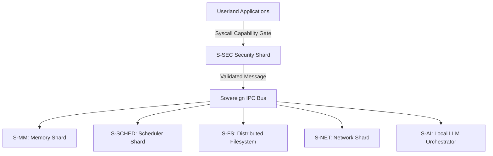

# 🛡️ SigmaOS — Sovereign, AI-Native Operating System

> **"Sovereignty is the ultimate efficiency."**
> The world's first industrial-grade microkernel designed for total digital autonomy, post-quantum resilience, and Indian industrial compliance.

---

## 🎯 Overview

SigmaOS is a sovereign, zero-dependency, AI-native operating system built entirely in Rust. It discards legacy POSIX assumptions to build a hyper-secure, capability-based microkernel designed for an AI-first, object-oriented ecosystem.

### Core Pillars

- **Post-Quantum Cryptography**: Native Kyber-1024 KEM + Dilithium-5 signatures (NIST FIPS 203/204).
- **Capability-Based Security**: 64-bit hardware-enforced permission model replacing legacy ACLs.
- **Shard Architecture**: 600+ hot-swappable kernel modules with zero-latency IPC.
- **AI-Native Design**: Local LLM inference as a first-class OS primitive.
- **India-First**: Native GST, Income Tax, UPI, and 22-language support.

---

## 📊 System Architecture

SigmaOS decomposes the traditional monolithic kernel into specialized, isolated shards. The interaction between these shards is governed by a capability-enforced transaction bus.



- **S-MM**: Sovereign Memory Manager (Buddy Allocator).
- **S-SCHED**: Predictive Multi-Priority Scheduler (MLFQ + CFS + EDF).
- **S-FS**: Sovereign Distributed Filesystem (VFS + SigmaFS).
- **S-SEC**: Security Framework (PQC + MAC + Sandbox).
- **S-AI**: AI Task Orchestrator (Local LLM routing).

---

## 🚀 Quick Start

### Running the QEMU Demo (Works Today)

Ensure you have the required compiler toolchain and emulation packages:

```bash
# Install dependencies
sudo apt install -y build-essential nasm cmake qemu-system-x86 golang-go xorriso

# Clone the repository
git clone https://github.com/AaryanSinghChauhan09/SigmaOS.git
cd SigmaOS

# Build the system image
make clean && make all -j$(nproc)

# Run in QEMU
qemu-system-x86_64 -cdrom build/sigmaos.iso -m 2G -serial stdio
```

### Profile Builds

SigmaOS supports declarative compilation profiles specified at build-time:

```bash
make PROFILE=standalone all    # Full desktop ISO
make PROFILE=rtos all          # Hard real-time ELF
make PROFILE=cloud all         # Headless cloud image
make PROFILE=browser all       # WASM bundle
```

---

## 📚 Categorized Documentation Hub

To facilitate seamless developer onboarding, our extensive documentation is categorized into functional zones:

### 🧩 1. Core Architecture & Kernel Designs
* **[Maturity & Distro-Parity Roadmap](Maturity_Parity_Roadmap.md)** — Strategic milestones detailing gaps & improvements vs mainstream monolithic distributions.
* **[Kernel Evolution Architecture](Kernel_Evolution_Architecture.md)** — Trait hierarchies and microkernel modular boundaries.
* **[Virtual Memory & Paging](Virtual_Memory_Paging.md)** — Page allocation patterns, demand-paging models, and buddy splitting checks.
* **[Real-Time HPC Scheduling](Realtime_HPC_Scheduling_Roadmap.md)** — EEVDF, MLFQ, and EDF scheduling blueprints under heavy CPU loads.
* **[Sovereign BIOS & UEFI Firmware Spec](BIOS_FIRMWARE_SPEC.md)** — Boot phases, system diagnostics, and firmware time-travel modes.

### 🔌 2. Drivers & Hardware Ecosystem
* **[Driver Ecosystem & Plug-and-Play (PnP)](Driver_Ecosystem.md)** — Base interfaces, lazy dynamic loading registries, and hardware-evolution mapping.
* **[Driver Management Roadmap](Driver_Management_Roadmap.md)** — Staged driver development loops (NVMe, USB xHCI, graphics card ports).
* **[Peripheral Compatibility Plan](Peripheral_Compatibility_Plan.md)** — Emulation support for classic inputs and output nodes.
* **[Zig Language Integration](ZIG_INTEGRATION_PLAN.md)** — Incorporating Zig native drivers and cross-language FFI boundary safety.
* **[Nim Language Integration](NIM_INTEGRATION_PLAN.md)** — Interoping Nim safe heap routines with Rust-native allocators.

### 🗂️ 3. Filesystems & Networking
* **[SigmaFS Innovations](SigmaFS_Innovations.md)** — Decentralized COW storage, block replication, and semantic AI queries.
* **[Network Stack & Zero-Copy Net](Network_Stack.md)** — Zero-copy DMA packet transfer schedules, adaptation logic, and VPN clients.
* **[Sovereign Cloud Sync Engine](Core_Builtin_Apps.md)** — On-device P2P chunk sync, verification paths, and decentralized torrent clients.

### 🛡️ 4. Security & Post-Quantum Cryptography
* **[Security Framework](Security_Framework.md)** — Zero-trust process sandboxing, Kyber-1024 KEM, and Dilithium-5 signatures.
* **[Qubes Isolation Roadmap](Qubes_Isolation_Roadmap.md)** — Isolated container shards and micro-VM process execution fences.
* **[Compliance & Regulatory Blueprint](COMPLIANCE_REGULATORY_PLAN.md)** — GDPR, HIPAA, and WCAG accessibility checklist mappings.

### 🧠 5. AI, Automation, & User Interface
* **[Sigma AI Agents](Sigma_AI_Agents.md)** — On-device local inference schedulers and S-CLI natural language parser routing.
* **[Wayland Zenith UI Spec](WAYLAND_ZENITH_SPEC.md)** — 120 FPS high-contrast window composition, screen readers, and WCAG focus structures.
* **[Zenith Desktop UI](Zenith_Desktop.md)** — Dynamic Island statuses, tile-auto panels, and desktop theme overlays.
* **[Custom Personalization & Themes](CUSTOM_PERSONALIZATION_SPEC.md)** — Ambient color rendering rules and reduce-motion settings.

---

## 🤝 Contributing

We welcome contributions! See [Contributor Guidelines](Contributor_Guidelines.md) for details.

### High-Impact Areas

- Round-robin scheduler implementation
- Buddy allocator completion
- sigma-sh REPL
- USB HID keyboard driver
- VESA framebuffer driver
- Package recipes

---

## 📄 License

Dual-licensed under MIT and GPL-2.0. See the `LICENSE` file for details.
