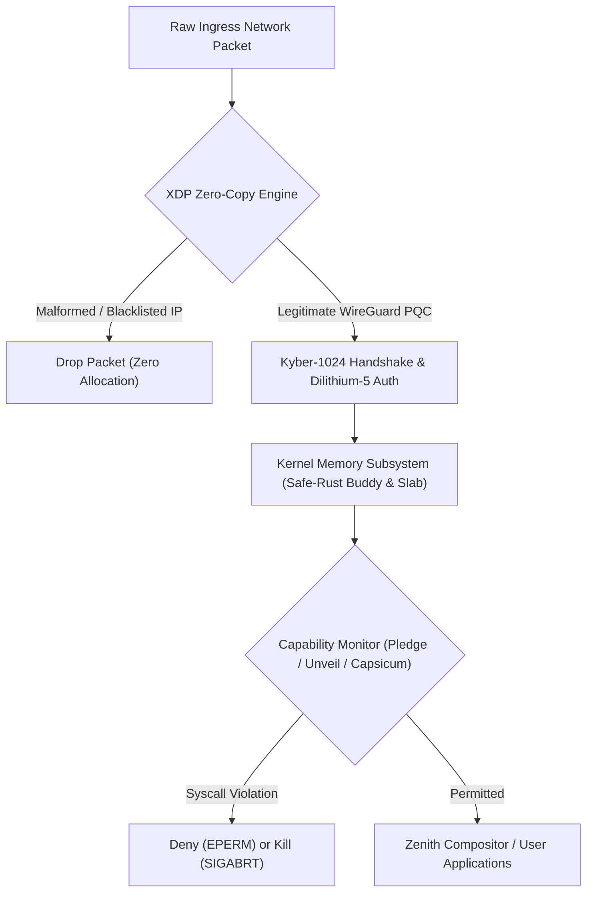

# SigmaOS Security Threat Model & Attack Surface Mitigation Matrix

## 1. Threat Modeling Framework
Inspired by:
- **STRIDE** (Spoofing, Tampering, Repudiation, Information Disclosure, Denial of Service, Elevation of Privilege)
- **MITRE ATT&CK for Enterprise & Cloud**
- **NIST SP 800-207** (Zero Trust Architecture)
- **OpenBSD** Security Posture & Proactive Audit

---

## 2. Attack Surface Vectors & Sovereign Mitigations

| Threat ID | Threat Vector | Target Subsystem | Standard Linux/BSD Exposure | SigmaOS Sovereign Countermeasure | Status |
|---|---|---|---|---|---|
| **THREAT-01** | Post-Quantum Eavesdropping (Store-Now-Decrypt-Later) | Network VPN / In-Transit Data | Classical X25519 vulnerable to Shor's algorithm | Hybrid Kyber-1024 + Dilithium-5 authenticated WireGuard PQC tunnel (`src/network/wireguard_pqc_bridge.rs`) | ✅ Implemented |
| **THREAT-02** | Supply-Chain Package Tampering & Compromised Mirrors | Package Management (`sigpkg`) | Stolen GPG keys, unsigned metadata, mirror poisoning | Content-addressed Merkle Store (`src/sigpkg/merkle_store.rs`), Dilithium-5 signed packages, SLSA Level 4 build provenance (`src/sigpkg/package_signing.rs`) | ✅ Implemented |
| **THREAT-03** | RLE / Delta Injection & Memory Corruption in Updates | Package Update Engine | Buffer overflows in binary patch parsers (e.g., bsdiff CVEs) | Bounds-checked safe-Rust differential delta engine with Adler-32 verification (`src/sigpkg/delta_engine.rs`) | ✅ Implemented |
| **THREAT-04** | Volumetric Layer 3/4 Network DDoS | Ingress Network Interfaces | Kernel socket queue exhaustion, conntrack table blowout | Sovereign zero-copy eBPF XDP filter (`src/kernel/xdp_engine_sovereign.rs`) sub-microsecond early drop before socket allocation | ✅ Implemented |
| **THREAT-05** | Privilege Escalation via Unsanitized Syscalls | Kernel Core & IPC | Monolithic kernel vulnerability exploitation | Capability Monitor (`src/security/capability_monitor.rs`) enforcing OpenBSD pledge(2) immutable profiles & FreeBSD Capsicum fd rights | ✅ Implemented |
| **THREAT-06** | Unauthorized Filesystem Traversal & Information Leakage | VFS & User Processes | SUID binaries, symlink attacks, directory traversal | Per-process fine-grained Unveil(2) path prefixes & Landlock LSM access masks (`src/security/capability_monitor.rs`) | ✅ Implemented |
| **THREAT-07** | Process Hijacking & Live Migration State Tampering | Container & VM Runtime | Unencrypted CRIU image tampering, dirty memory inspection | Cryptographically authenticated snapshots & memory dirty-bitmap validation (`src/kernel/live_migration_engine.rs`) | ✅ Implemented |
| **THREAT-08** | Wayland Client Impersonation & Keystroke Injection | GUI Compositor | X11 global input sniffing, fake Wayland seat events | Zenith Wayland compositor strict client PID separation, focused seat dispatch, and isolated surface buffers (`src/compositor/zenith_core.rs`) | ✅ Implemented |

---

## 3. Defense-in-Depth Enforcement Pipeline

