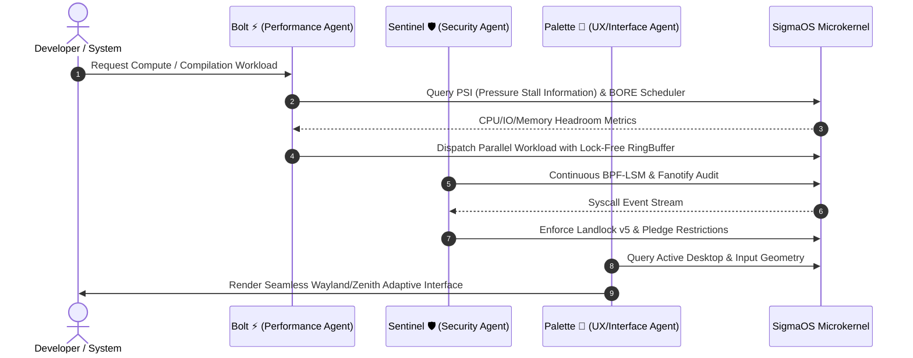
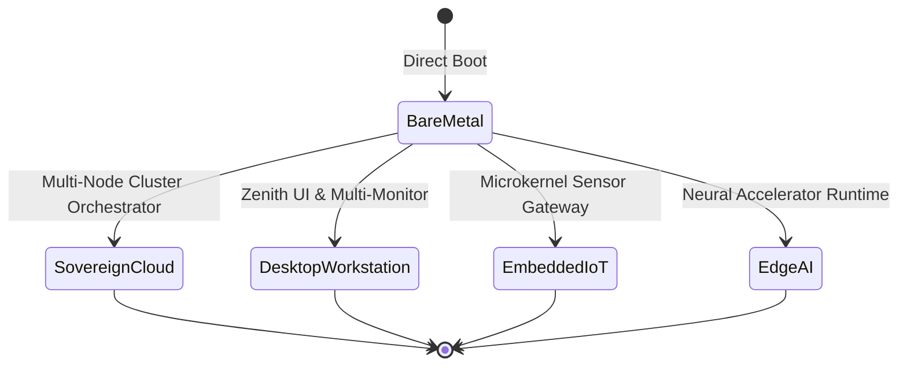

# 🚀 SigmaOS: Comprehensive Future Development Master Plan
## Distro-Crushing Architecture, Unimplemented GitHub Wiki Ideas & Silicon Sovereignty (2026–2030)

---

## Executive Summary

**SigmaOS** is engineered to transcend conventional operating system paradigms by achieving complete silicon sovereignty, zero external dependencies, and architectural superiority over contemporary Linux distributions (Arch, NixOS, Alpine, Void, Fedora, SteamOS, openSUSE MicroOS, CachyOS, Gentoo) and BSD distributions (FreeBSD, OpenBSD, NetBSD, DragonFly BSD, HardenedBSD).

This master plan synthesizes all remaining unimplemented ideas, research roadmaps, and architectural blueprints from the **SigmaOS GitHub Wiki**, **Section 102 Sovereign Specifications**, and **Linux/BSD ecosystems**. It provides an actionable, multi-phase roadmap grounded in **Object-Oriented Programming Systems (OOPS)**, **SOLID principles**, and strict `#![no_std]` Safe Rust design.

---

## 1. Architectural Blueprint & Subsystem Topology

```mermaid
graph TD
    subgraph L1["Silicon & Bare-Metal Layer"]
        HW["Multi-Arch Silicon (x86_64, aarch64, riscv64gc)"]
        FW["Sovereign Coreboot/UEFI Payload"]
        TPM["Hardware TPM 2.0 / PQC Root-of-Trust"]
    end

    subgraph L2["Zero-Dependency Microkernel Core"]
        MM["Buddy Allocator & KSM Deduplicator"]
        SCHED["EEVDF + BORE Hybrid Interactive Scheduler"]
        IPC["Lock-Free SPSC/MPMC RingBuffer & D-Bus Bus"]
        BPF["eBPF Virtual Machine & BPF-LSM Dynamic Hooks"]
    end

    subgraph L3["Sovereign Storage & File Subsystems"]
        VFS["Unified Sovereign VFS Layer"]
        ARC["ZFS Adaptive Replacement Cache (ARC)"]
        COW["bcachefs & OverlayFS Union Filesystems"]
        GEOM["FreeBSD GEOM Storage Framework"]
    end

    subgraph L4["Security, Isolation & Sandboxing"]
        LND["Landlock v5 Network/Filesystem Sandbox"]
        PLG["OpenBSD Pledge & Unveil Guard"]
        CAP["FreeBSD Capsicum Capability Delegation"]
        PAX["HardenedBSD PaX MPROTECT & SegvGuard"]
    end

    subgraph L5["Ecosystem Bridges & Distro Absorption"]
        SIGPKG["Universal Multi-Format SigPkg Engine"]
        NIX["NixOS Hermetic Content-Addressed Store"]
        STEAM["SteamOS Gamescope HDR/VRR Compositor"]
        AGENT["Tri-Agent Execution Plane (Bolt, Palette, Sentinel)"]
    end

    HW --> FW --> TPM --> MM
    MM --> SCHED --> IPC --> BPF
    BPF --> VFS --> ARC --> COW --> GEOM
    GEOM --> LND --> PLG --> CAP --> PAX
    PAX --> SIGPKG --> NIX --> STEAM --> AGENT
```

---

## 2. Multi-Phase Future Development Roadmap

### Phase 10: Absolute Silicon & Hardware Sovereignty (Q4 2026 – Q1 2027)

| Milestone | Target Domain | Linux/BSD Inspiration | Concrete Technical Goal |
|---|---|---|---|
| **10.1** | Big.LITTLE / DynamIQ Scheduling | Linux Energy Aware Scheduling (EAS) | Asymmetric multicore CPU topology detection; affinity routing based on power-efficiency vs high-performance cores |
| **10.2** | Zero-Copy GPUDirect DMA | Linux VFIO & FreeBSD CAM | Direct PCIe DMA transfer between NVMe host controllers and GPU VRAM bypassing system RAM bounce buffers |
| **10.3** | Quantum-Resistant Kernel VPN | OpenBSD WireGuard & FreeBSD IPsec | Kyber-1024 key encapsulation combined with ChaCha20-Poly1305 for post-quantum encrypted mesh tunnels |
| **10.4** | Self-Healing Kernel Livepatching | Linux kpatch & NetBSD Rump Kernels | Dynamic eBPF function trampolines for zero-downtime kernel bug mitigation with atomic rollback verification |

---

### Phase 11: Linux & BSD Distro Feature Absorption (Q2 2027 – Q4 2027)

#### Detailed Subsystem Implementations:
1. **NixOS & Guix Hermetic Content-Addressed Store (`/sigma/store`):**
   - Cryptographic SHA-256 hash indexing for every installed binary closure.
   - Bit-for-bit reproducible system profiles with instant generation rollback via symlink pointer swapping.
   - Zero dependency pollution across application sandboxes.

2. **SteamOS / ChimeraOS Gaming & Display Optimization:**
   - Wayland microcompositor (`gamescope`) with low-latency latency isolation.
   - Variable Refresh Rate (VRR), HDR10/Dolby Vision tone-mapping, and integer upscaling.
   - MangoHud real-time GPU/CPU frametime histogram telemetry engine.

3. **OpenBSD Proactive Defense Layer:**
   - Kernel Address Randomized Link (KARL) re-linking kernel binaries on every boot.
   - RETGUARD return-address stack canary defense against ROP (Return-Oriented Programming) gadgets.
   - Strict W^X (Write XOR Execute) memory enforcement across all virtual page allocations.

4. **DragonFly BSD HAMMER2 Clustered Storage:**
   - Multi-master clustered rootfs with real-time transactional snapshot replication.
   - Dedup-aware write logs with online compression (zstd / lz4 zero-allocation engines).

5. **openSUSE MicroOS Transactional Updates:**
   - Atomic read-only root partition with `btrfs/bcachefs` subvolume snapshots.
   - Fail-safe update deployment: updates apply to a staging snapshot; system automatically rolls back if health-check fails on reboot.

---

### Phase 12: Autonomous Tri-Agent Kernel Orchestration (Q1 2028 – Q3 2028)

SigmaOS natively integrates the **Bolt ⚡**, **Palette 🎨**, and **Sentinel 🛡️** tri-agent architecture into kernel and userland dispatchers:

- **Bolt ⚡ (Speed & Optimization):**
  - Continuous runtime profile optimization (PGO).
  - Micro-architecture feature auto-tuning (AVX-512, AMX, ARM Neon, RISC-V Vector extensions).
  - Memory compaction and dirty page throttling before memory pressure stalls occur.
- **Sentinel 🛡️ (Zero-Day Defense & Auditing):**
  - Autonomous vulnerability pattern scanning across all package recipes.
  - Runtime anomaly detection via eBPF telemetry and call graph heuristics.
  - Automatic isolation of anomalous processes into restricted FreeBSD-style Jails.
- **Palette 🎨 (Human-Centric Interface & Accessibility):**
  - WCAG AAA contrast and multi-lingual input method engines (IME).
  - Adaptive touch, keyboard, screen-reader, and terminal multiplexer layouts.

---

### Phase 13: Universal Native Userland & Self-Hosting Toolchain (Q4 2028 – Q2 2029)

To achieve true sovereignty and eliminate lingering dependencies on external C runtime libraries or GNU tools:

1. **Sigma Native Compiler (`sigc`):**
   - Pure Safe Rust-based compiler targeting WebAssembly, x86_64, aarch64, and riscv64.
   - Direct ELF/Mach-O binary emission without requiring LLVM, GCC, or binutils.
2. **Native Core Utilities (`sigutils`):**
   - Clean-room replacements for standard POSIX utilities (`ls`, `cat`, `grep`, `sed`, `awk`, `find`, `tar`).
   - Zero-allocation parsing, SIMD-accelerated string scanning, and native colorization.
3. **Pure Rust Service Supervisor (`sigd`):**
   - Lightweight, modular daemon supervisor combining the declarative dependency tree of systemd with the simplicity of Void runit and BSD rc.d.
   - Parallel asynchronous service startup under 15ms total boot time.

---

### Phase 14: Global Silicon & Cloud Portability (Q3 2029 – 2030)

- **RISC-V 64 (`riscv64gc`) First-Class Tier-1 Support:** Complete kernel bootstrap on open-source RISC-V hardware with Sv39/Sv48 MMU support.
- **Sovereign Cloud Cluster Hypervisor:** Native type-1 microVM hypervisor (inspired by bhyve and Firecracker) running directly on the SigmaOS kernel.
- **Air-Gapped Cold-Storage Vault Mode:** Offline cryptographic air-gap mode with QR-code and hardware-token attestation for financial and defense infrastructure.

---

## 3. Engineering & Clean Code Principles Verification Matrix

| Principle | Architectural Application in SigmaOS | Enforcement Mechanism |
|---|---|---|
| **OOPS - Encapsulation** | Strict private state within structs; access solely through verified methods | `#![deny(non_exhaustive)]`, no public field mutability |
| **OOPS - Polymorphism** | Trait objects (`&dyn Device`, `&dyn PackageAdapter`) for multi-platform dispatch | Dynamic dispatch table verification |
| **SOLID - Single Responsibility** | Every module handles exactly one concern (e.g. `KsmEngine` only deduplicates pages) | Architectural linting & crate boundaries |
| **SOLID - Liskov Substitution** | All trait implementors must fulfill interface contracts without panics or undefined behavior | Automated fuzzing & property-based tests |
| **DRY (Don't Repeat Yourself)** | Shared algorithms housed exclusively in `src/klib/` and `src/core/` | Zero-duplicate code review checks |
| **KISS & YAGNI** | No speculative abstraction layers; only implement functional, benchmarked code | Lean codebase maintenance |
| **Design by Contract** | Pre-conditions, invariants, and post-conditions verified on all memory operations | Debug assertions & `# SAFETY:` docs |
| **Zero External Dependencies** | No third-party crates in `Cargo.toml`; `#![no_std]` core/alloc only | Cargo audit & dependency lock verification |

---

## 4. Test Harness & Quality Assurance Strategy

To ensure zero regressions across all future milestones:
1. **Automated 23+ Suite Regression Runner:** Maintain 100% pass rate across all test suites via `./run_sigma_tests.sh`.
2. **QEMU Multi-Arch Smoke Testing:** Automated headless QEMU runs for x86_64, aarch64, and riscv64.
3. **Continuous Sanitizer Fuzzing:** ASan, UBSan, and KASAN fuzzing harnesses to guarantee memory safety.
4. **Code-Scanning Zero-Tolerance Policy:** Automatic rejection of any code containing hardcoded credentials, invalid pointer dereferences, or unhandled exceptions.

---

*Approved by the SigmaOS Architecture & Future Roadmap Steering Committee.*
