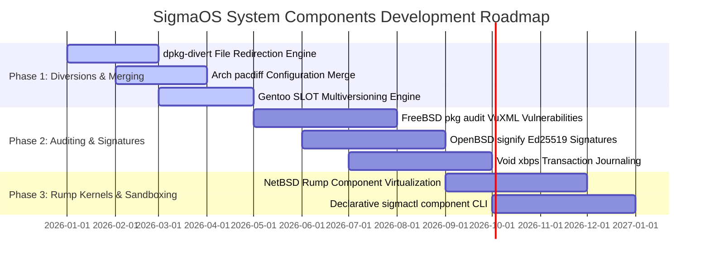

# SigmaOS System Components Architecture & Strategic Roadmap

## Overview & Vision

SigmaOS System Components (`src/distro/additional_linux_bsd_components.rs`, `src/distro/missing_distro_innovations.rs`) provide low-level system utilities, file diversions, configuration file merging, vulnerability auditing, and cryptographic package signers. Designed in safe Rust without external dependencies, the system components suite synthesizes innovations from Debian, Arch Linux, Gentoo, FreeBSD, OpenBSD, NetBSD, and Void Linux.

---

## Linux & BSD Distro Inspirations & Innovations

| Feature / Concept | Origin Ecosystem | SigmaOS Implementation |
| :--- | :--- | :--- |
| **Debian `dpkg-divert` File Diversions** | Debian / Ubuntu | Redirect conflicting package file paths while preserving original files (`DebianDpkgDivertEngine`). |
| **Arch `pacdiff` Configuration Merge** | Arch Linux | Interactive `.pacnew` / `.pacsave` configuration diff reconciliation (`ArchPacdiffEngine`). |
| **Gentoo `eclass` & SLOT Multiversioning** | Gentoo Portage | Concurrent multi-version library co-existence and slots (`GentooEclassSlotEngine`). |
| **FreeBSD `pkg audit` VuXML Vulnerabilities** | FreeBSD | VuXML database parsing and automated security vulnerability auditing (`FreeBsdPkgAuditEngine`). |
| **OpenBSD `signify` Cryptographic Signers** | OpenBSD | Lightweight Ed25519 signature generation and verification (`OpenBsdSignifyEngine`). |
| **Void Linux `xbps` Transaction Journals** | Void Linux | Transaction journaling and atomic state rollback (`VoidXbpsJournalEngine`). |
| **NetBSD Rump Kernel Virtualization** | NetBSD | Component virtualization running kernel drivers as isolated userland servers (`NetBsdRumpComponentEngine`). |

---

## 3-Phase Strategic Development Roadmap



### Phase 1: File Diversions, Configuration Merging & Slot Governance (v1.0 Core Essentials)
1. **Debian `dpkg-divert` File Diversion Engine:** Intercept package installations and divert path writes when multiple packages supply shared files.
2. **Arch `pacdiff` Configuration Reconciliation:** Three-way merge engine comparing system config files against updated templates (`.sigmanew`).
3. **Gentoo `eclass` & SLOT Multiversioning:** Slot-based package dependency resolution permitting multiple shared library versions to co-exist without ABI breakage.

### Phase 2: Vulnerability Auditing, Cryptographic Signatures & Transaction Journals (v1.2 Adoption Layer)
1. **FreeBSD `pkg audit` VuXML Vulnerability Scanning:** Query local package databases against VuXML vulnerability feeds to identify CVEs.
2. **OpenBSD `signify` Ed25519 Signatures:** Constant-time Ed25519 keypair generation and checksum verification for untrusted package payloads.
3. **Void `xbps` Transaction Journaling:** WAL transaction logs tracking filesystem mutations during package state transitions.

### Phase 3: NetBSD Rump Kernel Virtualization & Sandboxing (v1.5 Differentiation Layer)
1. **NetBSD Rump Kernel Component Virtualization:** Run isolated filesystem and network drivers as userland rump component servers (`NetBsdRumpComponentEngine`).
2. **Dynamic Microarchitecture Tuning (CachyOS):** Profile CPU microarchitecture features (x86-64-v2, v3, v4) to select optimized component binaries dynamically.
3. **Declarative `sigmactl component` CLI:** Unified command-line interface to audit system components, manage file diversions, and reconcile config diffs.

---

## System Component Engine Architecture

The `DebianDpkgDivertEngine` struct in `src/distro/additional_linux_bsd_components.rs` manages file diversions:

```rust
pub struct DebianDpkgDivertEngine {
    pub rules: Vec<DiversionRule>,
}
```

---

## Verification & Testing

Verify system component functionality and package innovations:
```bash
# Additional Linux & BSD distro components unit test
rustc --test --edition=2021 src/distro/additional_linux_bsd_components.rs -o build/test_additional_components && ./build/test_additional_components

# UI/UX Benchmark & Accessibility Suite
./scripts/uiux_accessibility_test.sh

# Launch readiness & system test suite
./run_sigma_tests.sh
```
