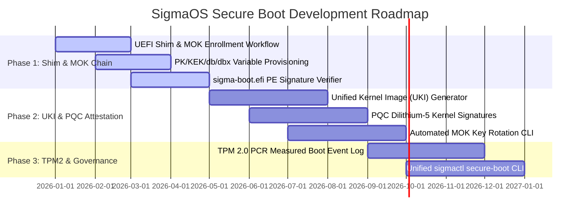

# SigmaOS UEFI Secure Boot Installation & Chain-of-Trust Roadmap

## Overview & Vision

The Secure Boot Verification Engine (`src/boot/secure_boot.rs`) provides cryptographic chain-of-trust verification for SigmaOS bootloader binaries (`sigma-boot.efi`), kernel images, and initial RAM filesystems (`initramfs`). Designed in safe Rust without external C dependencies, the Secure Boot suite synthesizes Linux Shim/MOK workflows, Unified Kernel Images (UKI), and BSD measured boot attestation.

---

## Linux & BSD Distro Inspirations & Innovations

| Feature / Concept | Origin Ecosystem | SigmaOS Implementation |
| :--- | :--- | :--- |
| **UEFI Shim & Machine Owner Key (MOK)** | Fedora / Ubuntu / Debian | First-stage `shim.efi` bootloader delegating key enrollment to MOK manager routines (`mokutil` interface). |
| **Custom PK / KEK / db / dbx Management** | Arch Linux (`sbctl`) | Provisioning custom Platform Key (PK), Key Exchange Key (KEK), Allowed Signature DB (`db`), and Forbidden Key DBX (`dbx`). |
| **Unified Kernel Images (UKI)** | Fedora / Arch / systemd-ukify | All-in-one signed PE/COFF binary bundling EFI stub, kernel ELF, initramfs, cmdline, and OS release metadata. |
| **Post-Quantum Dilithium-5 Attestation** | Sovereign Innovation | PQC Dilithium-5 / Kyber-1024 signature verification extending classical RSA-4096 / ECDSA-P384 Secure Boot keys. |
| **TPM 2.0 Measured Boot & PCR Logging** | Linux / FreeBSD `tpm` driver | Platform Configuration Register (PCR 0-7) event logging and TPM 2.0 secret unsealing tied to boot integrity state. |
| **OpenBSD Integrity Attestation** | OpenBSD `sysupgrade` | Bootloader signature verification and immutable boot configuration attestation. |

---

## 3-Phase Strategic Development Roadmap



### Phase 1: Shim / MOK Chain-of-Trust & Key Enrollment (v1.0 Core Essentials)
1. **UEFI Shim Interoperability:** Boot via Microsoft-signed `shim.efi` first stage to load `sigma-boot.efi` using MOK certificates.
2. **MOK Key Enrollment Interface (`mokutil`):** User-guided interactive key enrollment workflow during installer setup (`/EFI/SigmaOS/MOK.cer`).
3. **PE/COFF Signature Verification:** Fast Authenticode signature verification of kernel ELF binaries using keys in `db` and MOK list.

### Phase 2: Unified Kernel Images (UKI) & Post-Quantum Attestation (v1.2 Adoption Layer)
1. **Unified Kernel Image (UKI) Generation:** Package `sigma-kernel.elf`, `initramfs.cpio.gz`, `/etc/kernel/cmdline`, and `/etc/os-release` into a single signed PE binary.
2. **Post-Quantum Dilithium-5 Signature Attestation:** Combine classical Authenticode signatures with PQC Dilithium-5 signatures for quantum-resistant boot chain validation.
3. **Automated MOK Key Rotation:** Command-line key generation and MOK variable enrollment during kernel package updates via `sigma-pkg`.

### Phase 3: Measured TPM 2.0 Boot & Declarative Key Governance (v1.5 Differentiation Layer)
1. **TPM 2.0 PCR Event Logging:** Extend hashes of bootloader, kernel, initramfs, and kernel command line parameters into TPM 2.0 PCR 4, 8, and 9.
2. **Disk Encryption Secret Unsealing:** Seal LUKS2 / SigmaFS encryption keys against TPM 2.0 PCR policies, unsealing only when Secure Boot verification succeeds.
3. **Declarative `sigmactl secure-boot` CLI:** Unified command-line interface to audit Secure Boot status, enroll keys, inspect PCR measurements, and manage MOK keys.

---

## Secure Boot Verifier Architecture

The `SecureBootVerifier` struct in `src/boot/secure_boot.rs` manages verification state:

```rust
pub struct SecureBootVerifier {
    pub state: SecureBootState,
    pub db: Vec<SecureBootDbEntry>,
    pub dbx: Vec<u64>,
    pub MOK_list: Vec<SecureBootDbEntry>,
    pub tpm2_pcr_logger: Tpm2PcrLogger,
}
```

---

## Verification & Testing

Verify Secure Boot functionality and bootloader chain-of-trust:
```bash
# Standalone Secure Boot unit test
rustc --test --edition=2021 src/boot/secure_boot.rs -o build/test_secure_boot && ./build/test_secure_boot

# UI/UX Benchmark & Accessibility Suite
./scripts/uiux_accessibility_test.sh

# Launch readiness & system test suite
./run_sigma_tests.sh
```
