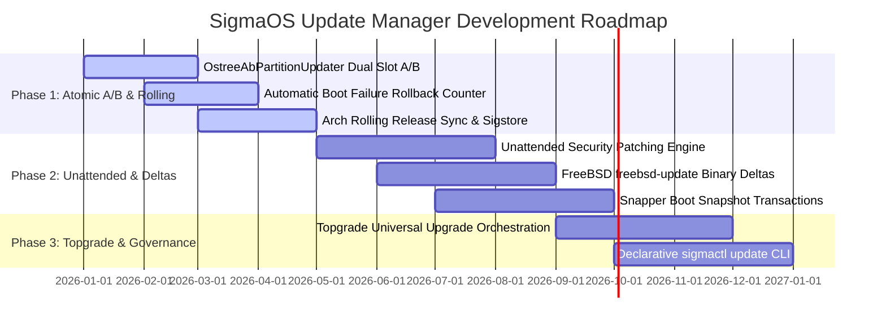

# SigmaOS Software Update Manager & Atomic OS Image Deployment Roadmap

## Overview & Vision

The SigmaOS Software Updater subsystem (`src/package/updater.rs`, `src/update/distro_update_parity.rs`) provides atomic OS updates, dual-slot A/B partition switching, automated boot snapshot rollbacks, non-interactive security patching, and firmware updates (`fwupd`). Designed in safe Rust without external dependencies, the update engine synthesizes patterns from ChromeOS, Fedora `rpm-ostree`, Debian `unattended-upgrades`, FreeBSD `freebsd-update`, and OpenBSD `sysupgrade`.

---

## Linux & BSD Distro Inspirations & Innovations

| Feature / Concept | Origin Ecosystem | SigmaOS Implementation |
| :--- | :--- | :--- |
| **`rpm-ostree` & ChromeOS Dual-Slot A/B** | Fedora Silverblue / ChromeOS | Atomic OS image deployment switching between `SlotA` and `SlotB` partitions (`OstreeAbPartitionUpdater`). |
| **Automatic Boot Snapshot Rollback** | openSUSE Snapper / Arch | Automatic Btrfs/ZFS snapshot creation prior to updates with automatic rollback on boot failure. |
| **FreeBSD `freebsd-update` Binary Deltas** | FreeBSD | Binary delta diff patching downloading only changed byte blocks for fast sub-second updates. |
| **Debian `unattended-upgrades`** | Debian / Ubuntu | Automated background security update installation without user intervention or reboot prompts. |
| **Arch Linux Rolling Release Sync** | Arch Linux (`pacman -Syu`) | Continuous rolling release package updates with TUF / Sigstore post-quantum Dilithium signature verification. |
| **OpenBSD `sysupgrade` Simplicity** | OpenBSD | Zero-configuration single-command OS upgrades with cryptographic signature verification. |
| **Topgrade Universal Orchestration** | Community / Topgrade | Single-pass upgrade orchestration across system packages, flatpaks, Rust toolchains, and containers. |

---

## 3-Phase Strategic Development Roadmap



### Phase 1: Atomic A/B Partition Updating & Rolling Releases (v1.0 Core Essentials)
1. **`OstreeAbPartitionUpdater` Dual Slot A/B Deployment:** Apply updates to the inactive slot (`SlotB` if `SlotA` is active) and stage boot configuration for seamless atomic reboot.
2. **Automatic Boot Failure Rollback:** Track boot attempts; if a newly updated slot fails to reach `ServiceState::Ready` within 3 boot attempts, automatically roll back to the previous slot.
3. **Rolling Release Sync & Sigstore Verification:** Fast package updates with TUF metadata verification and post-quantum Dilithium signatures.

### Phase 2: Unattended Security Patching & Binary Deltas (v1.2 Adoption Layer)
1. **Non-Interactive Unattended Security Patching:** Background security updates for critical vulnerabilities (`UpdateType::Security`) without interrupting active sessions.
2. **FreeBSD-Style Binary Delta Diffing:** Generate and apply compact VCDIFF / bsdiff binary patch files for bandwidth-constrained updates.
3. **Pre-Update Snapper Boot Snapshots:** Create ZFS / Btrfs boot environment snapshots prior to every update transaction.

### Phase 3: Topgrade Universal Orchestration & Firmware Updating (v1.5 Differentiation Layer)
1. **Topgrade Universal Upgrade Orchestrator:** Single command (`sigmactl update --all`) updating OS base images, universal packages (`sigma-pkg`), Flatpaks, Rust toolchains, and container images.
2. **`fwupd` / LVFS Hardware Firmware Updates:** Query and install UEFI, NVMe, TPM, and device firmware updates via LVFS metadata.
3. **Declarative `sigmactl update` CLI:** OpenBSD-inspired clean CLI for status checks (`sigmactl update status`), channel selection (`Stable`/`Beta`/`Nightly`), and rollback (`sigmactl update rollback`).

---

## Update Manager Architecture

The `OstreeDeploymentState` and `UpdateManager` structs in `src/update/distro_update_parity.rs` manage deployment state:

```rust
pub struct OstreeDeploymentState {
    pub active_slot: PartitionSlot,
    pub slot_a_version: &'static str,
    pub slot_b_version: &'static str,
    pub boot_successful: bool,
    pub rollback_count: u32,
}
```

---

## Verification & Testing

Verify software updater functionality and atomic deployment rollbacks:
```bash
# Standalone updater unit test
rustc --test --edition=2021 src/package/updater.rs -o build/test_updater && ./build/test_updater

# Distro update parity standalone test
rustc --test --edition=2021 src/update/distro_update_parity.rs -o build/test_update_parity && ./build/test_update_parity

# UI/UX Benchmark & Accessibility Suite
./scripts/uiux_accessibility_test.sh

# Launch readiness & system test suite
./run_sigma_tests.sh
```
