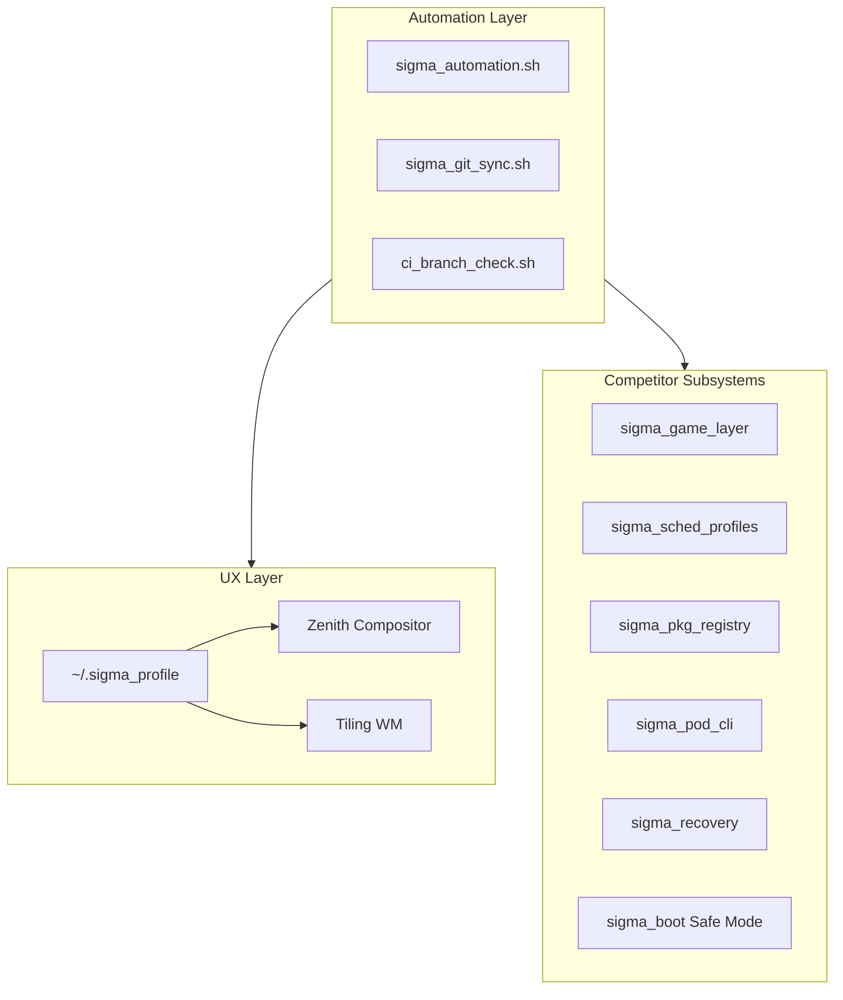

# SigmaOS Meta-Distro Unified Engine

SigmaOS treats other Linux distributions as **feature suppliers**, not competitors. Each distro’s unique capability maps to a sovereign subsystem that shares automation, CLI, Zenith GUI, and branch parity enforcement.

## Architecture



## Subsystem map

| Distro class | SigmaOS module | User-visible feature |
|--------------|----------------|----------------------|
| SteamOS | `sigma_game_layer.c` | Gaming profile + compatibility shim hooks |
| Clear Linux | `sigma_sched_profiles.c` | Performance / balanced / power-save CPU policy |
| NixOS | `sigma_pkg_registry/` | Reproducible signed `.spkg` recipes |
| CoreOS / Flatcar | Boot + rollback | Immutable updates, Safe Mode, Fix-it menu |
| RancherOS | `sigma_pod_cli` | Namespaced workloads without Docker |
| Rescuezilla | `sigma_recovery.c` | Snapshots, rollback, forensic audit |
| Solus | Zenith + profile | Themes, gaps, auto-tile layouts |

## Branch parity

All `release/*` branches must satisfy profiles in `FEATURE_MATRIX.md`. CI runs `scripts/ci_branch_check.sh` on every push.

## Maintainer workflow

```bash
./scripts/sigma_automation.sh update
./scripts/ci_branch_check.sh
./scripts/sigma_branch_sync.sh --report
./scripts/sigma_git_sync.sh -m "docs: meta-distro wiki sync"
```

Wiki publishes from `wiki_repo/` via GitHub Actions.
