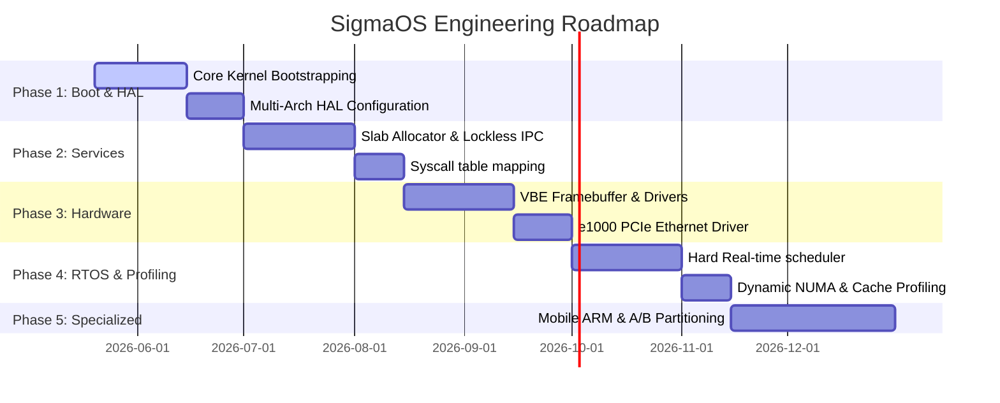

# Σ SigmaOS Zenith: Sovereign Launch & Expansion Roadmap

SigmaOS Zenith is an industrial-grade, sovereign microkernel operating system built on a modular 600-shard C++ singleton lattice. This document establishes the definitive master launch strategy, core vision, multi-branch engineering architecture, and 5-phase execution roadmap to outperform traditional monolithic operating systems on modern silicon.

---

## 🏛️ Core Vision & Strategic Focus
Unlike general-purpose operating systems built on decades of legacy POSIX baggage, SigmaOS is designed from the ground up for **absolute sovereignty, zero-dependency purity, and modular scale**.
Our core vision positions SigmaOS as a **universal cross-profile operating system**, utilizing a shared high-performance C++ microkernel core at Ring 0, which is dynamically extended via profile configurations to target four critical computing domains:
1. **Desktop / Workstation**: Immersive glassmorphic environments powered by direct-silicon Vulkan compositing.
2. **Cloud / Infrastructure**: Container-native, immutable virtual machine scale with A/B partition redundancy.
3. **Embedded / RTOS**: Safety-critical, deterministic scheduling with low-latency zero-copy IPC.
4. **Mobile / Portable**: Low-power ARM/RISC-V architectures with adaptive power state scaling.

---

## 🚀 Key Development Areas & Subsystem Linkages

### 1. Microkernel Base (`release/microkernel`)
* **Philosophy**: Minimal Ring-0 footprint focusing entirely on thread scheduling, virtual memory paging, and hardware abstraction. All high-level services (file systems, network stacks, user UIs) are run in Ring 3 as isolated user-space processes (Attested Core Shards) communicating via syscalls.
* **Code Base Linkages**:
  * Syscall Routing: Mapped dynamically via the O(1) registry in [SovereignSyscall.cpp](file:///C:/Users/Aaryan/Documents/antigravity/joyful-einstein/kernel/core/syscall/SovereignSyscall.cpp) (`int 0x80` entrypoints).
  * Shard Isolation: Enforced using privilege Ring 3 boundaries and separate page directories in the Virtual Memory Manager.
  * Extensibility: Supports on-the-fly loading of signed modular binaries via `sys_pkg_install` (Syscall `0x06`).

### 2. Real-Time OS Extensions (`release/rtos`)
* **Philosophy**: Hard real-time execution guarantees through deterministic task prioritization, priority inheritance (to prevent priority inversion), and lock-free Single Producer Single Consumer (SPSC) IPC queues.
* **Code Base Linkages**:
  * Scheduling Class: Tasks marked with priorities > 80 are automatically promoted to `SchedClass::SCHED_SOVEREIGN` (Hard Real-Time Class) inside [SovereignScheduler.cpp](file:///C:/Users/Aaryan/Documents/antigravity/joyful-einstein/kernel/scheduler/SovereignScheduler.cpp).
  * Priority Inheritance: Supports dynamic priority boosts through `task.priority_boost` to resolve resource locking.
  * IPC Channels: Lock-free zero-copy ring buffers running in active memory segments to achieve sub-microsecond inter-task message dispatch.

### 3. Performance-Optimized Branch (`performance-optimized`)
* **Philosophy**: Direct-silicon latency reduction. Lockless, fragmentation-free memory allocation, NUMA cache locality pinning, and register-preserving inline assembly context switches.
* **Code Base Linkages**:
  * Context Switch: Preserves and swaps x86_64 registers directly on CPU stacks via register inline asm inside `SovereignScheduler::swapContextRegisters`.
  * Memory Allocation: Fast O(1) page allocation handled by the Physical Memory Manager bitmap and lock-free Slab allocation buckets.
  * NUMA Locality: Pinned scheduler threads automatically balance workloads using `SovereignScheduler::balanceNUMANodes()` to eliminate high-latency cross-socket memory accesses.

### 4. Mobile Adaptations (`release/mobile`)
* **Philosophy**: Tailored for ARM64 and RISC-V architectures. Focuses on low-power C-state/P-state transitions, battery-efficiency scheduling (pinning background tasks to efficient cores), and touch-friendly interface scaling.
* **Code Base Linkages**:
  * Hardware Abstraction: The HAL layer in `/kernel/hal/` handles multi-architecture registers for x86_64, ARM, and RISC-V.
  * Visual Compositor: Touch-responsive UI layouts and responsive glassmorphism in `zenith_desktop.js` and `style.css`.
  * Power Management: Thread scheduling intervals dynamically expand during idle periods to preserve silicon power draw.

### 5. Cloud/Distributed Native (`release/cloud` and `release/distributed`)
* **Philosophy**: CoreOS-style immutability. Supports bare-metal A/B partition redundancy for safe rolling updates, declarative system configurations, and decentralized virtual file system clusters.
* **Code Base Linkages**:
  * Immutable Root: Handled by `SovereignImmutableHostEngine` inside [sigma_absorption_principle_container_coreos.cpp](file:///C:/Users/Aaryan/Documents/antigravity/joyful-einstein/tools/sigma_absorption_principle_container_coreos.cpp), blocking write operations targeting root directories.
  * A/B Partitions: Active system state is tracked via two redundant `PartitionSlot` structures, enabling instant rollbacks if a boot attestation fails.
  * Distributed VFS: Decoupled virtual filesystems synced via secure sockets.

### 6. Dual-Boot Coexistence (`release/dual-boot`)
* **Philosophy**: Coexistence with Windows/Linux. Out-of-the-box Multiboot specification compatibility, allowing standard bootloaders like GRUB to parse and chain-load the system.
* **Code Base Linkages**:
  * Bootloader Entry: Mapped via [linker.ld](file:///C:/Users/Aaryan/Documents/antigravity/joyful-einstein/linker.ld) targeting ELF64 output at load address `0x100000`.
  * Packaging Pipeline: Containerized ISO compilation and GRUB configuration generator inside [Makefile](file:///C:/Users/Aaryan/Documents/antigravity/joyful-einstein/Makefile) (`grub-mkrescue`).

### 7. Standalone Stable Packaging (`release/standalone`)
* **Philosophy**: Complete self-contained sovereign execution. Fuses Vite frontend assets, Electron desktop runtimes, and core system shunts into a lightweight, standalone app package requiring zero host environment setups.
* **Code Base Linkages**:
  * Desktop Shell: Orchestrated through [main.js](file:///C:/Users/Aaryan/Documents/antigravity/joyful-einstein/main.js) and standard production distribution scripts.

---

## 📈 The 5-Phase Engineering Roadmap



### Phase 1: Core Kernel Bootstrapping & Multi-Arch HAL
* **Deliverable**: A bootable ELF64 microkernel image that prints diagnostic outputs to VGA text mode and serial UART (COM1).
* **Focus**: Setting up Global Descriptor Tables (GDT), Interrupt Descriptor Tables (IDT), Page Table mappings, and register structures for x86_64 and ARM.

### Phase 2: Essential System Services
* **Deliverable**: O(1) Slab memory allocator and inter-shard syscall table.
* **Focus**: Activating lockless memory bucket structures, register-preserving context switches, and completing the userland-kernel boundary interface (`int 0x80` dispatcher).

### Phase 3: Hardware Porting & Core Drivers
* **Deliverable**: Storage (ATA/IDE), Display (VBE linear framebuffer), and Ethernet (Intel e1000) hardware support.
* **Focus**: Writing robust interrupt handlers, configuring DMA transfers for hard drives, and drawing high-performance UI pixels directly to graphics hardware buffers.

### Phase 4: Dynamic Performance Profiling & RTOS Extensions
* **Deliverable**: Hard real-time priority queues and NUMA memory socket affinity re-balancing.
* **Focus**: Activating preemptive priority scheduling, implementing priority inheritance lock shunts, and optimizing memory access times.

### Phase 5: Specialized Profiles & Immutable Distribution
* **Deliverable**: Declarative packaging and immutable CoreOS-style partitionSlots.
* **Focus**: Packaging the standalone desktop environment, optimizing ARM registers for mobile profiles, and implementing cryptographic signature boot validations.

---

## 🛠️ Developer Guides, Contribution & Testing Framework

### Developer Onboarding Workflow
To run a local development workspace, compile the system components, and launch:
1. **Clone the Sovereign Workspace**:
   ```bash
   git clone https://github.com/AaryanSinghChauhan09/SigmaOS.git
   cd SigmaOS
   ```
2. **Build and Preview the Desktop Environment (Web/Vite UI)**:
   ```bash
   npm install
   npm run build
   npm run preview
   ```
3. **Compile the x86_64 Bare-Metal Iso (requires cross-compiler toolchain or Ubuntu container)**:
   ```bash
   make all
   ```

### Consolidated Testing Framework
SigmaOS implements a rigorous multi-tier testing pipeline to prevent regressions across all branches:
- **Unit and Integration Tests**: Standard JS/TS and C++ behavior assertions are run in the web-app layer via Vitest:
  ```bash
  npm run test
  ```
- **QEMU Emulation Verification**: Boot and scheduler states are validated directly inside hardware emulators using QEMU:
  ```bash
  # Test x86_64 Singularity Boot
  bash qemu-boot.sh x86_64

  # Test ARM64 Emulation
  bash qemu-boot.sh aarch64
  ```

---

> **Σ SigmaOS**: Absolute Sovereignty. Singularity Achieved.
