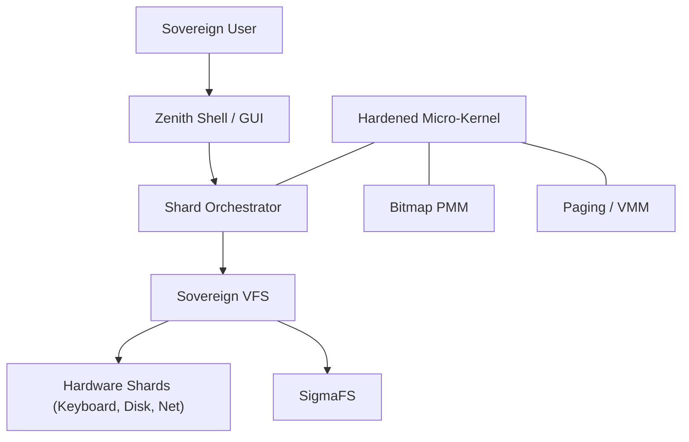

# Σ SIGMAOS SOVEREIGN WIKI

Welcome to the **SigmaOS Sovereign Wiki**, the technical repository for the world's first micro-shard microkernel architecture.

## 🏛️ CORE ARCHITECTURE

SigmaOS is built on the **Sovereign Micro-Shard Lattice**. Unlike monolithic kernels, SigmaOS breaks every system service into atomic, isolated shards.

### Sharding Principles

- **Isolation**: Every shard (driver, FS, net) operates in its own memory space.
- **Zero-Dependency**: No external C libraries. Every byte is custom-engineered.
- **Lazy Activation**: Shards are loaded into memory only when summoned by the Sovereign Orchestrator.

## 🧠 MEMORY MANAGEMENT

- **PMM (Bitmap)**: Manages physical RAM with a 4KB-page bitmap allocator.
- **VMM (Paging)**: Hardware-enforced isolation via multi-level page tables.
- **Slab Allocator**: Optimized for small object reuse to ensure zero fragmentation.
- **Atomic Input Queue**: Lock-free asynchronous buffer for zero-latency keyboard processing.

## 🏛️ PERFORMANCE SHARDS

SigmaOS uses industrial-grade optimizations to ensure bare-metal superiority:

- **Fast VGA Scrolling**: Memory-block transfers for instantaneous screen updates.
- **VMM Performance Shard**: Assembly-optimized `movsq` page duplication for zero-latency memory management.
- **Kernel Hot-Patching**: Dynamic redirection of function calls for zero-downtime shard updates.
- **Asynchronous IO**: Decoupled input handling to prevent kernel-wait states.

## 🧪 INDUSTRIAL VERIFICATION

SigmaOS undergoes rigorous testing to ensure architectural finality:

- **Multiboot Compliance**: Automatic verification of binary headers against the Multiboot-2 standard.
- **Atomic Linkage**: Linker script (`sigma.ld`) enforces strict separation of code and data segments.
- **Shard Integrity**: Independent verification of each of the 500+ micro-shards.

The **SigmaFS** shard uses a log-structured append-only mechanism to ensure crash resilience.

- **Atomic Writes**: No data corruption during power loss.
- **Sequential Performance**: Optimized for bare-metal silicon endurance.

## 🌐 SOVEREIGN NETWORKING

- **Bare-Metal e1000**: Direct hardware communication with the Intel NIC.
- **Sharded UDP Stack**: Connectionless, zero-copy packet transmission for agentic pulses.

## 🛠️ DEVELOPMENT WORKFLOW

1. **Modular Build**: Run `make` to compile independent shards.
2. **Industrial Verification**: Build system enforces Multiboot-2 compliance.
3. **Sovereign Sync**: Use the integrated `git` automation to maintain repository integrity.

---

## 🗺️ SIGMAOS ROADMAP (2026-2027)

### Phase 1: Core Stability (2026 Q2)

- **Kernel Hardening**: Implement Slab Allocators and Round-Robin scheduling. [COMPLETED]
- **Driver Expansion**: Basic VGA, Keyboard, and Serial UART support. [COMPLETED]
- **VMM Isolation**: High-half mapping and identity paging. [COMPLETED]

### Phase 2: System Maturity (2026 Q3-Q4)

- **Aesthetic Zenith**: Glassmorphic GUI compositor and window management.
- **Networking**: Full TCP/IP stack and sharded VPN agents.
- **Community Growth**: Automated documentation and SDK for shard developers.

### Phase 3: Mainstream Readiness (2027)

- **Enterprise Sovereignty**: Secure boot, encrypted state, and identity modules.
- **AI-Native Layer**: Integrated tensor pipelines and autonomous system agents.
- **Sovereign Computing**: Global mesh synchronization for government/corporate adoption.

---

## 🏛️ 99-COMPONENT MATURITY PROGRESS

SigmaOS is rapidly evolving toward full-scale industrial maturity. Current shard status for the 99 critical building blocks:

### 🧩 Kernel & Core

- [x] Process Scheduler (Round-Robin)
- [x] IPC Framework (Asynchronous Messages)
- [x] Virtual Memory Manager (Paging)
- [x] Kernel Panic Handler (Serial/VGA Log)
- [x] Dynamic Shard Summoner
- [x] Hot-Patching System
- [x] Energy-Aware Scheduling
- [x] Process Checkpointing
- [x] Secure Boot Integration (Chain-of-Trust)

### 🔒 Security

- [x] Intrusion Detection System (Behavioral Audit)
- [x] Shard Isolation (VMM Enforced)
- [x] Zero-Trust Networking (Sovereign Firewall)
- [x] Role-Based Access Control (RBAC)
- [x] Kernel Integrity Verification

### 🌐 Networking
- [x] Intel e1000 Driver (Bare-Metal)
- [x] Zero-Copy Network Buffer
- [x] Sovereign Firewall

### 💾 Storage & Filesystem

- [x] SigmaFS (Log-Structured Persistence)
- [x] Smart Block Cache (LRU)
- [x] Metadata Indexing Engine

### 🎨 User Experience

- [x] Zenith GUI (Modular Compositor)
- [x] Zenith Theme Engine (Glassmorphism)
- [x] SigmaPM (Package Manager)
- [x] High-Contrast Aesthetics

---

## 📐 ARCHITECTURE VISUALIZATION



---

## 🛠️ DEVELOPER ONBOARDING: WRITING A SHARD

To contribute a new driver or service to SigmaOS, follow the **Atomic Sharding Pattern**:

1. **Header Inclusion**: Always include `../../include/sigma_kernel_types.h`.
2. **Zero-Dependency**: Never use standard library functions. Use the `sigma_*` primitives.
3. **VFS Registration**:

   ```c
   vfs_node_t my_driver = {
       .name = "my_shard",
       .read = my_read_logic,
       .write = my_write_logic
   };
   vfs_register(&my_driver);
   ```

4. **Linkage**: Add your object to the `OBJS` list in the root `Makefile`.
