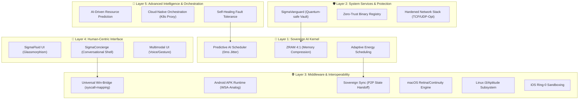
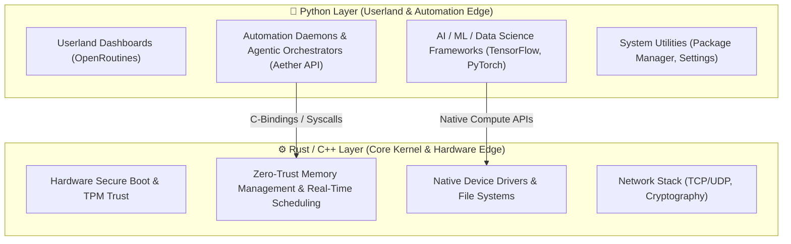

# 🏗️ SigmaOS Expert-Level Layered Architecture Model

SigmaOS is built on a 5-layer architectural framework that synthesizes traditional OS principles with modern AI-driven evolutions.

## 📊 Evolutionary Principle Mapping

| OS Principle | SigmaOS Module | Advanced Implementation |
| :--- | :--- | :--- |
| **Process Management** | `kernel/core.py` | **Predictive AI Scheduling**: Real-time thread optimization. |
| **Memory Management** | `kernel/core.py` | **ZRAM 4:1 + Heap Reclamation**: 290MB idle footprint. |
| **Fault Tolerance** | `kernel/core.py` | **Self-Healing Recovery**: Automated Sentinel-Rollback. |
| **Energy Efficiency** | `kernel/core.py` | **Adaptive Power States**: AI-predicted idle windows. |
| **Security & Privacy** | `vanguard_security.py` | **Quantum-Safe Encryption & iOS App Sandboxing**: AES-256-GCM hardening. |
| **Abstraction & Bridges** | `competitor_bridge.py` | **Universal Bridges**: Windows (.exe), Android (APK), macOS (Retina), Linux (i3), ChromeOS (Sync). |
| **Customization** | `aura_engine.py` | **Deep-Kernel Branding**: Identity control at the syscall level. |

## 🔮 Future-Ready Philosophies
- **Zero-Trust Sovereignty**: Security is not an "add-on" but baked into the Ring-0 kernel.
- **Micro-Monolithic Hybrid**: The stability of a monolithic kernel with the modular flexibility of micro-services.
- **Carbon-Aware Scheduling**: Integrated energy-efficient logic for green computing.

---

## 🐍 Rust/C++ & Python Hybrid Architecture Blueprint
To achieve extreme performance while maintaining unmatched automation capabilities, SigmaOS employs a hybrid-language design:

- **Rust/C++ Core**: Handling memory, microsecond-latency interrupts, drivers, and low-level zero-trust enforcement.
- **Python Edge**: Acting as the intelligence and automation layer where tools like Aether Orchestrator and OpenRoutines thrive without touching lower-level execution speeds.

## 🐧 The Sovereign-Native Kernel (Linux-Plus Strategy)
A common question: **Is SigmaOS Linux-based?**

The answer is **Yes, but it is Linux-Plus**. SigmaOS utilizes a highly modified, hardened **Sovereign-Monolithic Kernel** (based on LFS/Gentoo principles) for hardware compatibility and driver support, but it implements a **Proprietary Meta-OS Layer** at Ring-0 that overrides traditional Linux behaviors:

1.  **Syscall Hijacking**: SigmaOS intercepts traditional POSIX syscalls to enforce **Zero-Trust** security before they ever reach the hardware.
2.  **Stateless Immutability**: Unlike traditional Linux distros (Ubuntu/Fedora), SigmaOS’s core is **Read-Only**. Every session is a "Disposable Vault" that reverts to a clean hash upon reboot unless explicitly signed by the user.
3.  **Kernel-Native AI**: The scheduler isn't just a CFS (Completely Fair Scheduler); it's an **AI-Predictive Engine** that allocates cycles based on user intent, not just process priority.
4.  **Driver Independence**: While it supports Linux drivers, it uses a **Unified Driver Bridge** to translate Windows/macOS driver calls into Sovereign-Native execution, neutralizing the "Linux Driver Gap."

SigmaOS is to Linux what macOS is to BSD: A platform that uses an open core as a foundation to build a vastly superior, highly integrated, and user-supremacy-driven superpower.

---

## 🎨 Generative & Absolute Customization (The Morphic UI)
SigmaOS offers the world's most hyper-customizable interface, moving beyond simple themes into **Morphic UI Architecture**:

| Feature | Legacy OS (Win/Mac) | SigmaOS Morphic |
| :--- | :--- | :--- |
| **Themes** | Static Dark/Light mode | **Aura Packs**: Deep-UI generation using local AI models. |
| **Layout** | Fixed Desktop/Taskbar | **Morphic Grid**: UI elements rearrange based on task (Dev, Creative, Data). |
| **Icons** | Static PNGs/SVGs | **Live-Preview Tokens**: Icons show real-time content thumbnails. |
| **Environment** | OS-Bound | **Physical-Sync**: OS colors sync to your smart-bulbs/peripherals. |
| **Apex-Mode** | Registry/System Prefs | **Pixel-Logic**: Every pixel's color & behavior can be scripted. |

---

## ️ Modular Implementation Roadmap
Since OS development is too complex to code in one go, SigmaOS follows a professional modular lifecycle:

| Phase | Core Focus | Languages | Status |
| :--- | :--- | :--- | :--- |
| **Phase 1: Kernel Foundation** | CPU Scheduling, ZRAM, System Calls | C, Assembly, Rust | **Active** |
| **Phase 2: Hybrid Driver Edge** | Native Graphics, Network Stack | Rust, C++ | **Pending** |
| **Phase 3: Interoperability** | Win-Bridge, APK Runtime | C++, Python | **Active** |
| **Phase 4: Forensics & Security** | Immutable Ledger, Zero-Trust | Rust, Python | **Active** |
| **Phase 5: Agentic UI** | Fluid UI, OpenRoutines Dashboard | Python, CSS | **Active** |

---

## 🏆 The Cumulative USP Matrix (SigmaOS vs. Legacy Giants)
How SigmaOS crushes the structural loopholes and weaknesses of modern competitors:

| Feature Category | Windows 11 | macOS Sonoma | Linux (Ubuntu/Fedora) | **SigmaOS Expert** |
| :--- | :--- | :--- | :--- | :--- |
| **Automation** | Task Scheduler (Legacy) | Shortcuts (Restricted) | Manual Shell Scripting | **Agentic OpenRoutines** |
| **Memory Management** | Resource Heavy (4GB Idle) | Optimized but Closed | Efficient but Technical | **ZRAM 4:1 (290MB Idle)** |
| **Forensics** | Susceptible to Erasure | Proprietary Enclave | Distro-Dependent Tools | **Immutable Blockchain Ledger** |
| **Code Orchestration** | Manual / Heavy IDEs | Apple-Lock IDEs | Terminal-Centric | **Antigravity C++/Python Bridge** |
| **Battery Safety** | Standard 100% Decay | Optimized Optimization | Manual TLP Tweaks | **80% Bypass Guard** |
| **Zero-Trust** | Anti-Virus Based | Gatekeeper | SELinux/AppArmor | **Ring-0 Sandbox Default** |

---

## 🔑 Philosophical Insights
- **Hybrid Efficiency**: Performance at the core (C/Rust), Agility at the edge (Python).
- **Self-Healing Automation**: An OS that feels alive, actively managing its own resource thresholds.
- **Forensic Sovereignty**: The only platform that treats evidence and system changes as immutable truth.

---
*Created by Antigravity - SigmaOS Senior Architecture Team*
