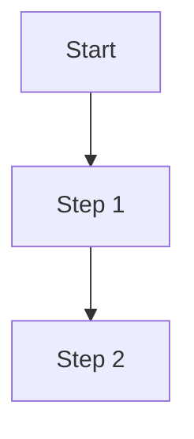

# RFC-NNNN: Title

- **RFC number**: NNNN (assigned by maintainers)
- **Author(s)**: Full Name <email or GitHub @handle>
- **Subsystem**: (kernel/net/security/desktop/sdk/ci/...)
- **Status**: Draft | Under Discussion | Accepted | Rejected | Implemented
- **Date proposed**: YYYY-MM-DD
- **Date accepted**: YYYY-MM-DD (fill when accepted)
- **Tracking issue**: #(GitHub issue number)
- **Implementation PR**: #(GitHub PR number, when started)

---

## Summary

<!-- One paragraph — what does this RFC propose and why? -->

---

## Motivation

<!-- Why is this change needed? What problem does it solve?
     Describe the current state, its shortcomings, and the desired end state.
     Include concrete examples if possible. -->

### Current behaviour

### Desired behaviour

### Non-goals (what this RFC explicitly does NOT address)

---

## Detailed Design

<!-- The core of the RFC. Be precise.
     For kernel changes: describe data structures, algorithms, and
     interactions with other subsystems.
     For API changes: show before/after API signatures.
     For workflow changes: show the new workflow step-by-step. -->

### Data structures / interfaces

```rust
// Example: new struct or trait
pub struct NewThing {
    pub field: u32,
}
```

### Algorithm / flow

<!-- Pseudocode, flowcharts (Mermaid), or prose describing the algorithm -->



### Interactions with existing subsystems

| Subsystem | Impact | Notes |
|-----------|--------|-------|
| scheduler | none / minor / major | |
| VFS       | none / minor / major | |
| security  | none / minor / major | |

---

## Alternatives Considered

<!-- List at least 2 alternatives and explain why you rejected them -->

### Alternative A: ...

- Pros: ...
- Cons: ...

### Alternative B: ...

- Pros: ...
- Cons: ...

---

## Drawbacks

<!-- Honest assessment of the costs and risks of this RFC -->

---

## Security Considerations

<!-- Any security implications? pledge/unveil impact? ABI stability? -->

---

## Performance Implications

<!-- Any expected performance changes? Include numbers if possible. -->

---

## Compatibility / ABI Impact

- [ ] No ABI change
- [ ] ABI-compatible addition
- [ ] ABI break — requires kabi version bump

---

## Implementation Plan

<!-- Break into stages if applicable -->

1. Stage 1: ...
2. Stage 2: ...
3. Stage 3: ...

**Estimated effort**: Small (< 1 week) / Medium (1–4 weeks) / Large (> 1 month)

**Subsystem maintainer(s) who must approve**: (from MAINTAINERS file)

---

## Unresolved Questions

<!-- Things the RFC doesn't yet answer; to be resolved during discussion -->

1. ...
2. ...

---

## References

<!-- Links to relevant papers, prior art, other OS designs, etc. -->

- [Linux: relevant subsystem doc](https://...)
- [Prior discussion](https://github.com/AaryanSinghChauhan09/SigmaOS/issues/...)

---

## Revision History

| Date | Author | Change |
|------|--------|--------|
| YYYY-MM-DD | @author | Initial draft |
