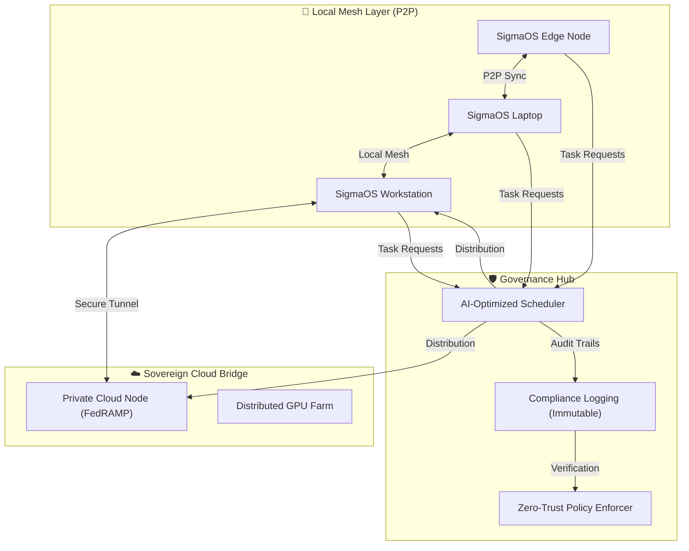

# 🌐 SigmaOS Shared Processing Architecture (AetherGrid)

SigmaOS leverages the collective power of the user's ecosystem via **AetherGrid**, a modular layer that allows devices to pool and share processing power (CPU/GPU/NPU) while maintaining absolute sovereignty and compliance.

## 🏗️ Architectural Overview

## 🚀 Key Processing Modes

### 1. 🤝 Local Mesh Mode (P2P)
- **Concept**: Nearby SigmaOS devices discover each other over LAN/Bluetooth Mesh.
- **Action**: A laptop with a weak CPU can "borrow" rendering cycles from a nearby desktop.
- **Benefit**: Zero latency, zero cloud cost, 100% data sovereignty.

### 2. 🌉 Sovereign Cloud Bridge
- **Concept**: Secure offloading to verified, high-performance cloud nodes (e.g., for LLM training or heavy Data Science).
- **Compliance**: Only utilizes nodes that meet the user's required standards (SOC2, FedRAMP, HIPAA).

### 3. 🛡️ Compliance-Aware Sharing (Audit-First)
- Every shared cycle is cryptographically signed and logged in the **Immutable Evidence Ledger**.
- **Forensic Integrity**: You can prove *where* a calculation happened and *how* the data was handled at every millisecond.

### 4. 🧠 AI-Optimized Scheduling
- **Predictive Distribution**: The kernel analyzes the task complexity and current device thermal/battery states to decide whether to run locally, on the mesh, or in the cloud.

---

## 📊 Comparison: SigmaGrid vs. Generic Grid/Cloud

| Feature | Standard Cloud (AWS/GCP) | Generic Grid (BOINC) | **Sigma AetherGrid** |
| :--- | :--- | :--- | :--- |
| **Trust** | Third-Party Managed | Voluntary/Unverified | **Zero-Trust Sovereign** |
| **Compliance** | Static Certificates | None | **Real-time Active Auditing** |
| **Privacy** | Data Egress / Mining Risk | Public Nodes | **Local-Only Encryption** |
| **Control** | Provider Decides | Manual Setup | **AI-Native Auto-Scaling** |

---
*Architectural Design inspired by distributed computing research at DA-IICT & PDEU*
*Developed by Antigravity - SigmaOS Senior Engineering Team*
