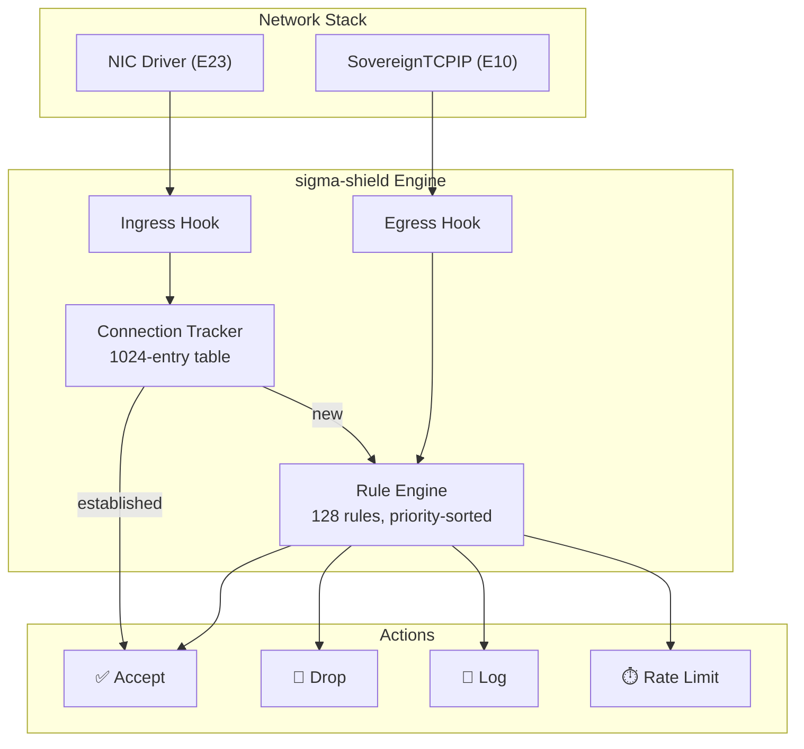

# sigma-shield Firewall Specification

> **Status**: ACTIVE | **Component**: `kernel/net/sigma_shield.rs` | **Shard**: E12

sigma-shield is the SigmaOS sovereign packet filter. It enforces a **default-drop** policy with connection tracking and priority-sorted rule matching.

---

## Architecture



---

## Default Policy

SigmaOS ships with a **default-drop** ingress and egress policy:

```rust
// Default rules installed by sigma_shield_init()
Rule { id: 1, priority: 255, direction: Ingress, action: Drop }  // Drop all ingress
Rule { id: 2, priority: 255, direction: Egress,  action: Drop }  // Drop all egress
```

Users must explicitly allow traffic by adding higher-priority rules.

---

## Connection Tracking

sigma-shield maintains a connection tracking table with 1024 entries. When a packet matches an `Accept` rule, a connection entry is created. Subsequent packets belonging to the same connection (matching `src_port`, `dst_port`, `protocol`) bypass the rule engine and are accepted immediately.

| State | Description |
|---|---|
| `New` | First packet seen for this flow |
| `Established` | Reply packet received, connection confirmed |
| `Related` | Associated connection (e.g., FTP data channel) |
| `Invalid` | Packet doesn't match any known flow |

---

## Rule Configuration

### CLI

```bash
# Allow HTTPS inbound
sigma-shield add --direction ingress --proto tcp --dst-port 443 --action accept

# Rate-limit SSH to 10 connections/sec
sigma-shield add --direction ingress --proto tcp --dst-port 22 --action rate-limit:10

# Allow all outbound DNS
sigma-shield add --direction egress --proto udp --dst-port 53 --action accept

# View all rules
sigma-shield list

# View statistics
sigma-shield stats
```

### TOML Configuration

```toml
# /etc/sigma/firewall.toml
[[rule]]
id = 10
priority = 10
direction = "ingress"
protocol = "tcp"
dst_port = 443
action = "accept"
comment = "Allow HTTPS inbound"

[[rule]]
id = 11
priority = 10
direction = "ingress"
protocol = "tcp"
dst_port = 80
action = "accept"
comment = "Allow HTTP inbound"

[[rule]]
id = 20
priority = 20
direction = "ingress"
conn_state = "established"
action = "accept"
comment = "Allow established connections"

[[rule]]
id = 30
priority = 50
direction = "ingress"
protocol = "tcp"
dst_port = 22
action = "rate-limit"
rate_limit = 10
comment = "Rate-limit SSH"
```

---

## C-ABI Interface

```c
void   sigma_shield_init(void);
int32  sigma_shield_add_rule(uint32 id, uint16 priority, uint8 direction,
                              uint8 protocol, uint16 src_port, uint16 dst_port,
                              uint8 action, uint32 rate_limit);
uint8  sigma_shield_filter(uint8 direction, uint8 protocol,
                            uint16 src_port, uint16 dst_port, uint32 length);
```

---

*See also: [ESSENTIAL_SHARDS](ESSENTIAL_SHARDS.md) | [Knowledge-Base](Knowledge-Base.md#sigma-shield-firewall)*
