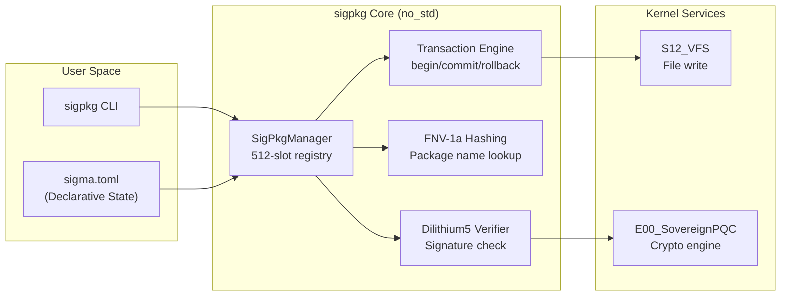

# sigma-pkg Specification

> **Status**: ACTIVE | **Component**: `usr/sigpkg/` | **Shard**: S18_Package

`sigpkg` is the sovereign package manager for SigmaOS. It does not depend on POSIX libc, uses post-quantum cryptographic verification, and supports transactional installs with full rollback capability.

---

## Architecture



---

## Package Format (`.spkg`)

```
package-name-1.0.0.spkg
├── MANIFEST.toml             # Metadata, version, dependencies, capabilities
├── files/                    # Installed file tree
│   ├── bin/my-app
│   ├── lib/libfoo.so
│   └── share/my-app/
├── pre_install.sh            # Pre-install hook (optional)
├── post_install.sh           # Post-install hook (optional)
├── sfc.json                  # Sovereign Finality Certificate
└── signature.dilithium5      # PQC digital signature
```

### MANIFEST.toml

```toml
[package]
name = "sigma-browser"
version = "0.4.2"
description = "Sovereign web browser for SigmaOS"
license = "GPL-2.0-or-later"
arch = ["x86_64", "aarch64"]

[dependencies]
sigma-net = ">=0.3.0"
sigma-gpu = ">=0.1.0"

[capabilities]
required = ["CAP_NETWORK", "CAP_DEVICE"]
optional = ["CAP_STORAGE"]
```

---

## CLI Commands

```bash
sigpkg install <package>         # Install a package
sigpkg remove <package>          # Remove a package
sigpkg update                    # Update package index
sigpkg upgrade                   # Upgrade all packages
sigpkg search "<query>"          # Search packages
sigpkg info <package>            # Show package details
sigpkg verify <package>          # Verify cryptographic signature
sigpkg doctor                    # Run diagnostics
sigpkg clean-cache               # Clear stale cache
sigpkg rollback                  # Rollback last transaction
```

---

## Declarative Mode (NixOS Parity)

When `declarative_mode` is enabled in `sigma.toml`, `sigpkg` refuses manual `install`/`update` calls. Only the declarative state parser may install packages:

```toml
# sigma.toml
[packages]
declarative_mode = true
required_shards = [
    "S00_KERNEL",
    "S01_MEM_MANAGER",
    "S02_IPC_BROKER",
    "S03_VFS",
    "S04_CRYPTO",
    "sigma-browser",
]
```

Running `sigpkg install` manually while in declarative mode returns:
```
error: declarative mode is enforced. Edit sigma.toml to add packages.
```

---

## Transaction Safety

Every `sigpkg install` and `sigpkg upgrade` wraps mutations in a transaction:

1. `sigpkg_transaction_begin()` — snapshots the current registry state.
2. Installs/updates packages.
3. If any step fails → `sigpkg_transaction_rollback()` restores the snapshot.
4. If all steps succeed → `sigpkg_transaction_commit()` finalizes.

This guarantees that a failed multi-package upgrade never leaves the system in a half-updated state.

---

## Signature Verification

All packages are signed with **Dilithium5** (FIPS 204). The verification flow:

1. Download `.spkg` and `sfc.json` (Sovereign Finality Certificate).
2. Validate the Dilithium5 signature on the SFC.
3. Compute the BLAKE3 hash of the `.spkg`.
4. Assert hash matches the SFC exactly.
5. If mismatch → abort and log anomaly.

---

*See also: [Reproducibility](Reproducibility.md) | [ESSENTIAL_SHARDS](ESSENTIAL_SHARDS.md) | [Knowledge-Base](Knowledge-Base.md#sigpkg-overview)*
