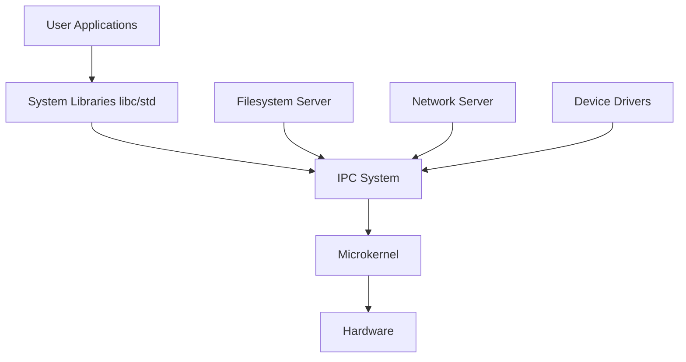

# SigmaOS Architecture

SigmaOS is designed around a modern, capability-based microkernel architecture, taking inspiration from various operating systems while implementing strict memory safety through Rust.

## Overall Architecture (Microkernel Design)

Unlike monolithic kernels (like Linux or FreeBSD) where device drivers, filesystems, and the networking stack all run in a single privileged address space, SigmaOS isolates these components into separate, unprivileged user-space processes (servers). The microkernel itself is minimal and only handles:
- Inter-Process Communication (IPC)
- Thread scheduling
- Basic memory management and paging
- Hardware interrupt routing

## Component Interaction Diagram

## How the Kernel Boots
1. **Bootloader**: The system is booted using a standard UEFI bootloader (or BIOS fallback) which loads the kernel and initial ramdisk into memory.
2. **Early Init**: Architecture-specific initialization (GDT, IDT, basic paging on x86_64).
3. **Kernel Main**: The Rust environment is established, memory allocators are initialized.
4. **Driver Startup**: The kernel spawns the critical driver processes.
5. **Init Process**: The first user-space process (PID 1) is started, which then orchestrates the rest of the system initialization (similar to runit or systemd).

## Comparison to Linux Kernel Architecture
- **Linux** is monolithic, meaning a crash in a device driver can panic the entire kernel.
- **SigmaOS** isolates drivers. If a network driver crashes, the microkernel restarts it without halting the system.

## Comparison to FreeBSD Architecture
- **FreeBSD** provides an integrated base system (kernel + userland). SigmaOS adopts this model, maintaining core utilities alongside the kernel in the same repository.
- Unlike FreeBSD's monolithic kernel, SigmaOS isolates components for enhanced security.

## Memory Layout
SigmaOS uses standard higher-half kernel mapping:
- Lower half: User-space applications.
- Higher half: Kernel space (mapped in every process for fast syscalls, but protected via page permissions).

## Security Model
- **Capabilities**: Access to resources (files, network ports) requires explicit capabilities passed via IPC, rather than global ambient authority (like root privileges).
- **Namespaces**: Built-in support for mount, network, and PID namespaces for OCI container runtimes.

## Inspiration
- **Arch Linux / Gentoo**: Rolling release model and source-based customization options.
- **NixOS**: Reproducible builds and declarative configuration.
- **FreeBSD / OpenBSD**: Cohesive base system and aggressive security auditing (like OpenBSD's `pledge`/`unveil`).
