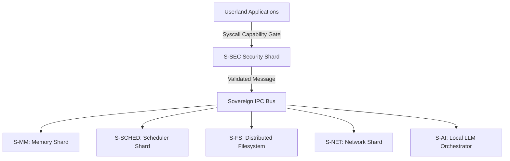

# SigmaOS

A next-generation operating system built with Rust, focusing on security, performance, and modularity. SigmaOS aims to provide a modern, secure, and efficient computing environment while maintaining compatibility with existing Linux applications and drivers.

## 🌟 Key Features

- **Security-First Design**: Post-quantum cryptography, capability-based security, and comprehensive auditing
- **Zero-Dependency Architecture**: Custom implementations of core libraries to reduce external dependencies
- **Linux Compatibility**: Comprehensive package translation layer for .deb, .rpm, and pacman packages
- **AI-Native Runtime**: Built-in machine learning inference and training capabilities
- **Microkernel Architecture**: Modular design with clear separation between kernel and userspace
- **Energy-Aware Scheduling**: Intelligent CPU scheduling based on power consumption and performance needs
- **Advanced Filesystem**: Custom filesystem with content-addressed storage and efficient caching

## 🏗️ Architecture

SigmaOS follows a microkernel architecture with the following major components:

### Core Components
- **Kernel**: Lightweight microkernel with process management, memory management, and IPC
- **Security Module**: Capability-based access control, audit logging, and vulnerability scanning
- **Filesystem**: Content-addressed storage with deduplication and efficient caching
- **Network Stack**: TCP/UDP networking with zero-copy buffers and advanced congestion control
- **Graphics System**: Hardware-accelerated compositor with double buffering and window management
- **Package Manager**: Universal package manager supporting multiple Linux package formats

### Advanced Features
- **AI Subsystem**: Machine learning inference and training with hardware acceleration
- **Container Runtime**: Lightweight containerization with sandboxing
- **Remote Desktop**: Built-in remote desktop capabilities
- **Productivity Tools**: Media playback, document editing, and collaboration tools
- **Accessibility**: Screen readers, magnifiers, and input method editors

## 🚀 Getting Started

### Prerequisites
- Rust 1.70 or later
- Cargo
- For kernel development: QEMU or similar emulator
- For cross-compilation: appropriate toolchains

### Building SigmaOS

```bash
# Clone the repository
git clone https://github.com/AaryanSinghChauhan09/SigmaOS.git
cd SigmaOS

# Build the userspace components
cargo build --release

# Build the kernel (requires cross-compilation)
cargo build --release --target x86_64-unknown-none

# Run in QEMU
qemu-system-x86_64 -kernel target/x86_64-unknown-none/release/sigmaos -m 512M
```

### Development Setup

```bash
# Install development dependencies
cargo install cargo-make
cargo install cross

# Set up the development environment
cargo make dev-setup

# Run tests
cargo test

# Run benchmarks
cargo bench
```

## 📦 Package Management

SigmaOS includes a universal package manager that can translate and install packages from multiple Linux distributions:

### Supported Package Formats
- **Debian/Ubuntu**: .deb packages with APT metadata
- **Fedora/RHEL**: .rpm packages with SPEC files
- **Arch Linux**: PKGBUILD files with pacman database
- **Snap**: Snapcraft.yaml manifests
- **Flatpak**: Flatpak manifests
- **AppImage**: AppImage bundles
- **Nix**: Nix derivations

### Package Installation

```bash
# Install a Debian package
sigpkg install neofetch.deb

# Install an Arch package
sigpkg install neofetch

# Search for packages
sigpkg search editor

# Update all packages
sigpkg update
```

## 🔒 Security Features

### Capability-Based Security
- Fine-grained permission system
- Process isolation and sandboxing
- Secure IPC mechanisms

### Post-Quantum Cryptography
- PQC signature verification (Dilithium)
- Secure key management
- Hardware attestation

### Audit and Compliance
- Comprehensive audit logging
- Real-time security monitoring
- Compliance dashboard for regulatory requirements

### Vulnerability Management
- Automatic vulnerability scanning
- Security advisory integration
- Patch management system

## 🎯 Development Roadmap

### Current Focus
- [x] Core kernel functionality
- [x] Basic filesystem implementation
- [x] Network stack (TCP/UDP)
- [x] Package translation layer
- [x] Security framework
- [ ] Graphics system completion
- [ ] Driver framework expansion
- [ ] AI subsystem optimization

### Future Goals
- Enhanced Linux compatibility layer
- Advanced power management
- GPU acceleration for AI workloads
- Cloud-native features
- Mobile device support

## 🤝 Contributing

We welcome contributions to SigmaOS! Please see our contributing guidelines for more information.

### Development Workflow
1. Fork the repository
2. Create a feature branch
3. Make your changes
4. Run tests and benchmarks
5. Submit a pull request

### Code Style
- Follow Rust best practices
- Use `cargo fmt` for formatting
- Use `cargo clippy` for linting
- Write comprehensive tests
- Document public APIs

## 📚 Documentation

- [Architecture Overview](./ARCHITECTURE.md)
- [API Reference](./API_REFERENCE.md)
- [Security Guide](./SECURITY.md)
- [Package Management](./PACKAGE_MANAGEMENT.md)
- [Driver Development](./DRIVER_DEVELOPMENT.md)
- [AI Subsystem](./AI_SUBSYSTEM.md)

## 🐛 Bug Reporting

Please report bugs using our [issue tracker](https://github.com/AaryanSinghChauhan09/SigmaOS/issues) with the following information:
- SigmaOS version
- Hardware configuration
- Steps to reproduce
- Expected behavior
- Actual behavior
- Log files (if applicable)

## 📄 License

Dual-licensed under MIT and GPL-2.0. See the `LICENSE` file for details.
# SigmaOS Sovereign Wiki

## 🙏 Acknowledgments

- The Rust community for excellent tooling and libraries
- Linux distributions for inspiration and compatibility targets
- Security researchers for vulnerability disclosures
- All contributors who have helped make SigmaOS better

## 📞 Contact

- GitHub: https://github.com/AaryanSinghChauhan09/SigmaOS
- Issues: https://github.com/AaryanSinghChauhan09/SigmaOS/issues
- Wiki: https://github.com/AaryanSinghChauhan09/SigmaOS/wiki

---

## 🌍 Community-Building Plan for SigmaOS

To grow a healthy, thriving, and highly technical open-source ecosystem around SigmaOS, we have established a clear and structured framework for contributor onboarding, communication, incentives, hackathons, partnerships, and developer SDKs.

### 1. Developer Onboarding
* **Clear Documentation:** Maintain comprehensive guides on how to build, compile, unit-test, and contribute to both the C++ microkernel core and the Rust-based boot, initialization, and networking compatibility layers.
* **Starter Issues:** Actively curate and label newcomer-friendly tasks with the `good first issue` tag to significantly lower entry barriers for new contributors.

### 2. Communication Channels
* **Real-time Collaboration:** Host a dedicated Discord/Matrix server for direct real-time communication between system architects, driver developers, and contributors.
* **GitHub Discussions:** Utilize GitHub Discussions as the primary forum for long-form technical Q&A, architectural RFCs, and platform proposals.
* **Monthly Newsletters:** Publish monthly updates summarizing core development progress, highlighting new drivers, and celebrating community-driven milestones.

### 3. Contribution Incentives
* **Recognition:** Commemorate top contributors prominently in the release notes of each milestone release.
* **Mentorship:** Run a dedicated mentorship program matching experienced system engineers with new Rust and OS-dev enthusiasts.
* **Subsystem Grants/Bounties:** Sponsor financial grants or developer bounties targeting crucial subsystem implementations, including next-gen network virtualization, advanced storage subsystems, and missing device drivers.

### 4. Hackathons & Sprints
* **Themed Sprints:** Sponsor virtual hackathons targeting specific subsystem needs (e.g., *“SigmaOS Networking Sprint”* focusing on native IPv6 integration, high-performance zero-copy DMA sockets, or TLS protocol wrappers).
* **Developer Swag:** Reward participants with custom project merchandise, certificates of recognition, and sponsored server credits.

### 5. Partnerships & Collaborations
* **Academic Outreach:** Partner with university computer science departments for low-level systems research projects, thesis sponsorships, and microkernel verification studies.
* **OS-Dev Communities:** Cross-pollinate ideas with larger Rust and alternative OS development communities (such as OSDev forums, Redox OS, and SeL4 mailing lists).
* **Hardware Vendors:** Seek strategic hardware testing and development kits from FPGA, accelerator, and CPU vendors to accelerate physical hardware verification.

### 6. Ecosystem Bootstrapping
* **SDKs & Application APIs:** Build clean, multi-language SDKs facilitating streamlined app creation for userland desktop applications.
* **Compatibility Layers:** Maintain and extend robust Linux and POSIX-compatible translation enclaves to attract early-stage power users.
* **Porting Initiatives:** Work hand-in-hand with prominent open-source maintainers to port crucial, everyday tools and software to run natively inside Zenith Desktop.

---

## 📊 Suggested Roadmap for Community Growth

We divide the expansion of our collaborative ecosystem into four sequential, target-driven stages:

| Stage | Focus Area | Intended Strategic Outcome |
| :--- | :--- | :--- |
| **Stage 1** | Documentation + Starter Issues | Attract first wave of contributors and build foundation |
| **Stage 2** | Communication Channels + Hackathons | Foster real-time collaboration and establish an active dev base |
| **Stage 3** | Incentives + Partnerships | Scale specialized subsystem contributions via grants & academia |
| **Stage 4** | SDKs + App Ecosystem | Attract end-user application developers and bootstrap daily-usage |

---

## 🚀 Recommended Next Steps
1. **Infrastructure Provisioning:** Initialize GitHub Discussions and host the Matrix workspace.
2. **Contributor Onboarding Guide:** Write down step-by-step build and containerization instructions within `wiki/README.md`.
3. **Issue Curation:** Label 10–15 pre-existing issues across the repositories as `"good first issue"`.
4. **Networking Sprint Launch:** Announce the first online virtual sprint (focused on high-throughput socket layers).
5. **Community Outreach:** Reach out directly to system forums and social channels for cross-pollination.
# 🛡️ SigmaOS — Sovereign, AI-Native Operating System

> **"Sovereignty is the ultimate efficiency."**
> The world's first industrial-grade microkernel designed for total digital autonomy, post-quantum resilience, and Indian industrial compliance.

---

## 🎯 Overview

SigmaOS is a sovereign, zero-dependency, AI-native operating system built entirely in Rust. It discards legacy POSIX assumptions to build a hyper-secure, capability-based microkernel designed for an AI-first, object-oriented ecosystem.

### Core Pillars

- **Post-Quantum Cryptography**: Native Kyber-1024 KEM + Dilithium-5 signatures (NIST FIPS 203/204).
- **Capability-Based Security**: 64-bit hardware-enforced permission model replacing legacy ACLs.
- **Shard Architecture**: 600+ hot-swappable kernel modules with zero-latency IPC.
- **AI-Native Design**: Local LLM inference as a first-class OS primitive.
- **India-First**: Native GST, Income Tax, UPI, and 22-language support.


---

## 📊 System Architecture

SigmaOS decomposes the traditional monolithic kernel into specialized, isolated shards. The interaction between these shards is governed by a capability-enforced transaction bus.



- **S-MM**: Sovereign Memory Manager (Buddy Allocator).
- **S-SCHED**: Predictive Multi-Priority Scheduler (MLFQ + CFS + EDF).
- **S-FS**: Sovereign Distributed Filesystem (VFS + SigmaFS).
- **S-SEC**: Security Framework (PQC + MAC + Sandbox).
- **S-AI**: AI Task Orchestrator (Local LLM routing).


---

## 🚀 Quick Start

### Running the QEMU Demo (Works Today)

Ensure you have the required compiler toolchain and emulation packages:

```bash

# Install dependencies

sudo apt install -y build-essential nasm cmake qemu-system-x86 golang-go xorriso

# Clone the repository

git clone https://github.com/AaryanSinghChauhan09/SigmaOS.git
cd SigmaOS

# Build the system image

make clean && make all -j$(nproc)

# Run in QEMU

qemu-system-x86_64 -cdrom build/sigmaos.iso -m 2G -serial stdio
```

### Profile Builds

SigmaOS supports declarative compilation profiles specified at build-time:

```bash
make PROFILE=standalone all    # Full desktop ISO
make PROFILE=rtos all          # Hard real-time ELF
make PROFILE=cloud all         # Headless cloud image
make PROFILE=browser all       # WASM bundle
```

---

## 🔒 Security & Sandboxing

SigmaOS features a capability-native access control system. Programs are executed with explicit privilege tokens (capabilities) rather than generic user IDs.

```rust
// Capability delegation example
let token = CapabilityToken::new()
    .allow_network("tcp", 80)
    .allow_read("/var/www");
```

For a detailed review of all security policies, see the canonical [Security Framework](https://github.com/AaryanSinghChauhan09/SigmaOS/wiki) page on the Wiki.

---

## 📚 Canonical Documentation (GitHub Wiki)

```text
Phase F (Competitor Crusher)   ████████████████████  100% ✅
Phase G (Kernel Boot)          ████████████░░░░░░░░   60% ← ACTIVE
Phase H (India Stack)          ░░░░░░░░░░░░░░░░░░░░    0% (blocked on G)
```

### Current Status

- ✅ Kernel scheduler (MLFQ+CFS+EDF)
- ✅ Syscalls (I/O + Process)
- ✅ Physical MM (buddy allocator)
- 🔄 Virtual MM (paging) - Partial
- ✅ APIC + timer
- ✅ sigma_pledge + sigma_unveil
- ✅ Kyber-1024 KEM + Dilithium-5
- 🔄 TCP/UDP stack - Partial
- ✅ Ext4 + FAT32 filesystems
- ✅ NVMe + USB xHCI drivers
- ✅ Zenith Desktop prototype
- ✅ sigma-pkg CLI
- ⬜ Bootable ISO (Phase G)


---

## 🤝 Contributing

We welcome contributions! See [CONTRIBUTING.md](CONTRIBUTING.md) for guidelines.

### High-Impact Areas

- Round-robin scheduler implementation
- Buddy allocator completion
- sigma-sh REPL
- USB HID keyboard driver
- VESA framebuffer driver
- Package recipes


---

## 📚 Documentation

### Repository Documentation

- [Documentation Audit](docs/doc_audit_backlog.md) — Implementation status
- [Roadmap](Roadmap.md) — Development plan
- [INSTALL.md](INSTALL.md) — Build instructions
- [CONTRIBUTING.md](CONTRIBUTING.md) — Contribution guidelines
- [SECURITY_POLICY.md](SECURITY_POLICY.md) — Security policy
- [SUPPORT.md](SUPPORT.md) — Support and troubleshooting
- [FAQ](FAQ.md) — Common questions (coming soon)


### GitHub Wiki (Canonical Documentation)

Detailed conceptual documentation is managed exclusively in the GitHub Wiki:

- **Master Roadmap**: [Maturity & Distro-Parity Roadmap](https://github.com/AaryanSinghChauhan09/SigmaOS/wiki/Maturity_Parity_Roadmap)
- **Advanced Core Architecture**: [Advanced Absorption Matrix](https://github.com/AaryanSinghChauhan09/SigmaOS/wiki/Advanced_Absorption)
- **Filesystem Design**: [SigmaFS Innovations](https://github.com/AaryanSinghChauhan09/SigmaOS/wiki/SigmaFS_Innovations)
- **Interactive UI Compositor**: [SigmaMedia Frameworks](https://github.com/AaryanSinghChauhan09/SigmaOS/wiki/SigmaMedia_Frameworks)
- **Local AI Daemon**: [Sigma AI Agents](https://github.com/AaryanSinghChauhan09/SigmaOS/wiki/Sigma_AI_Agents)


---

## 📄 License

Dual-licensed under MIT and GPL-2.0. See the `LICENSE` file for details.
