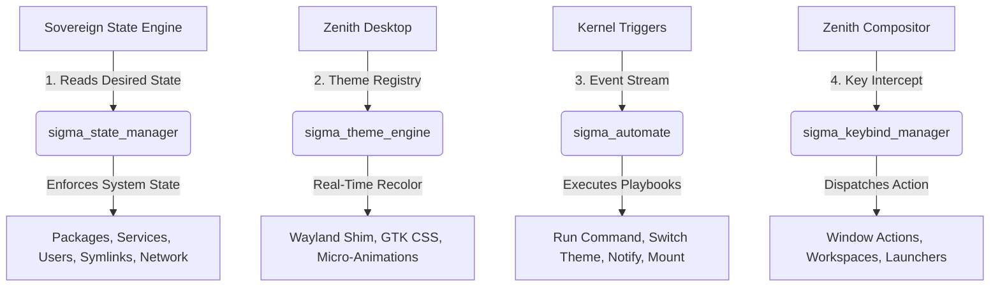

# Customization, Personalization, and Automation Engine

SigmaOS features a natively integrated, state-of-the-art **Customization, Personalization, and Automation Engine** that combines the declarative purity of NixOS, the deep aesthetic controls of KDE Plasma, and the powerful event-driven automation of macOS Shortcuts and systemd timers. 

Built directly into the Sovereign OS architecture, this engine ensures your system configuration is reproducible, your desktop environment is dynamically personalized, and routine tasks are executed securely in the background.

---

## ⚙️ Core Architecture & Pillars

The engine operates across four main pillars, fully integrated into the Zenith Desktop Environment and the SigmaOS Kernel:



---

## 1. Declarative System State Manager (`sigma_state_manager`)
Inspired by **NixOS** and **Fedora Silverblue**, SigmaOS abandons the traditional, mutable imperative configuration pattern in favor of a declarative, idempotent desired-state management model.

The `sigma_state_manager` reads a desired configuration file (typically in a JSON/YAML-like format) and compares it against the active system state. It then executes necessary transitions to achieve the target state in an atomic transaction. If any part of the transition fails, it rolls back to the previous generation.

### Supported State Resources:
*   **Packages**: Enforce present/absent package state (linked directly to the `OmniPkg` backend).
*   **Services**: Manage daemon execution states (communicates with `sigma-init` daemon).
*   **Users**: Automatic Pam-layer user provisioning (home directories, shell selection).
*   **Themes**: Declarative visual settings and desktop customization profiles.
*   **Sysctl**: Real-time tuning of kernel parameters (direct `/sys` equivalent writes).
*   **Symlinks**: Native file path management and absolute link provisioning.
*   **Network**: Active network profile configurations including static IPs and Wi-Fi SSIDs.

### Sample Declarative State Manifest (`sigma.state`):
```json
{
  "label": "Zenith Developer Workspace",
  "generation": 42,
  "entries": [
    { "type": "package", "desired": "present", "key": "neovim", "value": "stable" },
    { "type": "package", "desired": "present", "key": "git", "value": "latest" },
    { "type": "service", "desired": "present", "key": "sshd" },
    { "type": "user", "desired": "present", "key": "aaryan", "value": "/bin/sigma-sh" },
    { "type": "theme", "desired": "present", "key": "Sigma Dark" },
    { "type": "sysctl", "desired": "present", "key": "net.ipv4.ip_forward", "value": "1" },
    { "type": "network", "desired": "present", "key": "Office-Fiber", "value": "SSID=SovereignNet;DHCP=true" }
  ]
}
```

---

## 2. Personalization Core & Theme Engine (`sigma_theme_engine`)
Aesthetics are a first-class citizen in SigmaOS. The personalization core provides a centralized registry for global UI tokens, broadcasting live styling updates across the system.

### Features:
*   **Tailored Color Palettes**: Uses HSL-encoded colors instead of browser defaults to create premium, cohesive visual identities (accent, background, surface, error, success, warning).
*   **Glassmorphism & Shadows**: High-fidelity window styling support (rounded corner radius, dynamic drop-shadow blur, border widths, and frosted glass behind surfaces).
*   **Spring Animations**: Physics-based, smooth transition curves inspired by macOS (fast micro-interactions, normal panel transitions, and slow pages/workspaces).
*   **Auto Dark/Light Mode**: Smooth transitions depending on the time of day (sunrise and sunset auto-triggers).
*   **GTK/Qt Compatibility**: Instant dynamic stylesheet generation (`export_gtk_css`) to skin standard applications seamlessly.

### Premium Default Presets:
1.  **Sigma Dark** (Accent: HSL Violet, Background: Deep Navy, Surface: Sleek Aero Glass)
2.  **Sigma Light** (Accent: HSL Indigo, Background: Soft White, Surface: Pure Solid Glass)

---

## 3. Event-Driven Automation Taskmaster (`sigma_automate`)
The `sigma_automate` daemon functions as a sovereign task orchestrator. It registers trigger-action pipelines ("Playbooks") and executes them within the secure **Sovereign Sandbox**.

### Triggers:
*   `TRIGGER_ON_BOOT`: Run custom startup scripts immediately after `sigma-init` is completed.
*   `TRIGGER_ON_LOGIN` / `TRIGGER_ON_LOGOUT`: Session hooks for custom configuration loads/saves.
*   `TRIGGER_ON_WIFI_CONNECT`: Execute security validation or mounting steps upon networking initialization.
*   `TRIGGER_ON_USB_INSERT`: Automatically mount or scan newly connected storage drives.
*   `TRIGGER_ON_LOW_BATTERY`: Drop system power profile, dim Zenith panels, and trigger low-power CPU governor.
*   `TRIGGER_ON_FILE_CHANGE`: An inotify-style path watcher to trigger auto-syncing or building.
*   `TRIGGER_CRON_SCHEDULE`: Full cron-compliant scheduling parser.

### Core Actions:
*   `ACTION_RUN_COMMAND`: Run sandbox-contained CLI utilities.
*   `ACTION_SET_THEME`: Toggle or switch visual skins.
*   `ACTION_NOTIFY`: Push visual desktop cards to the Zenith Notification Daemon.
*   `ACTION_INSTALL_PKG`: Background packages update and provisioning.
*   `ACTION_SEND_WEBHOOK`: Dispatch JSON-based HTTP POST requests over network stack.

### Automation Playbook Example:
```json
{
  "id": 1003,
  "name": "Auto-Deploy On Code Change",
  "enabled": true,
  "trigger": {
    "type": "TRIGGER_ON_FILE_CHANGE",
    "watch_path": "/home/aaryan/projects/SigmaOS/src"
  },
  "actions": [
    {
      "type": "ACTION_RUN_COMMAND",
      "payload": "sigma-build --incremental",
      "run_in_sandbox": true
    },
    {
      "type": "ACTION_NOTIFY",
      "payload": "Incremental build finished successfully."
    }
  ]
}
```

---

## 4. Zenith Keybind Manager (`sigma_keybind_manager`)
A keyboard-driven UX is critical for developer productivity. Integrating custom keyboard shortcut mappings natively into the Zenith compositor, the `sigma_keybind_manager` coordinates global shortcuts and auto-tiling windows.

### Keyboard-Driven WM Controls:
SigmaOS employs an **i3/Sway/Hyprland** inspired mapping hierarchy utilizing a configurable modifier modifier key (`Super` / `Logo` / `Windows` key).

*   `Super + Return` ── Launch `sigma-terminal`
*   `Super + Q` ── Close active Zenith window
*   `Super + F` ── Toggle fullscreen mode
*   `Super + Shift + Space` ── Toggle window float state
*   `Super + Vim Navigation (H, J, K, L)` ── Switch focus directionally (Left, Down, Up, Right)
*   `Super + Workspace Number (1-0)` ── Switch virtual workspaces
*   `Super + Shift + Workspace Number (1-0)` ── Pin/Move window to target workspace
*   `Super + D` ── Launch fuzzy-finder `sigma-launcher`
*   `Super + T` ── Instantly toggle between Light and Dark mode presets

---

## 🛠️ CLI Reference

### State Manager: `sigma-state`
Manage declarative configurations and review generation histories.
```bash
# Apply a desired state configuration
sigma-state apply /etc/sigma/desktop.state

# Perform a dry-run to preview changes (idempotency check)
sigma-state diff /etc/sigma/desktop.state

# List current active configuration version and label
sigma-state info
```

### Theme Controller: `sigma-theme`
Direct CLI styling commands.
```bash
# Switch active desktop theme preset
sigma-theme apply "Sigma Dark"

# Change active accent color in real-time (ARGB Hex)
sigma-theme accent 0xFF6C63FF

# Force GTK4 styling export
sigma-theme export-gtk ~/.config/gtk-4.0/gtk.css
```

### Automation Scheduler: `sigma-auto`
Monitor and configure automation tasks.
```bash
# List all active playbooks
sigma-auto list

# Trigger a manual run of a specific playbook
sigma-auto run 1003

# Enable or disable an automation task
sigma-auto enable 1003
sigma-auto disable 1002
```

---

## 🧪 Real-World Verification

All core engines compile cleanly into the Zenith desktop environment and userland libraries. 

To verify state updates, you can run the following automated pipeline diagnostics:
```bash
# Build desktop modules and libraries
make zenith-desktop

# Run native test suite
./build/tests/test_theme_engine
./build/tests/test_automate
```
